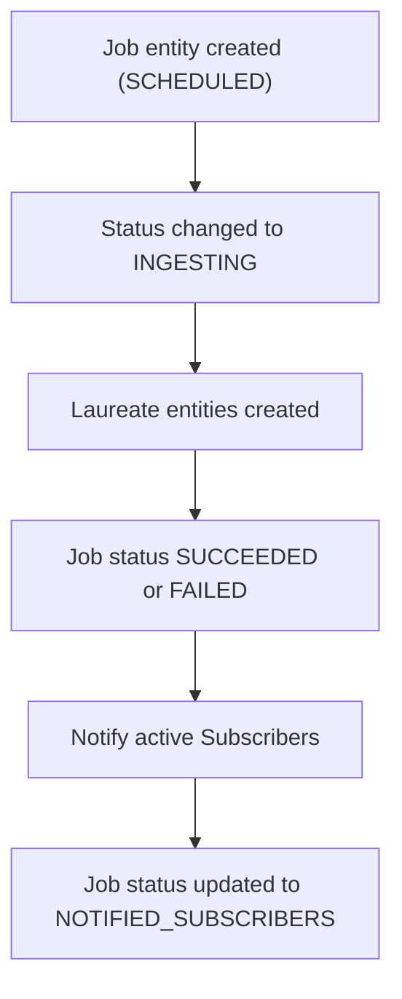
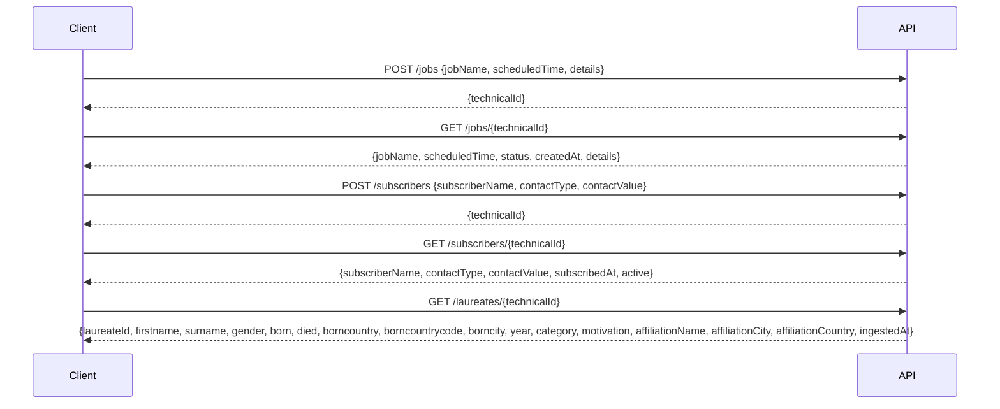

### 1. Entity Definitions

```
Job:
- jobName: String (Name or description of the ingestion job)
- scheduledTime: String (Timestamp when the job is scheduled to run)
- status: String (Current state of the job lifecycle, e.g., SCHEDULED, INGESTING, SUCCEEDED, FAILED, NOTIFIED_SUBSCRIBERS)
- createdAt: String (Timestamp when the job entity was created)
- details: String (Optional additional information or metadata about the job)

Laureate:
- laureateId: String (Unique identifier from the OpenDataSoft API)
- firstname: String (First name of the laureate)
- surname: String (Surname of the laureate)
- gender: String (Gender of the laureate)
- born: String (Birth date of the laureate)
- died: String (Death date if applicable, null otherwise)
- borncountry: String (Country of birth)
- borncountrycode: String (Country code of birth)
- borncity: String (City of birth)
- year: String (Year the Nobel Prize was awarded)
- category: String (Category of the Nobel Prize)
- motivation: String (Reason for awarding the prize)
- affiliationName: String (Name of affiliated institution)
- affiliationCity: String (City of the affiliation)
- affiliationCountry: String (Country of the affiliation)
- ingestedAt: String (Timestamp when the laureate entity was created/ingested)

Subscriber:
- subscriberName: String (Name of the subscriber)
- contactType: String (Type of contact, e.g., EMAIL, WEBHOOK)
- contactValue: String (Email address or webhook URL)
- subscribedAt: String (Timestamp when the subscriber registered)
- active: String (Flag indicating if subscriber is active, e.g., "true" or "false")
```

---

### 2. Entity Workflows

```
Job workflow:
1. Initial State: Job entity created with status='SCHEDULED'
2. Processing: Cyoda workflow triggers ingestion from OpenDataSoft API, status changes to 'INGESTING'
3. Validation & Transformation: Laureate entities created from API data
4. Completion: Job status updated to 'SUCCEEDED' or 'FAILED'
5. Notification: Notify all active Subscribers; Job status updated to 'NOTIFIED_SUBSCRIBERS'
```

```
Laureate workflow:
1. Created as immutable entity triggered by Job ingestion
2. Validation: Confirm required fields are present and formatted correctly
3. Enrichment: Normalize or calculate additional fields (e.g., age)
4. Stored as immutable record; no updates or deletes
```

```
Subscriber workflow:
1. Subscriber entity created via POST endpoint
2. Validation: Verify contact info format and activation status
3. Subscription active for notifications from Job completions
4. No updates or deletes unless explicitly requested
```


```mermaid
graph TD
    Job_Created["Job entity created (SCHEDULED)"] --> Job_Ingesting["Status changed to INGESTING"]
    Job_Ingesting --> Laureate_Created["Laureate entities created"]
    Laureate_Created --> Job_Completed["Job status SUCCEEDED or FAILED"]
    Job_Completed --> Notify_Subscribers["Notify active Subscribers"]
    Notify_Subscribers --> Job_Notified["Job status updated to NOTIFIED_SUBSCRIBERS"]
```

---

### 3. API Endpoints Design

**Job Entity:**

- `POST /jobs`  
  - Description: Create a new Job entity (triggers ingestion workflow)  
  - Request Body:  
    ```json
    {
      "jobName": "String",
      "scheduledTime": "String (ISO 8601 Timestamp)",
      "details": "String (optional)"
    }
    ```  
  - Response Body:  
    ```json
    {
      "technicalId": "String"
    }
    ```

- `GET /jobs/{technicalId}`  
  - Description: Retrieve Job entity by technicalId  
  - Response Body:  
    ```json
    {
      "jobName": "String",
      "scheduledTime": "String",
      "status": "String",
      "createdAt": "String",
      "details": "String"
    }
    ```

---

**Laureate Entity:**

- No POST endpoint (created automatically via Job ingestion process as immutable events)  
- `GET /laureates/{technicalId}`  
  - Retrieve a single Laureate entity by technicalId

- Optional (only if requested):  
  `GET /laureates?category=Chemistry&year=2010`  
  - Retrieve laureates filtered by category, year, or other fields

---

**Subscriber Entity:**

- `POST /subscribers`  
  - Register a new subscriber for notifications  
  - Request Body:  
    ```json
    {
      "subscriberName": "String",
      "contactType": "String (EMAIL or WEBHOOK)",
      "contactValue": "String (email address or URL)"
    }
    ```  
  - Response Body:  
    ```json
    {
      "technicalId": "String"
    }
    ```

- `GET /subscribers/{technicalId}`  
  - Retrieve subscriber details

---

### 4. Request/Response Formats Visualization


```mermaid
sequenceDiagram
    participant Client
    participant API

    Client->>API: POST /jobs {jobName, scheduledTime, details}
    API-->>Client: {technicalId}

    Client->>API: GET /jobs/{technicalId}
    API-->>Client: {jobName, scheduledTime, status, createdAt, details}

    Client->>API: POST /subscribers {subscriberName, contactType, contactValue}
    API-->>Client: {technicalId}

    Client->>API: GET /subscribers/{technicalId}
    API-->>Client: {subscriberName, contactType, contactValue, subscribedAt, active}

    Client->>API: GET /laureates/{technicalId}
    API-->>Client: {laureateId, firstname, surname, gender, born, died, borncountry, borncountrycode, borncity, year, category, motivation, affiliationName, affiliationCity, affiliationCountry, ingestedAt}
```