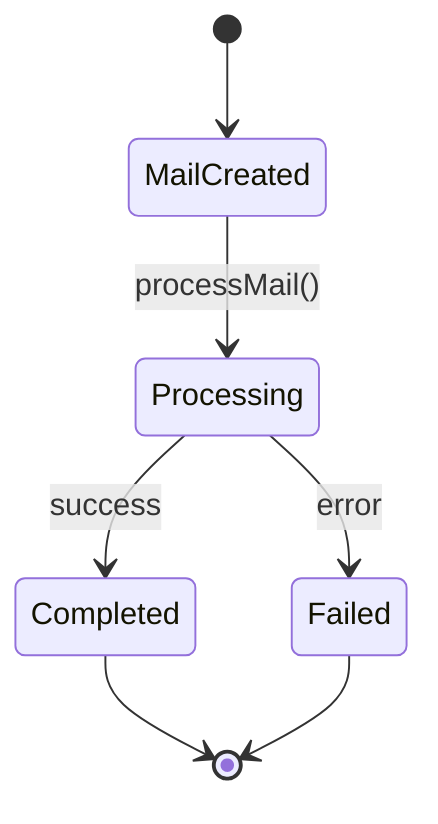
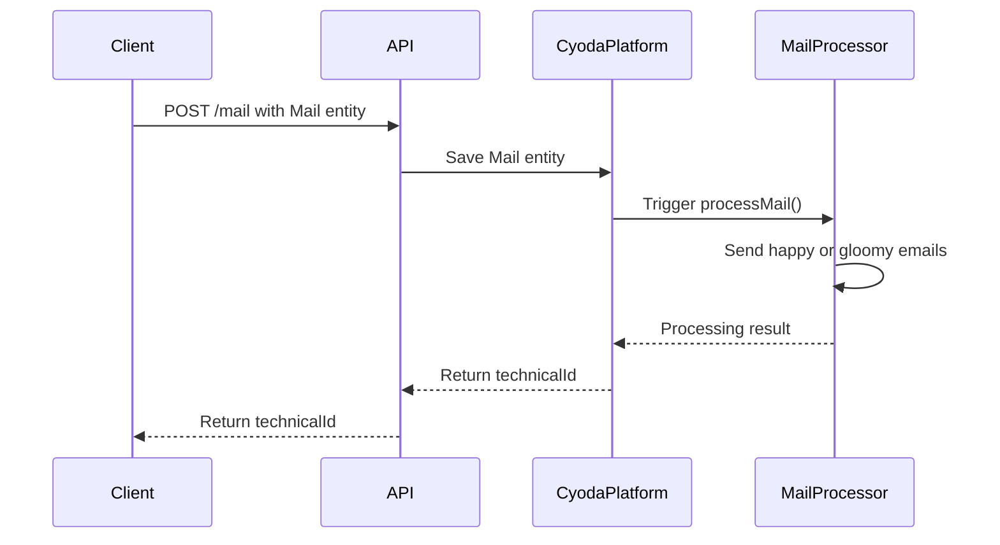
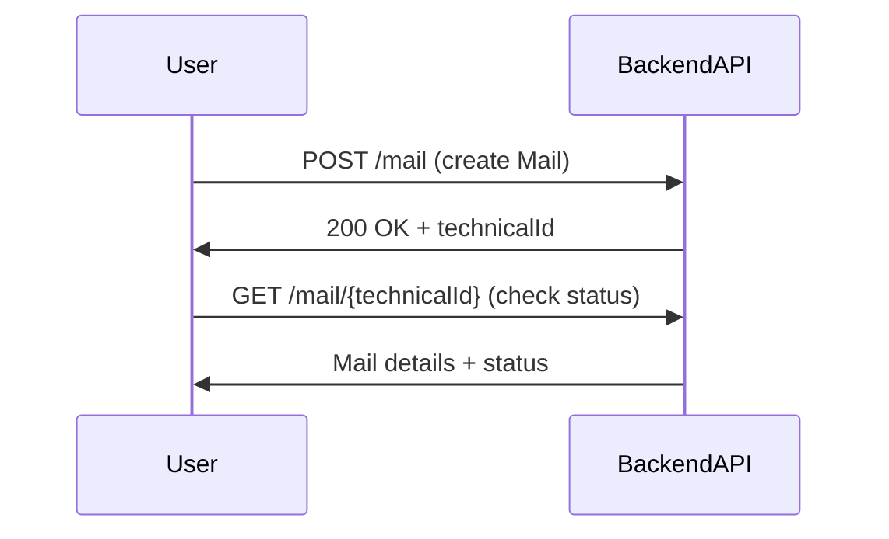

### 1. Entity Definitions

```
Mail:
- isHappy: Boolean (indicates if the mail is happy or gloomy)
- mailList: List<String> (list of recipient email addresses)
```

### 2. Process Method Flows

```
processMail() Flow:
1. Initial State: Mail entity is created with isHappy and mailList fields set.
2. Validation: (Optional) Validate mailList is not empty and email formats are correct.
3. Processing: 
    - If isHappy == true, send happy email to all recipients in mailList.
    - If isHappy == false, send gloomy email to all recipients in mailList.
4. Completion: Mark processing as completed (internally or via event metadata).
5. Notification: (Optional) Trigger notification/event about mail sent status.
```

### 3. API Endpoints Design

- **POST /mail**  
  - Description: Create a new Mail entity, triggers `processMail()` event automatically.  
  - Request Body:
    ```json
    {
      "isHappy": true,
      "mailList": ["user1@example.com", "user2@example.com"]
    }
    ```
  - Response Body:
    ```json
    {
      "technicalId": "string"
    }
    ```
- **GET /mail/{technicalId}**  
  - Description: Retrieve Mail processing results or status by technicalId.  
  - Response Body:
    ```json
    {
      "technicalId": "string",
      "isHappy": true,
      "mailList": ["user1@example.com", "user2@example.com"],
      "status": "COMPLETED" // or PENDING/FAILED
    }
    ```

- No update/delete endpoints will be provided due to EDA immutability principle.

### 4. Request/Response Formats

- **Create Mail Request Example**
  ```json
  {
    "isHappy": false,
    "mailList": ["recipient@example.com"]
  }
  ```

- **Create Mail Response Example**
  ```json
  {
    "technicalId": "abc123"
  }
  ```

- **Get Mail Response Example**
  ```json
  {
    "technicalId": "abc123",
    "isHappy": false,
    "mailList": ["recipient@example.com"],
    "status": "COMPLETED"
  }
  ```

---

### Mermaid Diagrams

**Mail Entity Lifecycle**


```mermaid
stateDiagram-v2
    [*] --> MailCreated
    MailCreated --> Processing : processMail()
    Processing --> Completed : success
    Processing --> Failed : error
    Completed --> [*]
    Failed --> [*]
```

**Event-Driven Processing Chain**


```mermaid
sequenceDiagram
    participant Client
    participant API
    participant CyodaPlatform
    participant MailProcessor

    Client->>API: POST /mail with Mail entity
    API->>CyodaPlatform: Save Mail entity
    CyodaPlatform->>MailProcessor: Trigger processMail()
    MailProcessor->>MailProcessor: Send happy or gloomy emails
    MailProcessor-->>CyodaPlatform: Processing result
    CyodaPlatform-->>API: Return technicalId
    API-->>Client: Return technicalId
```

**User Interaction Sequence Flow**


```mermaid
sequenceDiagram
    participant User
    participant BackendAPI

    User->>BackendAPI: POST /mail (create Mail)
    BackendAPI->>User: 200 OK + technicalId
    User->>BackendAPI: GET /mail/{technicalId} (check status)
    BackendAPI->>User: Mail details + status
```

---

If you need further refinements or additional entities later, feel free to ask!