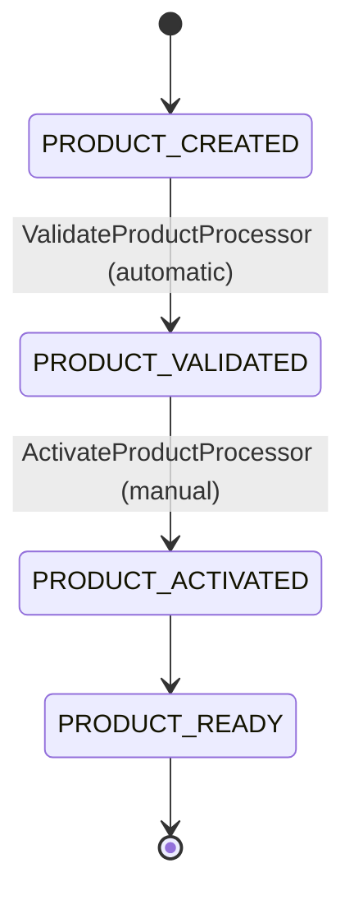
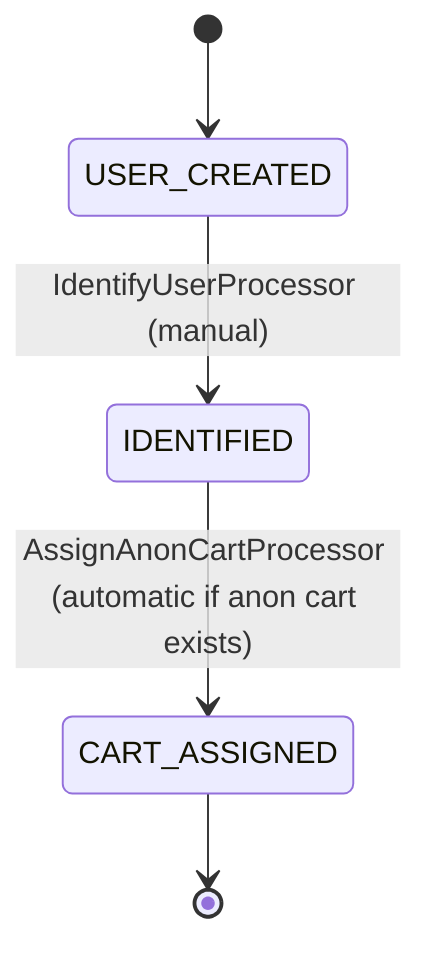
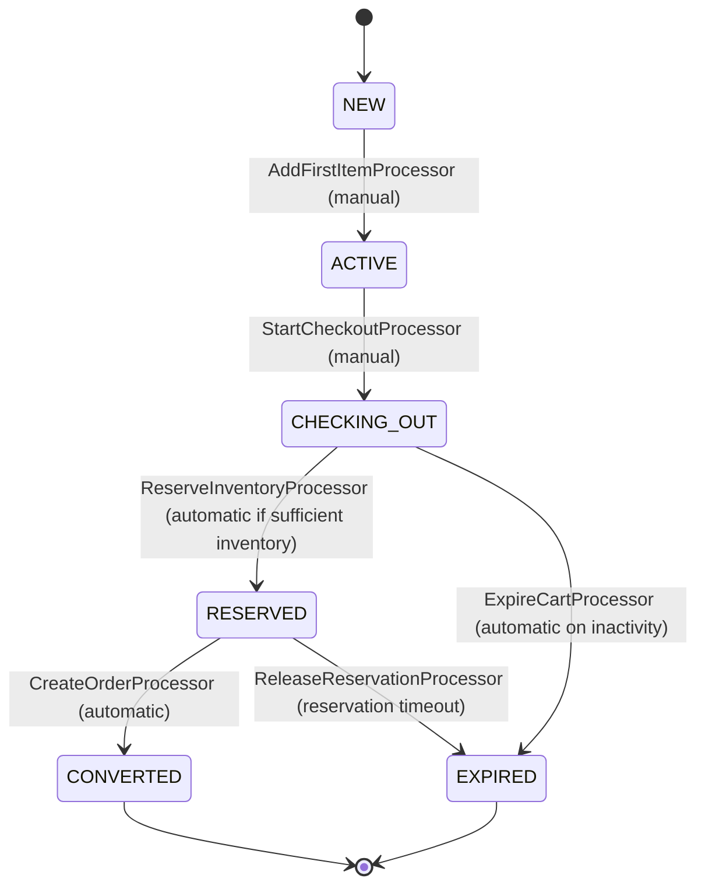
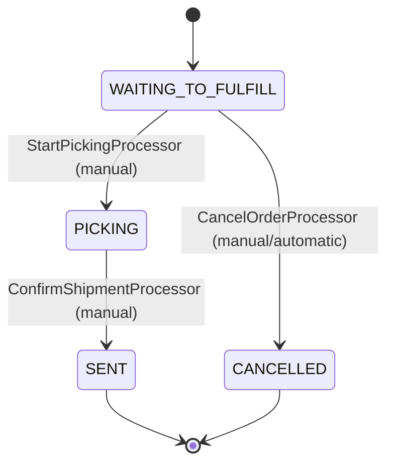
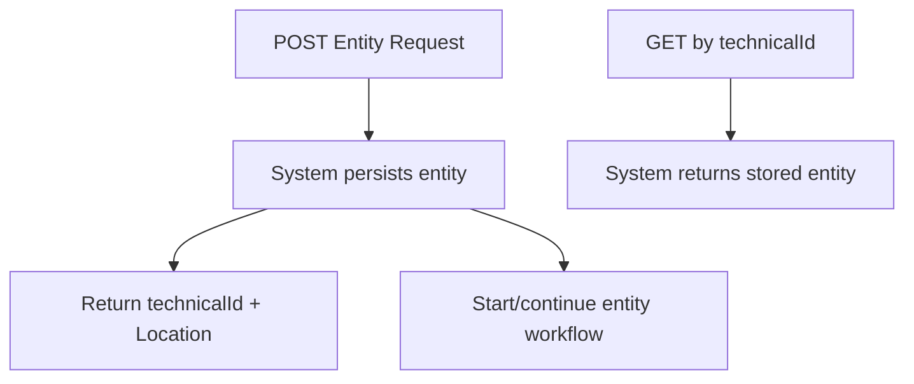

# Functional Requirements

Last updated: 2025-08-20

Summary
- Normalized field naming to camelCase across all entities.
- Clarified lifecycle logic for Cart and Order with explicit inventory reservation and release semantics.
- Fixed inconsistencies in timestamps and field names (createdAt / updatedAt consistently used).
- Added clear validation rules, constraints and default values.
- Described processors behavior, transaction and concurrency expectations.

---

## 1. Entities
(Using only the 5 entities: Product, User, Address, Cart, Order)

General conventions:
- Use camelCase for all property names (e.g., createdAt, updatedAt).
- Timestamps are ISO-8601 strings in UTC (e.g., 2025-08-20T14:30:00Z).
- Keys/IDs are strings (UUID recommended for technicalId/userId/cartId, etc.).
- All arrays are non-null; use empty arrays when applicable.

### Product
- sku: string (natural key, unique)
- technicalId: string (internal id, returned by POST)
- name: string
- description: string (optional)
- price: number (decimal, >= 0.00)
- quantityAvailable: integer (>= 0) — *available stock for sale*
- quantityReserved: integer (>= 0) — *stock reserved for carts/orders that have a temporary hold*
- category: string (optional)
- imageUrl: string (optional)
- active: boolean (default: true)
- createdAt: string (ISO-8601)
- updatedAt: string (ISO-8601)

Notes/Constraints:
- price must be >= 0.00.
- quantityAvailable represents physical inventory not including quantityReserved.
- quantityReserved + quantityAvailable is the total physical stock.
- System must enforce a non-negative invariant for both quantityAvailable and quantityReserved.

### User
- userId: string (technicalId, key)
- name: string
- email: string (unique; validated)
- phone: string (optional)
- identityState: string enum {ANON, IDENTIFIED}
- createdAt: string
- updatedAt: string

Notes:
- ANON users may exist with minimal data (e.g., for anonymous carts). On identification, associate records.

### Address
- addressId: string (key)
- userId: string (owner)
- line1: string
- line2: string (optional)
- city: string
- postcode: string
- country: string
- createdAt: string
- updatedAt: string

Notes:
- Addresses belong to users. Validation of postcode/country format is required upon creation.

### Cart
- cartId: string (key, technicalId returned on POST)
- userId: string (nullable) — null for anonymous cart until associated
- lines: array of { sku: string, name: string, unitPrice: number, qty: integer, lineTotal: number }
- totalItems: integer (sum of qty)
- grandTotal: number (sum of lineTotal + taxes/fees if any)
- status: string enum {NEW, ACTIVE, CHECKING_OUT, RESERVED, CONVERTED, EXPIRED}
- lastActivityAt: string
- expiresAt: string (calculated; e.g., lastActivityAt + cartExpiryDuration)
- createdAt: string
- updatedAt: string

Notes/Constraints:
- NEW: created but no items.
- ACTIVE: one or more items added, not yet checking out.
- CHECKING_OUT: user started checkout flow; requires address present or selected.
- RESERVED: inventory is temporarily reserved for this cart (reserved quantity is deducted from available and added to quantityReserved). This is a transient state used to reduce oversell — see reservation rules below.
- CONVERTED: order created from cart.
- EXPIRED: cart expired and will be deleted or archived.
- Cart expiry rules: inactivity expiry default 24 hours after lastActivityAt for NEW/ACTIVE; however, when a cart reaches CHECKING_OUT and inventory is RESERVED, reservation hold is shorter (e.g., 15 minutes by default) to avoid long inventory locks.

### Order
- orderId: string (technicalId)
- orderNumber: integer (sequential numeric identifier for human use)
- userId: string
- shippingAddressId: string
- lines: array of { sku: string, name: string, unitPrice: number, qty: integer, lineTotal: number }
- totals: { items: integer, grand: number }
- status: string enum {WAITING_TO_FULFILL, PICKING, SENT, CANCELLED, FAILED}
- createdAt: string
- updatedAt: string
- stateTransitions: array of { from: string, to: string, actor: string, timestamp: string, note: string }

Notes:
- On order creation (conversion), reserved inventory is converted into permanent decrements from quantityReserved; if there was no reservation, the system must decrement quantityAvailable atomically at conversion time.
- OrderNumber sequence must be provided by a dedicated, transactional sequence service (ensures monotonic increment).

---

## 2. Enums and Timeouts
- identityState: ANON | IDENTIFIED
- cart.status: NEW | ACTIVE | CHECKING_OUT | RESERVED | CONVERTED | EXPIRED
- order.status: WAITING_TO_FULFILL | PICKING | SENT | CANCELLED | FAILED

Timeouts and Durations (configurable):
- cartInactivityExpiry: 24 hours (default). Applies when cart is not in checkout/reserved.
- reservationHoldDuration: 15 minutes (default). Applies after inventory is reserved while cart is CHECKING_OUT or RESERVED.
- reservationReleaseOnExpiry: when reservationHoldDuration elapses without conversion, reserved quantities are released back to quantityAvailable.

---

## 3. Workflows (State Machines & Rules)

Notes:
- All transitions that affect inventory must be executed in a transaction or in a way that prevents oversell (e.g., optimistic locking with retry or database transactions).
- Reservation (temporary decrement) is introduced between CHECKING_OUT and CONVERTED to avoid overselling.

### Product workflow
1. PRODUCT_CREATED: product persisted
2. PRODUCT_VALIDATED: validation checks run (price, quantity)
3. PRODUCT_ACTIVATED: manual activation (flag active=true)
4. PRODUCT_READY: available for sale

Processors/criteria: ValidateProductProcessor
Criteria: PriceValidCriterion, QuantityNonNegativeCriterion

Mermaid:


```mermaid
stateDiagram-v2
    [*] --> PRODUCT_CREATED
    PRODUCT_CREATED --> PRODUCT_VALIDATED : ValidateProductProcessor (automatic)
    PRODUCT_VALIDATED --> PRODUCT_ACTIVATED : ActivateProductProcessor (manual)
    PRODUCT_ACTIVATED --> PRODUCT_READY
    PRODUCT_READY --> [*]
```

### User workflow
1. USER_CREATED: user record created (identityState may be ANON or IDENTIFIED)
2. IDENTIFIED: ANON -> IDENTIFIED on identification event
3. CART_ASSIGNED: assign an anonymous cart to the identified user if present

Processors/criteria: IdentifyUserProcessor, AssignAnonCartProcessor
Criteria: HasAnonCartCriterion

Mermaid:


```mermaid
stateDiagram-v2
    [*] --> USER_CREATED
    USER_CREATED --> IDENTIFIED : IdentifyUserProcessor (manual)
    IDENTIFIED --> CART_ASSIGNED : AssignAnonCartProcessor (automatic if anon cart exists)
    CART_ASSIGNED --> [*]
```

Behavioral detail:
- When user identity transitions from ANON to IDENTIFIED, call AssignAnonCartProcessor to migrate an anonymous cart (if found by session or cookie) to the userId.
- If the user already has an active cart, merge logic must be applied (configurable: merge, keep existing, or prompt). Minimum behavior: preserve the newest cart and migrate lines or discard duplicates according to business rules.

### Cart workflow
1. NEW: cart created
2. ACTIVE: first item added
3. CHECKING_OUT: checkout started (address selected)
4. RESERVED: inventory reserved (temporary hold)
5. CONVERTED: order created, inventory permanently decremented
6. EXPIRED: cart expired and cleaned up

Processors/criteria: AddFirstItemProcessor, StartCheckoutProcessor, ReserveInventoryProcessor, CreateOrderProcessor, ExpireCartProcessor, ReleaseReservationProcessor
Criteria: AddressPresentCriterion, SufficientInventoryCriterion

Mermaid:


```mermaid
stateDiagram-v2
    [*] --> NEW
    NEW --> ACTIVE : AddFirstItemProcessor (manual)
    ACTIVE --> CHECKING_OUT : StartCheckoutProcessor (manual)
    CHECKING_OUT --> RESERVED : ReserveInventoryProcessor (automatic if sufficient inventory)
    RESERVED --> CONVERTED : CreateOrderProcessor (automatic)
    CHECKING_OUT --> EXPIRED : ExpireCartProcessor (automatic on inactivity)
    RESERVED --> EXPIRED : ReleaseReservationProcessor (reservation timeout)
    CONVERTED --> [*]
    EXPIRED --> [*]
```

Behavioral detail (inventory and timing):
- StartCheckoutProcessor must verify AddressPresentCriterion before allowing transition to CHECKING_OUT.
- ReserveInventoryProcessor attempts to reserve the items in the cart (atomically decrementing quantityAvailable and incrementing quantityReserved).
  - If reservation fails due to insufficient inventory, the cart remains in CHECKING_OUT and user is notified.
  - Reservation holds for reservationHoldDuration (default 15 minutes). If not converted to ORDER in that time, reservation is released and quantities returned to quantityAvailable.
- CreateOrderProcessor converts the reservation into a permanent decrement. If no reservation exists (e.g., reservation disabled), CreateOrderProcessor will attempt to decrement quantityAvailable atomically at order creation and will fail if insufficient inventory.
- ExpireCartProcessor removes carts that exceed cartInactivityExpiry (24 hours) when not in checkout/reserved. For RESERVED carts, expiration follows reservation timeout rules.

### Order workflow
1. WAITING_TO_FULFILL: created from Cart
2. PICKING: fulfillment team picks items
3. SENT: order shipped
4. CANCELLED/FAILED: order can move here (manual or automatic)

Processors/criteria: StartPickingProcessor, ConfirmShipmentProcessor, DecrementInventoryProcessor (used when no prior reservation), ReleaseReservationProcessor
Criteria: InventoryReservedCriterion, InventoryAvailableCriterion

Mermaid:


```mermaid
stateDiagram-v2
    [*] --> WAITING_TO_FULFILL
    WAITING_TO_FULFILL --> PICKING : StartPickingProcessor (manual)
    PICKING --> SENT : ConfirmShipmentProcessor (manual)
    WAITING_TO_FULFILL --> CANCELLED : CancelOrderProcessor (manual/automatic)
    SENT --> [*]
    CANCELLED --> [*]
```

Behavioral detail:
- On order creation from a RESERVED cart, reserved quantities are converted into permanent decrements: quantityReserved -= qty, (physical stock reduced implicitly), and the order is persisted.
- If order created without a prior reservation, DecrementInventoryProcessor must perform atomic checks and decrements on quantityAvailable and fail if insufficient.
- stateTransitions entries must be appended on each state change with who acted and when.

---

## 4. Processors (Pseudo-code and Responsibilities)

General rules:
- Inventory-affecting processors must run in transactions and handle concurrency (optimistic locking or DB-level row locks). Retry policies must be employed for transient failures.
- Processors should emit events/audit entries for external systems.

ValidateProductProcessor
```
process(Product p) {
  if (p.price == null or p.price < 0) throw ValidationError("price must be >= 0")
  if (p.quantityAvailable == null or p.quantityAvailable < 0) throw ValidationError("quantityAvailable must be >= 0")
  p.updatedAt = now()
  mark p validated
  persist p
}
```

AssignAnonCartProcessor
```
process(User u, sessionId) {
  cart = findCartBySession(sessionId)
  if (cart exists) {
    // merge strategy: prefer newest cart; merge lines to reduce duplicates
    mergedCart = mergeCarts(userExistingCart, cart)
    mergedCart.userId = u.userId
    save mergedCart
    delete or archive old anon cart
  }
}
```

StartCheckoutProcessor
```
process(Cart c) {
  if (!AddressPresentCriterion(c)) reject("Address required to start checkout")
  c.status = CHECKING_OUT
  c.lastActivityAt = now()
  save c
  // may trigger ReserveInventoryProcessor automatically
}
```

ReserveInventoryProcessor
```
process(Cart c) {
  begin transaction
  for each line in c.lines {
    p = loadProductForUpdate(line.sku) // row lock / optimistic lock
    if (p.quantityAvailable < line.qty) {
      rollback
      reject("insufficient inventory for sku=" + line.sku)
    }
    p.quantityAvailable -= line.qty
    p.quantityReserved += line.qty
    save p
  }
  c.status = RESERVED
  c.expiresAt = now() + reservationHoldDuration
  save c
  commit
}
```

CreateOrderProcessor
```
process(Cart c) {
  if (!AddressPresentCriterion(c)) reject
  // If cart.status == RESERVED -> turn reservation into permanent decrement
  begin transaction
  order = buildOrderFromCart(c)
  order.orderNumber = sequenceService.nextOrderNumber()
  save order
  if (c.status == RESERVED) {
    // reserved quantities are already reflected in product.quantityReserved
    for line in order.lines {
      p = loadProductForUpdate(line.sku)
      if (p.quantityReserved < line.qty) { rollback; throw InventoryError }
      p.quantityReserved -= line.qty
      // physical decrement already accounted for when reserved; persistent stock represented by (quantityAvailable + quantityReserved)
      save p
    }
  } else {
    // no prior reservation: attempt to decrement available now
    for line in order.lines {
      p = loadProductForUpdate(line.sku)
      if (p.quantityAvailable < line.qty) { rollback; throw InventoryError }
      p.quantityAvailable -= line.qty
      save p
    }
  }
  c.status = CONVERTED
  save c
  addStateTransition(order, from=c.status, to=WAITING_TO_FULFILL)
  commit
}
```

ReleaseReservationProcessor
```
process(Cart c) {
  // invoked on reservation expiry or cart cancel
  begin transaction
  for each line in c.lines {
    p = loadProductForUpdate(line.sku)
    p.quantityReserved -= line.qty
    p.quantityAvailable += line.qty
    save p
  }
  c.status = EXPIRED or ACTIVE (configurable)
  save c
  commit
}
```

ExpireCartProcessor
```
process(Cart c) {
  if (now() > c.expiresAt) {
    if (c.status == RESERVED) call ReleaseReservationProcessor(c)
    delete or archive c
  }
}
```

DecrementInventoryProcessor (used only when order created without prior reservation)
```
process(Order o) {
  for line in o.lines {
    p = loadProductForUpdate(line.sku)
    if (p.quantityAvailable < line.qty) throw InventoryError
    p.quantityAvailable -= line.qty
    save p
  }
}
```

---

## 5. API Endpoints Design Rules & JSON formats
Rules and conventions:
- POST endpoints create entities and return a technicalId and Location header. POST triggers workflows where applicable (e.g., creating a cart starts the cart workflow in NEW). The response body should contain { "technicalId": "..." } and HTTP 201 Created.
- GET endpoints retrieve entities by technicalId and return the fully persisted entity.
- No additional POST endpoints should be used for business processing beyond creation — creation triggers processors/workflows. Exceptions for idempotent business actions (startCheckout, addItem) can be implemented as POST-to-action endpoints if strictly required, but preference is to use workflow-driven transitions.
- All input must be validated; invalid requests return 400 with an error payload.
- API must be idempotent where appropriate (e.g., adding the same line with same client-generated id should be deduplicated).

Examples

POST /products
Request Body:
{
  "sku":"P001",
  "name":"Tshirt",
  "description":"cotton",
  "price":19.99,
  "quantityAvailable":100
}
Response (201 Created):
Headers: Location: /entities/{technicalId}
Body:
{
  "technicalId":"tech-abc-123"
}

POST /carts
Request Body:
{
  "cartId":"C001", // optional client-specified id; server may return different technicalId
  "userId":null,
  "lines":[],
  "totalItems":0,
  "grandTotal":0,
  "status":"NEW"
}
Response (201 Created):
{
  "technicalId":"tech-cart-001"
}

GET /entities/{technicalId}
Response (200 OK):
{
  "technicalId":"tech-cart-001",
  "entity": { /* persisted entity object */ }
}

Event and workflow flow (high level)

```mermaid
graph TD
    A[POST Entity Request] --> B[System persists entity]
    B --> C[Return technicalId + Location]
    B --> D[Start/continue entity workflow]
    E[GET by technicalId] --> F[System returns stored entity]
```

---

## 6. Validation Rules & Error Handling
- All create/update endpoints validate required fields, types and business rules.
- Error responses include a machine-readable error code, message and optional detail array.
- Inventory errors return 409 Conflict with a payload describing failing SKUs and available quantities.
- Race conditions in inventory operations must be surfaced as 409 and retriable by clients.

---

## 7. Auditing & State Transitions
- Each state transition must append an entry to stateTransitions (for Order) or an audit log (for Cart/Product/User) with actor, timestamp and optional note.
- Processors must emit domain events for external consumers (inventory changed, order created, cart expired).

---

## 8. Operational Considerations
- Use database transactions and row locking for inventory changes (or a dedicated inventory service with atomic APIs).
- Monitor reservation holds and expired carts; background workers must run ReleaseReservationProcessor and ExpireCartProcessor.
- Backpressure and retry policies should be documented for transient DB contention.

---

If you want, I can produce a compact Cyoda import sheet (entities + processors + criteria names) ready for handoff. Which format would you prefer next?