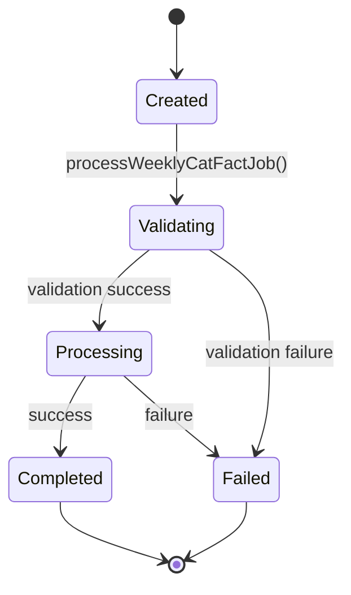
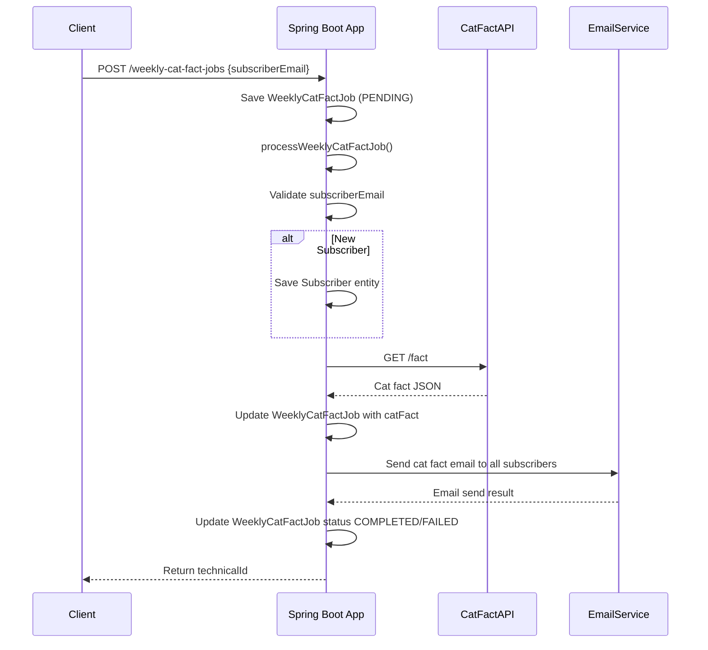
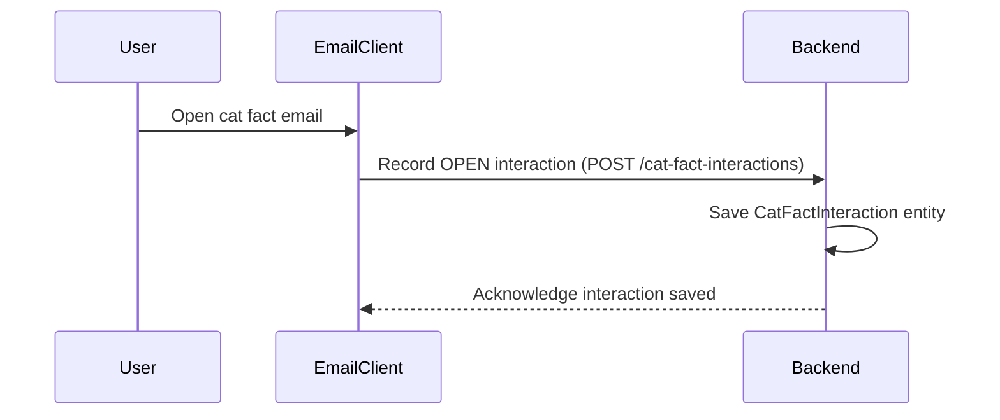

### 1. Entity Definitions

``` 
WeeklyCatFactJob:
- subscriberEmail: String (email of the subscriber signing up)
- catFact: String (the cat fact retrieved from the API for the week)
- status: String (job processing status: PENDING, COMPLETED, FAILED)
- scheduledAt: String (timestamp when the job is scheduled to run)

Subscriber:
- email: String (subscriber's email address)
- subscribedAt: String (timestamp when the subscriber signed up)

CatFactInteraction:
- subscriberEmail: String (email of subscriber interacting with the email)
- catFactId: String (reference to the cat fact sent)
- interactionType: String (e.g., OPEN, CLICK)
- interactionTimestamp: String (timestamp of the interaction)
```

---

### 2. Process Method Flows

``` 
processWeeklyCatFactJob() Flow:
1. Initial State: WeeklyCatFactJob entity created with status = PENDING and subscriberEmail set.
2. Validation: Validate subscriberEmail format and check if already subscribed (via checkSubscriberExists).
3. Processing:
   - If new subscriber, persist Subscriber entity (immutable creation).
   - Call Cat Fact API to retrieve a new cat fact.
   - Save the cat fact content in WeeklyCatFactJob.catFact.
   - Send cat fact email to all subscribers.
4. Completion:
   - Update WeeklyCatFactJob status to COMPLETED if all steps succeed.
   - If any step fails, update status to FAILED.
5. Notification: Log success/failure; optionally trigger follow-up events for interaction tracking.

processSubscriber() Flow:
1. Initial State: Subscriber entity created on sign-up.
2. Validation: Check email format and uniqueness.
3. Processing: Persist subscriber record and trigger confirmation email (optional).
4. Completion: Mark process as COMPLETED.

processCatFactInteraction() Flow:
1. Initial State: CatFactInteraction entity created when subscriber interacts with email.
2. Processing: Record interaction for reporting.
3. Completion: Mark process as COMPLETED.
```

---

### 3. API Endpoints Design

| Method | Endpoint                          | Description                                       | Request Body                             | Response                     |
|--------|---------------------------------|-------------------------------------------------|-----------------------------------------|------------------------------|
| POST   | /weekly-cat-fact-jobs            | Create a WeeklyCatFactJob (triggers fetching & email send) | `{ "subscriberEmail": "user@example.com" }` | `{ "technicalId": "uuid" }`  |
| POST   | /subscribers                    | Register new subscriber (optional if handled via job)          | `{ "email": "user@example.com" }`       | `{ "technicalId": "uuid" }`  |
| POST   | /cat-fact-interactions          | Record subscriber interaction with cat fact email               | `{ "subscriberEmail": "...", "catFactId": "...", "interactionType": "OPEN" }` | `{ "technicalId": "uuid" }`  |
| GET    | /weekly-cat-fact-jobs/{technicalId} | Retrieve job status and cat fact details                    | N/A                                     | Job entity JSON               |
| GET    | /subscribers/{technicalId}      | Retrieve subscriber details                                  | N/A                                     | Subscriber entity JSON        |
| GET    | /cat-fact-interactions/{technicalId} | Retrieve interaction details                               | N/A                                     | Interaction entity JSON       |

---

### 4. Request/Response JSON Examples

**POST /weekly-cat-fact-jobs**  
Request:  
```json
{
  "subscriberEmail": "user@example.com"
}
```  
Response:  
```json
{
  "technicalId": "uuid-generated-id"
}
```

**GET /weekly-cat-fact-jobs/{technicalId}**  
Response:  
```json
{
  "subscriberEmail": "user@example.com",
  "catFact": "Cats have five toes on their front paws, but only four on the back paws.",
  "status": "COMPLETED",
  "scheduledAt": "2024-06-01T10:00:00Z"
}
```

---

### Mermaid Diagrams

**WeeklyCatFactJob Lifecycle State Diagram**


```mermaid
stateDiagram-v2
    [*] --> Created
    Created --> Validating : processWeeklyCatFactJob()
    Validating --> Processing : validation success
    Validating --> Failed : validation failure
    Processing --> Completed : success
    Processing --> Failed : failure
    Completed --> [*]
    Failed --> [*]
```

**Event-Driven Processing Chain**


```mermaid
sequenceDiagram
    participant Client
    participant Backend as Spring Boot App
    participant CatFactAPI
    participant EmailService

    Client->>Backend: POST /weekly-cat-fact-jobs {subscriberEmail}
    Backend->>Backend: Save WeeklyCatFactJob (PENDING)
    Backend->>Backend: processWeeklyCatFactJob()
    Backend->>Backend: Validate subscriberEmail
    alt New Subscriber
        Backend->>Backend: Save Subscriber entity
    end
    Backend->>CatFactAPI: GET /fact
    CatFactAPI-->>Backend: Cat fact JSON
    Backend->>Backend: Update WeeklyCatFactJob with catFact
    Backend->>EmailService: Send cat fact email to all subscribers
    EmailService-->>Backend: Email send result
    Backend->>Backend: Update WeeklyCatFactJob status COMPLETED/FAILED
    Backend-->>Client: Return technicalId
```

**User Interaction Sequence Flow**


```mermaid
sequenceDiagram
    participant User
    participant EmailClient
    participant Backend

    User->>EmailClient: Open cat fact email
    EmailClient->>Backend: Record OPEN interaction (POST /cat-fact-interactions)
    Backend->>Backend: Save CatFactInteraction entity
    Backend-->>EmailClient: Acknowledge interaction saved
```

---

If you need any further refinements or additions, please let me know!