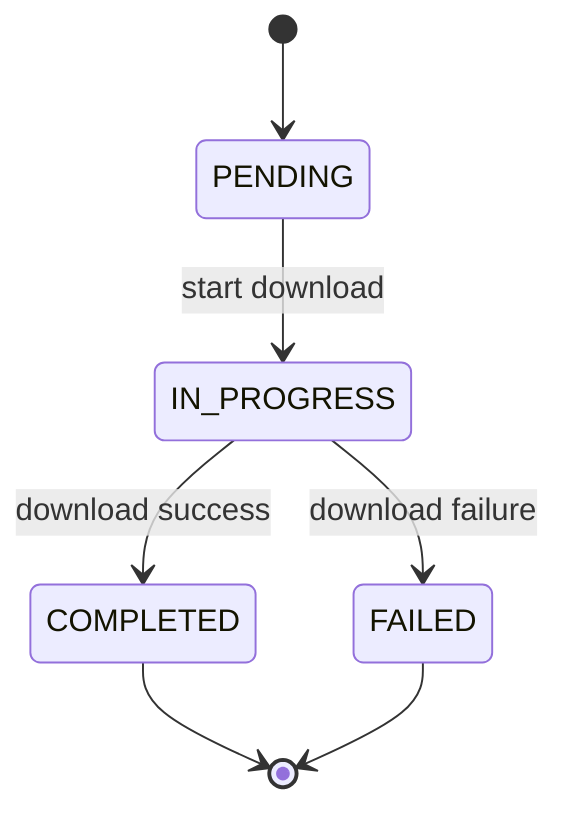
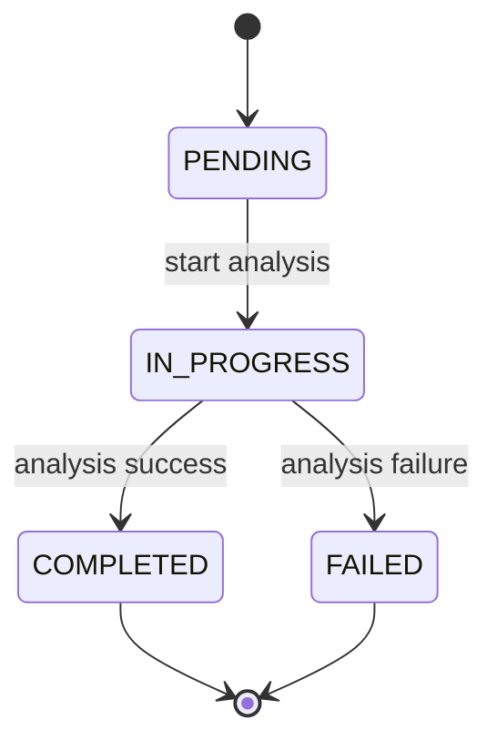
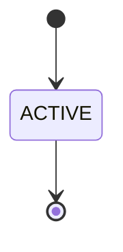
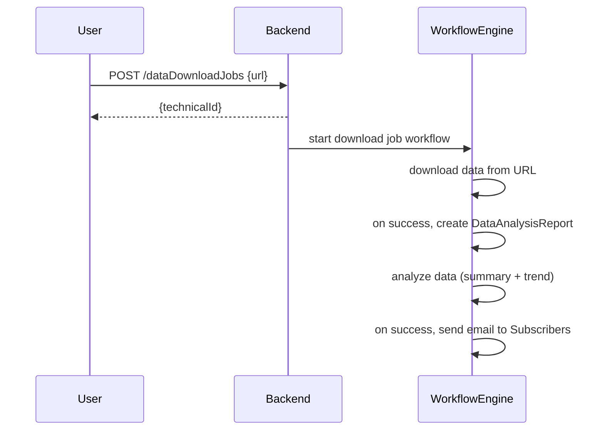

### 1. Entity Definitions

```
DataDownloadJob:
- url: String (URL to download the data from)
- status: String (Job status, e.g., PENDING, IN_PROGRESS, COMPLETED, FAILED)
- createdAt: String (Timestamp when job was created)
- completedAt: String (Timestamp when job was completed)

DataAnalysisReport:
- jobId: String (Reference to DataDownloadJob's technicalId)
- summaryStatistics: String (Serialized summary statistics result)
- trendAnalysis: String (Serialized trend analysis result)
- status: String (Report generation status, e.g., PENDING, COMPLETED, FAILED)
- createdAt: String (Timestamp when report was created)

Subscriber:
- email: String (Subscriber email address)
- name: String (Subscriber name)
- subscribedAt: String (Timestamp when subscriber was added)
```

---

### 2. Entity Workflows

```
DataDownloadJob workflow:
1. Initial State: Job created with status = PENDING when user submits URL
2. Processing: System downloads data from the URL → status = IN_PROGRESS
3. Completion: Download completes → status = COMPLETED or FAILED
4. Trigger: On COMPLETED, trigger DataAnalysisReport creation

DataAnalysisReport workflow:
1. Initial State: Report created with status = PENDING linked to DataDownloadJob
2. Processing: Perform predefined analysis (summary statistics, trend analysis)
3. Completion: Analysis completes → status = COMPLETED or FAILED
4. Trigger: On COMPLETED, send report via email to all Subscribers

Subscriber workflow:
1. Initial State: Subscriber created when added via API
2. No automatic workflow triggered on creation unless specified
```

---

### Entity State Diagrams


```mermaid
stateDiagram-v2
    [*] --> PENDING
    PENDING --> IN_PROGRESS : start download
    IN_PROGRESS --> COMPLETED : download success
    IN_PROGRESS --> FAILED : download failure
    COMPLETED --> [*]
    FAILED --> [*]
```


```mermaid
stateDiagram-v2
    [*] --> PENDING
    PENDING --> IN_PROGRESS : start analysis
    IN_PROGRESS --> COMPLETED : analysis success
    IN_PROGRESS --> FAILED : analysis failure
    COMPLETED --> [*]
    FAILED --> [*]
```


```mermaid
stateDiagram-v2
    [*] --> ACTIVE
    ACTIVE --> [*]
```

---

### 3. API Endpoints

- **POST /dataDownloadJobs**
  - Description: Create a new DataDownloadJob by providing the URL to download.
  - Request:
    ```json
    {
      "url": "string"
    }
    ```
  - Response:
    ```json
    {
      "technicalId": "string"
    }
    ```

- **GET /dataDownloadJobs/{technicalId}**
  - Description: Retrieve DataDownloadJob status and details by technicalId.
  - Response:
    ```json
    {
      "url": "string",
      "status": "string",
      "createdAt": "string",
      "completedAt": "string"
    }
    ```

- **GET /dataAnalysisReports/{technicalId}**
  - Description: Retrieve generated analysis report by technicalId.
  - Response:
    ```json
    {
      "jobId": "string",
      "summaryStatistics": "string",
      "trendAnalysis": "string",
      "status": "string",
      "createdAt": "string"
    }
    ```

- **POST /subscribers**
  - Description: Add a new subscriber.
  - Request:
    ```json
    {
      "email": "string",
      "name": "string"
    }
    ```
  - Response:
    ```json
    {
      "technicalId": "string"
    }
    ```

- **GET /subscribers/{technicalId}**
  - Description: Retrieve subscriber details by technicalId.
  - Response:
    ```json
    {
      "email": "string",
      "name": "string",
      "subscribedAt": "string"
    }
    ```

- **POST /subscribers/update**
  - Description: Add a new Subscriber entity reflecting updated subscriber info (following immutable creation principle).
  - Request:
    ```json
    {
      "technicalId": "string",
      "email": "string",
      "name": "string"
    }
    ```
  - Response:
    ```json
    {
      "technicalId": "string"
    }
    ```

- **POST /subscribers/remove**
  - Description: Add a new Subscriber entity reflecting removal (e.g., with a status field), following immutable creation principle.
  - Request:
    ```json
    {
      "technicalId": "string"
    }
    ```
  - Response:
    ```json
    {
      "technicalId": "string"
    }
    ```

---

### 4. Request/Response Flow Diagram for DataDownloadJob POST and Workflow


```mermaid
sequenceDiagram
    participant User
    participant Backend
    participant WorkflowEngine
    User->>Backend: POST /dataDownloadJobs {url}
    Backend-->>User: {technicalId}
    Backend->>WorkflowEngine: start download job workflow
    WorkflowEngine->>WorkflowEngine: download data from URL
    WorkflowEngine->>WorkflowEngine: on success, create DataAnalysisReport
    WorkflowEngine->>WorkflowEngine: analyze data (summary + trend)
    WorkflowEngine->>WorkflowEngine: on success, send email to Subscribers
```

---

This completes the finalized functional requirements specification based on your confirmed details, ready for documentation or implementation.

If you have further changes or additions, please let me know. Otherwise, you may proceed to the next step.