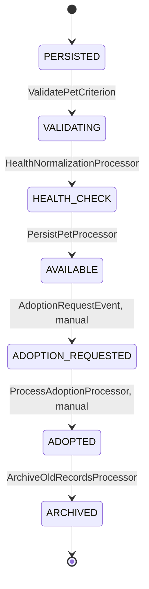
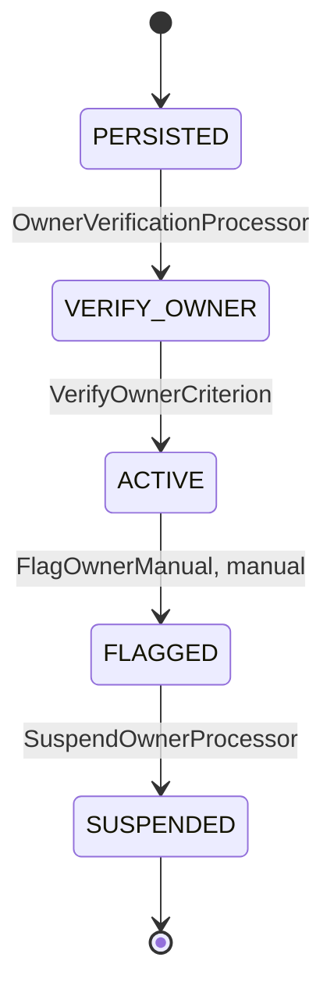
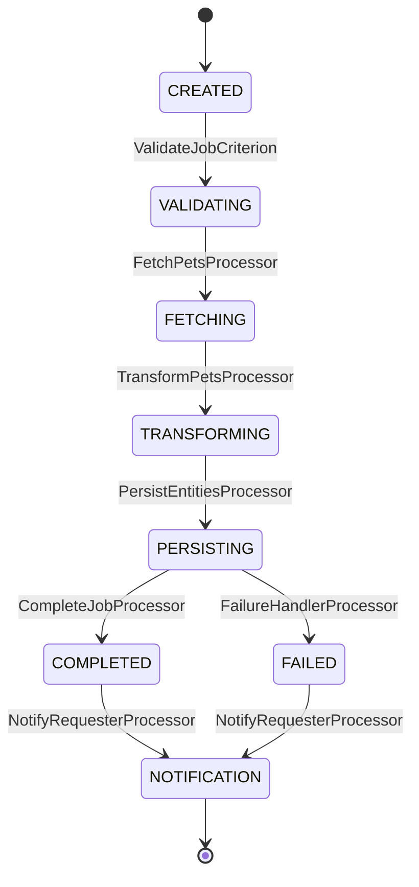

### 1. Entity Definitions
```
Pet:
- id: String (business id from source, e.g., petstore id)
- name: String (pet name)
- species: String (cat, dog, etc.)
- breed: String (breed description)
- ageMonths: Integer (age in months)
- healthStatus: String (brief health note)
- availability: String (available/adopted)
- ownerId: String (reference to Owner.id, nullable)

Owner:
- id: String (business id)
- fullName: String (owner name)
- contactEmail: String (email for notifications)
- contactPhone: String (phone)
- verified: Boolean (owner verification flag)
- adoptedPetIds: List<String> (pet ids adopted)

ImportJob:
- jobId: String (business job id)
- sourceUrl: String (Petstore API base URL)
- filterSpecies: String (optional filter)
- requestedBy: String (user who triggered import)
- createdAt: String (timestamp)
- status: String (PENDING/IN_PROGRESS/COMPLETED/FAILED)
- summary: Object (counts imported/failed)
```

### 2. Entity workflows

Pet workflow:
1. Initial State: PERSISTED (created by ImportJob process)
2. Validation: VALIDATING (automatic) — check required fields, age sanity
3. Health Check: HEALTH_CHECK (automatic) — basic health data normalization
4. AVAILABLE: pet listed for adoption
5. ADOPTION_REQUESTED: manual transition by user to request adoption
6. ADOPTED: owner assigned (manual confirmation)
7. ARCHIVED: automatic/manual cleanup (old/invalid records)


```mermaid
stateDiagram-v2
    [*] --> PERSISTED
    PERSISTED --> VALIDATING : ValidatePetCriterion
    VALIDATING --> HEALTH_CHECK : HealthNormalizationProcessor
    HEALTH_CHECK --> AVAILABLE : PersistPetProcessor
    AVAILABLE --> ADOPTION_REQUESTED : AdoptionRequestEvent, manual
    ADOPTION_REQUESTED --> ADOPTED : ProcessAdoptionProcessor, manual
    ADOPTED --> ARCHIVED : ArchiveOldRecordsProcessor
    ARCHIVED --> [*]
```

Needed processors/criteria: ValidatePetCriterion, HealthNormalizationProcessor, PersistPetProcessor, ProcessAdoptionProcessor, ArchiveOldRecordsProcessor.

Owner workflow:
1. Initial State: PERSISTED (created when adoption processed or imported)
2. VERIFICATION: VERIFY_OWNER (automatic/manual) — email/phone check
3. ACTIVE: owner can adopt
4. FLAGGED: manual (fraud/misuse)
5. SUSPENDED: manual


```mermaid
stateDiagram-v2
    [*] --> PERSISTED
    PERSISTED --> VERIFY_OWNER : OwnerVerificationProcessor
    VERIFY_OWNER --> ACTIVE : VerifyOwnerCriterion
    ACTIVE --> FLAGGED : FlagOwnerManual, manual
    FLAGGED --> SUSPENDED : SuspendOwnerProcessor
    SUSPENDED --> [*]
```

Needed: OwnerVerificationProcessor, VerifyOwnerCriterion, SuspendOwnerProcessor.

ImportJob workflow:
1. Initial State: CREATED (POST triggers event)
2. VALIDATING: validate job parameters (automatic)
3. FETCHING: call Petstore API and retrieve data (automatic)
4. TRANSFORMING: map source fields to Pet entity (automatic)
5. PERSISTING: create Pet (and Owner) entities (automatic)
6. COMPLETED or FAILED: finish with summary
7. NOTIFICATION: notify requester (automatic)


```mermaid
stateDiagram-v2
    [*] --> CREATED
    CREATED --> VALIDATING : ValidateJobCriterion
    VALIDATING --> FETCHING : FetchPetsProcessor
    FETCHING --> TRANSFORMING : TransformPetsProcessor
    TRANSFORMING --> PERSISTING : PersistEntitiesProcessor
    PERSISTING --> COMPLETED : CompleteJobProcessor
    PERSISTING --> FAILED : FailureHandlerProcessor
    COMPLETED --> NOTIFICATION : NotifyRequesterProcessor
    NOTIFICATION --> [*]
    FAILED --> NOTIFICATION : NotifyRequesterProcessor
```

Needed: ValidateJobCriterion, FetchPetsProcessor, TransformPetsProcessor, PersistEntitiesProcessor, CompleteJobProcessor, FailureHandlerProcessor, NotifyRequesterProcessor.

### 3. Pseudo code for processor classes
```text
ValidateJobCriterion:
  if job.sourceUrl missing or invalid -> mark job FAILED reason
  else pass

FetchPetsProcessor:
  call sourceUrl with filterSpecies -> return list of rawPets
  attach rawPets to job.context

TransformPetsProcessor:
  for each raw in job.context.rawPets:
    map fields -> Pet record
    sanitize age -> ensure integer
    create Owner record if owner info present
  attach transformed list to job.context

PersistEntitiesProcessor:
  for each pet in transformed list:
    save pet (triggers Pet workflow PERSISTED)
    if owner created save owner (triggers Owner workflow PERSISTED)
  update job.summary counts

ProcessAdoptionProcessor:
  validate owner ACTIVE
  set pet.ownerId = owner.id
  set pet.availability = ADOPTED
  update owner.adoptedPetIds

NotifyRequesterProcessor:
  build summary message and send to requestedBy (email/event)
```

Note: All processors/criteria are invoked by Cyoda when entity persistence triggers workflows.

### 4. API Endpoints Design Rules

- POST /import-jobs
  - Creates ImportJob entity (triggers ImportJob workflow)
  - Request:
```json
{
  "sourceUrl": "https://petstore.example/api/pets",
  "filterSpecies": "cat",
  "requestedBy": "alice@example.com"
}
```
  - Response (must return only technicalId):
```json
{ "technicalId": "job-1234" }
```

- GET /import-jobs/{technicalId}
  - Response:
```json
{
  "technicalId": "job-1234",
  "jobId": "import-2025-08-29-1",
  "sourceUrl": "...",
  "status": "COMPLETED",
  "summary": { "imported": 42, "failed": 1 },
  "createdAt": "2025-08-29T12:00:00Z"
}
```

- GET /pets/{technicalId}
```json
{
  "technicalId": "pet-5678",
  "id": "5678",
  "name": "Mittens",
  "species": "cat",
  "breed": "Tabby",
  "ageMonths": 24,
  "healthStatus": "Vaccinated",
  "availability": "AVAILABLE",
  "ownerId": null
}
```

- GET /owners/{technicalId}
```json
{
  "technicalId": "owner-9012",
  "id": "9012",
  "fullName": "Jane Doe",
  "contactEmail": "jane@example.com",
  "verified": true,
  "adoptedPetIds": ["5678"]
}
```

Questions to refine requirements:
- Do you want adoption requests to be created via a POST endpoint (user-initiated), or handled purely as manual transitions in the UI/operations?
- Any extra metadata from Petstore API to persist (images, description) or keep minimal as above?
- Do you want scheduled/recurrent import jobs or only ad-hoc triggered imports?

I can update entities, workflows, and processors based on your answers and prepare Cyoda-ready workflow names.