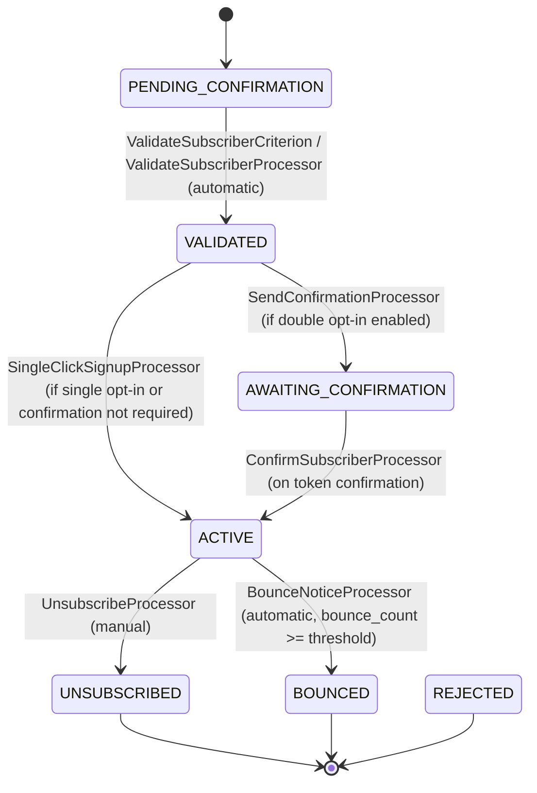
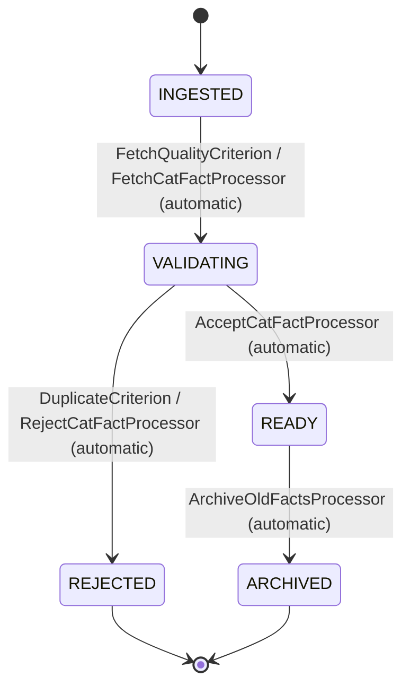
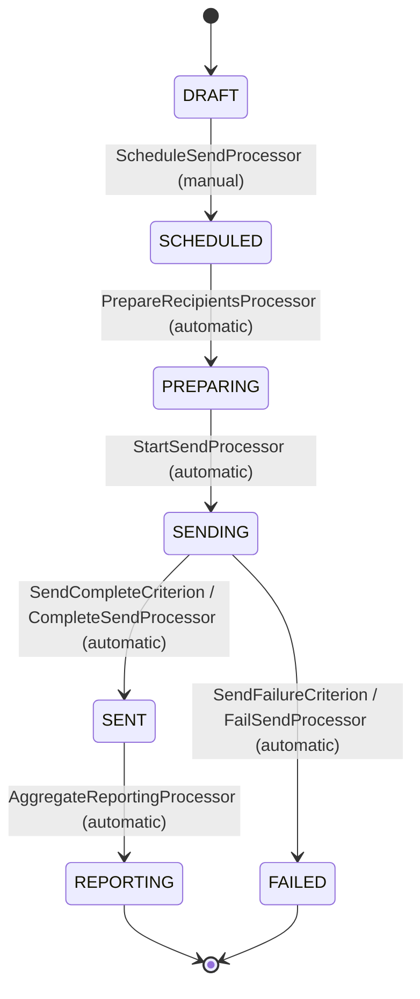

# Functional Requirements — CatFacts Weekly Send Prototype

Last updated: 2025-08-18

This document defines the entities, workflows, processors, criteria, pseudocode sketches and API contracts used by the CatFacts weekly send prototype. It updates and clarifies logic present in earlier drafts to ensure consistent behavior, unambiguous state transitions, and well-defined API responses.

---

## 1. Entity Definitions
All timestamps are ISO 8601 (UTC preferred). All string IDs are stable domain ids (UUIDs recommended).

### Subscriber
- id: String (domain id for subscriber record)
- technicalId: String (internal/POST-returned id; may equal id)
- email: String (normalized, lowercased)
- name: String (optional display name)
- status: String enum: pending_confirmation | validated | awaiting_confirmation | active | unsubscribed | bounced | rejected
- subscribed_date: String (ISO timestamp; set when status becomes active)
- unsubscribed_date: String (ISO timestamp)
- consent_given: Boolean (explicit opt-in flag)
- last_interaction_date: String (ISO timestamp; latest open/click/unsubscribe/bounce)
- bounce_count: Integer (number of bounce events observed)
- metadata: Map<String,String> (optional, free-form)

Notes:
- Email must be stored normalized (trim, lowercased) and deduplicated by normalized email.
- Duplicate POST attempts should be idempotent: if email already exists the API should return the existing technicalId (see API rules).

### CatFact
- id: String (domain id for the fact)
- text: String (cat fact content)
- source: String (source name or api endpoint)
- retrieved_date: String (ISO timestamp)
- fact_date: String|null (date provided by source if any)
- archived: Boolean (historical archive flag)
- status: String enum: ingested | validating | ready | rejected | archived
- text_hash: String (normalized content hash for duplicate detection)
- metadata: Map<String,String>

Notes:
- Facts are created by ingestion. Manual creation via API is not provided in V1.
- Duplicate detection uses a normalized hash of content and may include near-duplicate checks.

### WeeklySend
- id: String (domain id for this send/campaign)
- technicalId: String (POST-returned id)
- catfact_id: String (links to CatFact.id)
- scheduled_date: String (planned send date ISO)
- actual_send_date: String (when send occurred ISO)
- recipients_count: Integer
- opens_count: Integer
- clicks_count: Integer
- unsubscribes_count: Integer
- bounces_count: Integer
- status: String enum: draft | scheduled | preparing | sending | sent | failed | reporting
- error_details: String|null
- created_date: String (ISO timestamp)

Notes:
- WeeklySend is an orchestration entity. Per-recipient delivery records are created internally (delivery record statuses: queued | sent | delivered | failed | bounced | opened | clicked | unsubscribed). Delivery records are not top-level entities in V1 but are used by processors and reporting.

---

## 2. Workflows and State Transitions
This section clarifies transition conditions, automatic vs manual transitions, and configurable thresholds.

### Subscriber workflow
Purpose: validate and activate subscribers, handle unsubscribes and bounces.

Core steps:
1. Creation: POST /subscribers creates or returns existing subscriber (see API rules). New subscribers enter status = pending_confirmation by default.
2. Validation: system validates email format and uniqueness. If invalid, mark status = rejected and emit validation_error.
3. Confirmation: if double opt-in enabled and consent_given = true, send confirmation and move to awaiting_confirmation. If single opt-in configured (or confirmation is not required), move to active.
4. Activation: when confirmed (user clicks token) or when single opt-in flow completes, set status = active and set subscribed_date.
5. Interaction updates: opens/clicks/unsubscribes/bounces update last_interaction_date. Unsubscribe sets unsubscribed_date.
6. Bounce escalation: maintain bounce_count; when bounce_count >= BOUNCE_THRESHOLD (configurable, default 3) set status = bounced.
7. Deactivation: manual unsubscribe or bounce threshold → unsubscribed or bounced.

Subscriber states (enumerated): pending_confirmation -> validated -> awaiting_confirmation -> active -> unsubscribed/bounced/rejected

Mermaid (state diagram overview):


```mermaid
stateDiagram-v2
    [*] --> PENDING_CONFIRMATION
    PENDING_CONFIRMATION --> VALIDATED : ValidateSubscriberCriterion / ValidateSubscriberProcessor (automatic)
    VALIDATED --> AWAITING_CONFIRMATION : SendConfirmationProcessor (if double opt-in enabled)
    VALIDATED --> ACTIVE : SingleClickSignupProcessor (if single opt-in or confirmation not required)
    AWAITING_CONFIRMATION --> ACTIVE : ConfirmSubscriberProcessor (on token confirmation)
    ACTIVE --> UNSUBSCRIBED : UnsubscribeProcessor (manual)
    ACTIVE --> BOUNCED : BounceNoticeProcessor (automatic, bounce_count >= threshold)
    UNSUBSCRIBED --> [*]
    BOUNCED --> [*]
    REJECTED --> [*]
```

Key rules:
- Duplicate email POST is idempotent and returns existing technicalId (no new duplicate record created).
- ValidateSubscriberCriterion checks normalized email format, checks against blocklists and duplication.
- Consent must be explicit for sending marketing content.

### CatFact workflow
Purpose: ingest facts, dedupe, and prepare content for campaigns.

Core steps:
1. Ingestion: ingestion job creates new CatFact with status = ingested and computed text_hash.
2. Quality checks: validate presence, minimum length, and allowed character set.
3. Duplicate check: compare text_hash (and optionally near-duplicate heuristics) against recent facts. If duplicate -> rejected/archived.
4. Accept: if passes checks, mark status = ready and archived = false.
5. Archive: older facts may be archived by a periodic job.

Mermaid (state diagram):


```mermaid
stateDiagram-v2
    [*] --> INGESTED
    INGESTED --> VALIDATING : FetchQualityCriterion / FetchCatFactProcessor (automatic)
    VALIDATING --> REJECTED : DuplicateCriterion / RejectCatFactProcessor (automatic)
    VALIDATING --> READY : AcceptCatFactProcessor (automatic)
    READY --> ARCHIVED : ArchiveOldFactsProcessor (automatic)
    REJECTED --> [*]
    ARCHIVED --> [*]
```

Key rules:
- Minimum text length and duplication rules are configurable.
- Duplicate facts are marked rejected/archived and not used in campaigns.

### WeeklySend workflow
Purpose: create, schedule and dispatch weekly sends; collect metrics.

Core steps:
1. Create: POST /weekly-sends creates a WeeklySend in draft or scheduled state depending on presence of scheduled_date.
2. Schedule: explicit scheduling sets scheduled_date and moves to scheduled.
3. Prepare: query active subscribers with consent_given = true and status = active (exclude unsubscribed/bounced/rejected); build delivery records and set recipients_count.
4. Send: dispatch emails via sending provider. Mark weeklySend.status = sending.
5. Partial failures: track per-delivery failures and retry based on policy (configurable retries). If final unresolved errors exceed failure thresholds, mark overall send as failed (or keep sent with partial failure depending on policy).
6. Complete: when all deliveries reach a final delivery state (delivered/failed/bounced) mark weeklySend as sent and set actual_send_date.
7. Reporting: aggregate opens/clicks/unsubscribes/bounces to update metrics; set status = reporting or finalize as required.

Mermaid (state diagram):


```mermaid
stateDiagram-v2
    [*] --> DRAFT
    DRAFT --> SCHEDULED : ScheduleSendProcessor (manual)
    SCHEDULED --> PREPARING : PrepareRecipientsProcessor (automatic)
    PREPARING --> SENDING : StartSendProcessor (automatic)
    SENDING --> SENT : SendCompleteCriterion / CompleteSendProcessor (automatic)
    SENDING --> FAILED : SendFailureCriterion / FailSendProcessor (automatic)
    SENT --> REPORTING : AggregateReportingProcessor (automatic)
    REPORTING --> [*]
    FAILED --> [*]
```

Key rules:
- Recipient resolution excludes subscribers with status != active and consent_given != true.
- Delivery records are the source of truth for SendCompleteCriterion (no pending deliveries).
- Retry and failure thresholds are configurable. A send may be marked sent even if some recipients failed; detailed error counts are stored.

---

## 3. Processors & Criteria (Descriptions and Pseudocode)
These are functional pseudocode sketches; actual implementations should handle transactions, idempotency, retries and observability.

### ValidateSubscriberProcessor
Purpose: check format, duplication and blocklists.

Pseudocode:
```
function process_new_subscriber(payload):
    normalizedEmail = normalize(payload.email)
    existing = findSubscriberByEmail(normalizedEmail)
    if existing != null:
        // Idempotent create: return existing. Do not create duplicate.
        return existing.technicalId

    if not isValidEmail(normalizedEmail) or isBlocked(normalizedEmail):
        subscriber = createSubscriber(email=normalizedEmail, status='rejected')
        emitEvent('validation_error', subscriber.id)
        return subscriber.technicalId

    subscriber = createSubscriber(email=normalizedEmail, name=payload.name, consent_given=payload.consent_given, status='validated')
    if config.double_opt_in and payload.consent_given:
        // move to awaiting confirmation and send token
        subscriber.status = 'awaiting_confirmation'
        persist(subscriber)
        enqueue SendConfirmationProcessor(subscriber.id)
    else:
        // single opt-in or no confirmation required
        subscriber.status = 'active'
        subscriber.subscribed_date = now()
        persist(subscriber)
    return subscriber.technicalId
```

### SendConfirmationProcessor
```
function process(subscriberId):
    token = generateConfirmationToken(subscriberId)
    createEmailEvent(recipient=subscriber.email, template='confirmation', token=token)
    // status already set to awaiting_confirmation by validator
```

### ConfirmSubscriberProcessor
```
function process(token):
    subscriber = lookupByToken(token)
    if subscriber == null: emit invalid_token
    else:
        subscriber.status = 'active'
        subscriber.subscribed_date = now()
        persist(subscriber)
```

### BounceNoticeProcessor
```
function process(bounceEvent):
    subscriber = findSubscriberByEmail(normalize(bounceEvent.email))
    if subscriber == null: return
    subscriber.bounce_count += 1
    subscriber.last_interaction_date = now()
    if subscriber.bounce_count >= config.BOUNCE_THRESHOLD:
        subscriber.status = 'bounced'
        subscriber.unsubscribed_date = now()
    persist(subscriber)
```

### FetchCatFactProcessor
```
function process(ingestionJob):
    factData = callExternalApi()
    text = normalizeText(factData.text)
    textHash = hash(text)
    create CatFact with status='ingested', text=text, text_hash=textHash, source=factData.source, retrieved_date=now()
    // trigger validator
```

### AcceptCatFactProcessor / RejectCatFactProcessor
```
function validateCatFact(catFact):
    if text.length < config.MIN_FACT_LENGTH: reject
    if isDuplicateHash(catFact.text_hash): reject (mark archived/rejected)
    else accept (status = 'ready')
```

### PrepareRecipientsProcessor
```
function process(weeklySend):
    subscribers = query Subscribers where status == 'active' and consent_given == true
    weeklySend.recipients_count = subscribers.size

    for s in subscribers:
        createDeliveryRecord(weeklySend.id, subscriberId=s.id, email=s.email, status='queued')
    persist(weeklySend)
```

### StartSendProcessor
```
function process(weeklySend):
    weeklySend.status = 'sending'
    persist(weeklySend)
    for delivery in queryDeliveries(weeklySend.id, status='queued'):
        enqueue EmailEvent(recipient=delivery.email, body=compose(catfact, subscriber))
        mark delivery.status = 'sent' // or 'dispatched' depending on provider
    persistAll(deliveries)
```

### AggregateReportingProcessor
```
function process(weeklySend):
    weeklySend.opens_count = countEvents('open', weeklySend.id)
    weeklySend.clicks_count = countEvents('click', weeklySend.id)
    weeklySend.unsubscribes_count = countEvents('unsubscribe', weeklySend.id)
    weeklySend.bounces_count = countEvents('bounce', weeklySend.id)
    weeklySend.status = 'sent'
    weeklySend.actual_send_date = weeklySend.actual_send_date ?? now()
    persist(weeklySend)
```

Criteria examples:
- ValidateSubscriberCriterion: true if normalized email format OK and not blocked.
- DuplicateCriterion (CatFact): true if text_hash exists in recent facts window.
- SendCompleteCriterion: true if all delivery records are in a final state (delivered|failed|bounced).
- SendFailureCriterion: true if failed deliveries exceed configured percentage threshold.

---

## 4. API Endpoints Design Rules
Rules and rationale:
- POST endpoints create entities and MUST return only a JSON with technicalId (id returned is the stable identifier clients should store). If the create is idempotent due to duplication, the existing technicalId is returned with 200/201 as appropriate.
- GET by technicalId is available for entities created via POST. Collection GETs (list by condition) are intentionally omitted in V1 but can be added later.
- POSTs must be idempotent for safe retries: duplicate creation attempts (same normalized email for subscribers or same ingestion batch for CatFacts) should not create duplicates.
- All requests and responses use JSON and ISO 8601 timestamps.

Endpoints (V1)

1) POST /subscribers
- Purpose: user signup (creates Subscriber entity, triggers Subscriber workflow)
- Request JSON:
{
  "email": "alice@example.com",
  "name": "Alice",
  "consent_given": true
}
- Behavior:
  - Normalize email and deduplicate. If a subscriber with the normalized email exists, return the existing technicalId (HTTP 200 or 409-based policy; prefer 200 with existing id for idempotency).
  - If email invalid or blocked, create subscriber with status 'rejected' and return technicalId (client should be informed via event/notification flow).
- Response JSON:
{
  "technicalId": "string"
}

2) GET /subscribers/{technicalId}
- Purpose: retrieve stored subscriber record
- Response JSON (example):
{
  "technicalId": "string",
  "id": "string",
  "email": "alice@example.com",
  "name": "Alice",
  "status": "active",
  "subscribed_date": "2025-08-01T00:00:00Z",
  "consent_given": true,
  "last_interaction_date": "2025-08-07T12:00:00Z",
  "bounce_count": 0
}

3) POST /weekly-sends
- Purpose: create a WeeklySend orchestration (manual trigger or scheduled job creates same entity). Creates WeeklySend entity and starts its workflow (prepare -> send -> report) depending on scheduled_date.
- Request JSON:
{
  "catfact_id": "string",
  "scheduled_date": "2025-08-15T09:00:00Z" // optional -> immediate or scheduled
}
- Response JSON:
{
  "technicalId": "string"
}

4) GET /weekly-sends/{technicalId}
- Purpose: retrieve send status and metrics
- Response JSON (example):
{
  "technicalId": "string",
  "id": "string",
  "catfact_id": "string",
  "scheduled_date": "2025-08-15T09:00:00Z",
  "actual_send_date": "2025-08-15T09:05:00Z",
  "recipients_count": 1200,
  "opens_count": 300,
  "clicks_count": 45,
  "unsubscribes_count": 3,
  "bounces_count": 12,
  "status": "sent",
  "error_details": null
}

5) GET /catfacts/{id}
- Purpose: read stored cat fact (no POST - facts created by ingestion workflow in V1)
- Response JSON (example):
{
  "id": "string",
  "text": "Cats sleep 70% of their lives.",
  "source": "CatFactAPI",
  "retrieved_date": "2025-08-14T00:00:00Z",
  "archived": false,
  "status": "ready"
}

---

## 5. Operational Notes, Configuration and Assumptions
- BOUNCE_THRESHOLD default: 3 (configurable).
- MIN_FACT_LENGTH default: 20 characters (configurable).
- Double opt-in is configurable per deployment; system defaults should be explicit in config.
- Delivery provider integration must provide delivery/bounce/open/click callbacks to update delivery records and aggregated metrics.
- All events (creates, validation errors, confirmations, bounces, opens, clicks) should be emitted to the platform event bus for downstream consumers and analytics.
- If you want explicit delivery record APIs, lists (GET /subscribers?status=active), or additional entities (eg. SuppressionList, Template, Delivery), I can extend the model (up to 10 entities).

---

If you want I can also:
- produce an ER diagram or OpenAPI spec for the current API surface,
- add an explicit Delivery entity as a first-class API resource,
- convert these pseudocode sketches into skeleton Java/Cyoda processors.

