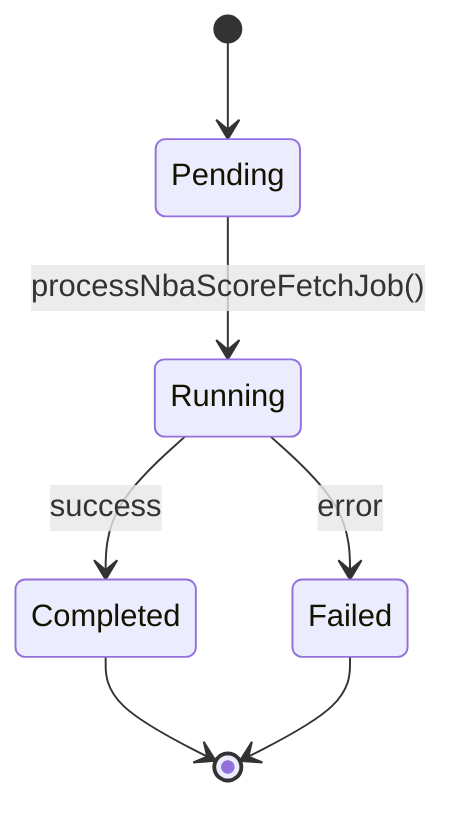
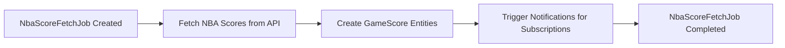
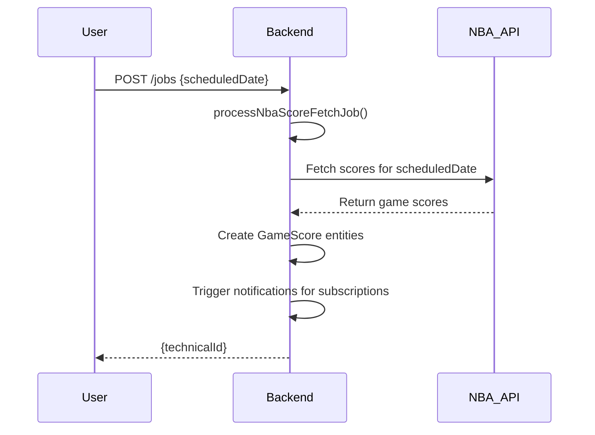

### 1. Entity Definitions

``` 
NbaScoreFetchJob:
- jobId: String (unique job identifier)
- scheduledDate: LocalDate (date for which NBA scores are fetched)
- status: JobStatusEnum (PENDING, RUNNING, COMPLETED, FAILED)
- createdAt: LocalDateTime (job creation timestamp)

GameScore:
- gameId: String (unique NBA game identifier)
- gameDate: LocalDate (date of the game)
- homeTeam: String (home team name)
- awayTeam: String (away team name)
- homeScore: Integer (home team final score)
- awayScore: Integer (away team final score)
- status: GameStatusEnum (SCHEDULED, COMPLETED, POSTPONED)

Subscription:
- subscriptionId: String (unique subscription identifier)
- userId: String (user identifier)
- team: String (team subscribed to, nullable for general NBA notifications)
- notificationType: NotificationTypeEnum (GAME_START, GAME_END, SCORE_THRESHOLD)
- channel: NotificationChannelEnum (EMAIL, SMS, PUSH)
- status: SubscriptionStatusEnum (ACTIVE, INACTIVE)
- createdAt: LocalDateTime (subscription creation timestamp)
```

---

### 2. Process Method Flows

``` 
processNbaScoreFetchJob() Flow:
1. Initial State: NbaScoreFetchJob created with PENDING status.
2. Fetching: Call external NBA API to retrieve game scores for scheduledDate.
3. Persistence: Create immutable GameScore entities for each fetched game.
4. Completion: Update NbaScoreFetchJob status to COMPLETED or FAILED.
5. Trigger Notifications: For each new GameScore, trigger notification events based on active Subscriptions.

processGameScore() Flow:
1. Initial State: GameScore entity created with status SCHEDULED or COMPLETED.
2. Validation: Validate score data consistency and completeness.
3. Processing: Update any derived data or trigger downstream processes (e.g., notifications).
4. Completion: Mark GameScore as COMPLETED if final data received.

processSubscription() Flow:
1. Initial State: Subscription entity created with ACTIVE status.
2. Validation: Check subscription fields (valid userId, team exists, etc.).
3. Processing: Register subscription for event notifications.
4. Completion: Subscription ready to receive notifications.
```

---

### 3. API Endpoints

| Method | Path                          | Description                                     | Request Body                     | Response                      |
|--------|-------------------------------|------------------------------------------------|---------------------------------|-------------------------------|
| POST   | /jobs                         | Create a new NBA Score Fetch Job (triggers fetch) | `{ "scheduledDate": "YYYY-MM-DD" }` | `{ "technicalId": "jobId" }`  |
| GET    | /jobs/{technicalId}            | Retrieve Job status and details                 | N/A                             | Full NbaScoreFetchJob entity (excluding technicalId) |
| GET    | /games/{technicalId}           | Retrieve single GameScore by ID                  | N/A                             | Full GameScore entity          |
| POST   | /subscriptions                | Create a new Subscription                        | `{ "userId": "...", "team": "...", "notificationType": "...", "channel": "..." }` | `{ "technicalId": "subscriptionId" }` |
| GET    | /subscriptions/{technicalId}   | Retrieve Subscription by ID                      | N/A                             | Full Subscription entity       |

---

### 4. Request/Response Formats

**POST /jobs Request Example:**

```json
{
  "scheduledDate": "2024-06-10"
}
```

**POST /jobs Response Example:**

```json
{
  "technicalId": "job_1234abcd"
}
```

**GET /jobs/{technicalId} Response Example:**

```json
{
  "jobId": "job_1234abcd",
  "scheduledDate": "2024-06-10",
  "status": "COMPLETED",
  "createdAt": "2024-06-10T05:00:00"
}
```

**POST /subscriptions Request Example:**

```json
{
  "userId": "user_5678",
  "team": "Lakers",
  "notificationType": "GAME_END",
  "channel": "EMAIL"
}
```

**POST /subscriptions Response Example:**

```json
{
  "technicalId": "sub_7890efgh"
}
```

---

### Visual Representations

#### Entity Lifecycle State Diagram (NbaScoreFetchJob)


```mermaid
stateDiagram-v2
    [*] --> Pending
    Pending --> Running : processNbaScoreFetchJob()
    Running --> Completed : success
    Running --> Failed : error
    Completed --> [*]
    Failed --> [*]
```

#### Event-Driven Processing Chain


```mermaid
graph LR
    JobCreated[NbaScoreFetchJob Created] --> FetchAPI[Fetch NBA Scores from API]
    FetchAPI --> CreateScores[Create GameScore Entities]
    CreateScores --> NotifySubs[Trigger Notifications for Subscriptions]
    NotifySubs --> JobCompleted[NbaScoreFetchJob Completed]
```

#### User Interaction Sequence Flow


```mermaid
sequenceDiagram
    participant User
    participant Backend
    User->>Backend: POST /jobs {scheduledDate}
    Backend->>Backend: processNbaScoreFetchJob()
    Backend->>NBA_API: Fetch scores for scheduledDate
    NBA_API-->>Backend: Return game scores
    Backend->>Backend: Create GameScore entities
    Backend->>Backend: Trigger notifications for subscriptions
    Backend-->>User: {technicalId}
```
