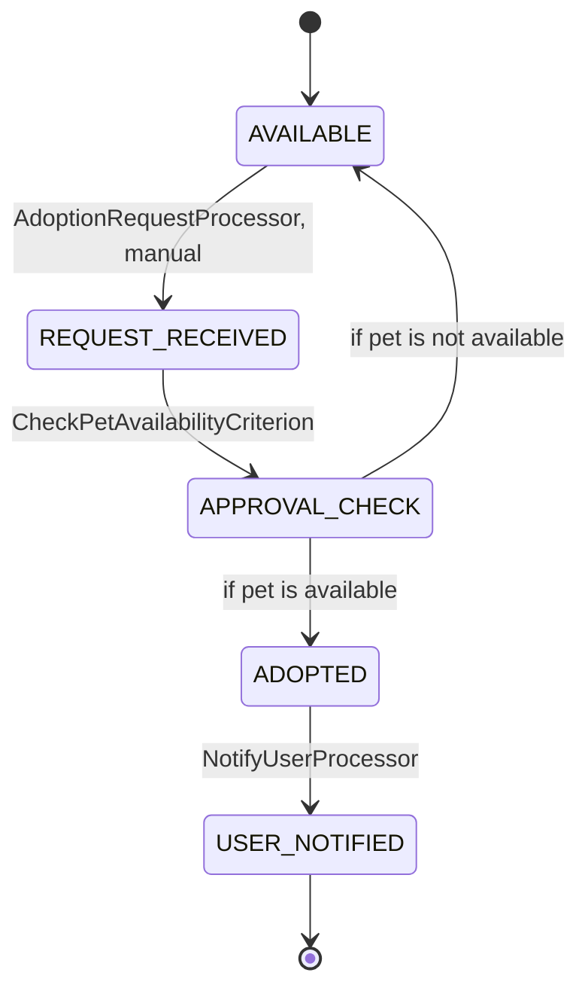
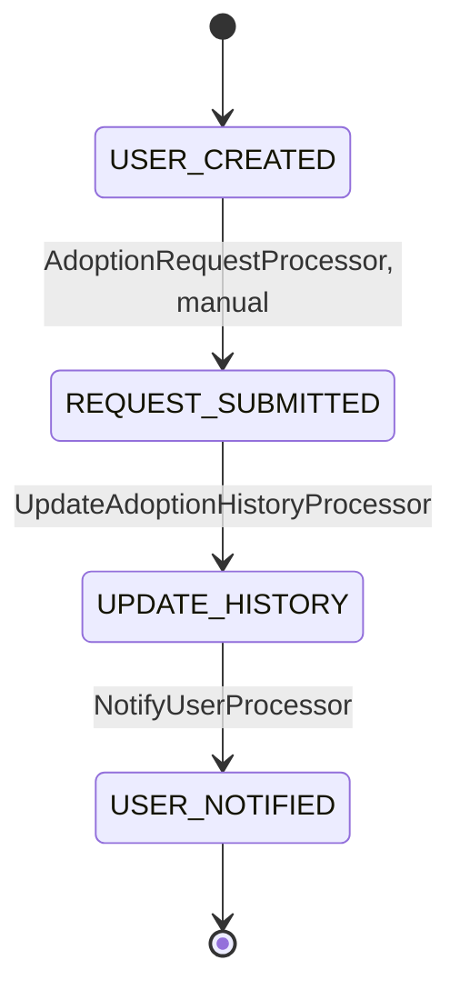
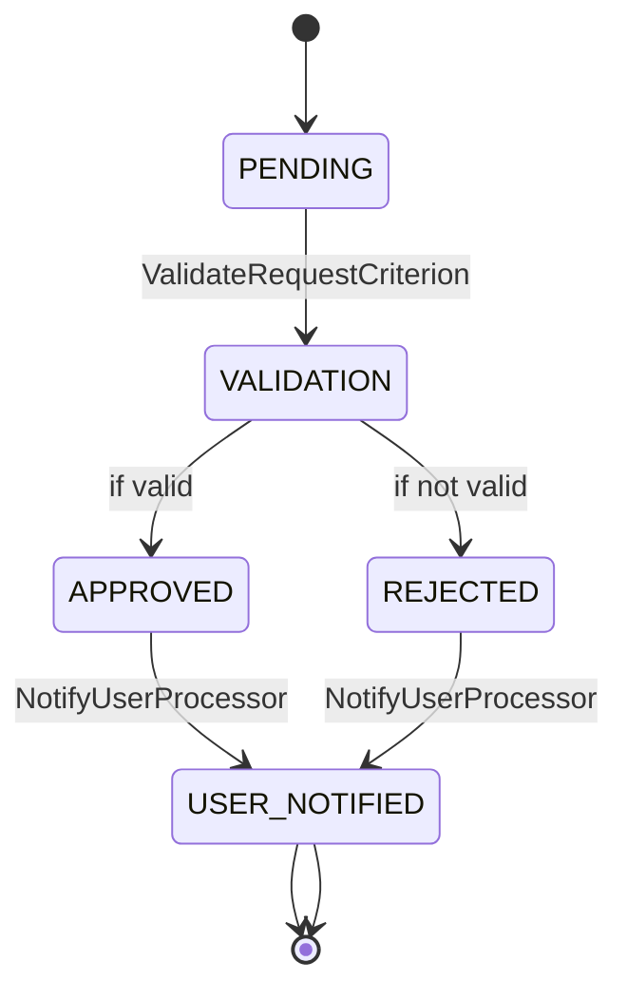

# Functional Requirements for 'Purrfect Pets' API App

This document outlines the functional requirements for the 'Purrfect Pets' API application using an Event-Driven Architecture (EDA) approach.

## 1. Entity Definitions
```
Pet:
- id: String (unique identifier for each pet)
- name: String (name of the pet)
- type: String (type of pet, e.g., cat, dog)
- age: Integer (age of the pet)
- breed: String (breed of the pet)
- status: String (adoption status, e.g., available, adopted)

User:
- id: String (unique identifier for each user)
- username: String (name of the user)
- contactInfo: String (contact details of the user)
- adoptionHistory: List<String> (list of pet IDs the user has adopted)

AdoptionRequest:
- id: String (unique identifier for the adoption request)
- petId: String (ID of the pet being adopted)
- userId: String (ID of the user requesting the adoption)
- status: String (status of the request, e.g., pending, approved, rejected)
- requestDate: Date (date when the request was made)
```

## 2. Entity Workflows

### Pet Workflow
```
1. Initial State: Pet created with AVAILABLE status
2. Adoption Request: User submits an adoption request
3. Approval: Check if pet is still available for adoption
4. Status Update: Update pet status to ADOPTED or remain AVAILABLE
5. Notification: Notify user of approval/rejection
```

### User Workflow
```
1. Initial State: User created
2. Adoption Request: User submits a request to adopt a pet
3. Update History: Add pet ID to adoptionHistory upon successful adoption
4. Notification: Notify user of successful adoption
```

### AdoptionRequest Workflow
```
1. Initial State: Request created with PENDING status
2. Validation: Validate user and pet availability
3. Processing: Update request status to APPROVED or REJECTED
4. Notification: Notify user of request status
```

### State Diagrams


```mermaid
stateDiagram-v2
    [*] --> AVAILABLE
    AVAILABLE --> REQUEST_RECEIVED : AdoptionRequestProcessor, manual
    REQUEST_RECEIVED --> APPROVAL_CHECK : CheckPetAvailabilityCriterion
    APPROVAL_CHECK --> ADOPTED : if pet is available
    APPROVAL_CHECK --> AVAILABLE : if pet is not available
    ADOPTED --> USER_NOTIFIED : NotifyUserProcessor
    USER_NOTIFIED --> [*]
```


```mermaid
stateDiagram-v2
    [*] --> USER_CREATED
    USER_CREATED --> REQUEST_SUBMITTED : AdoptionRequestProcessor, manual
    REQUEST_SUBMITTED --> UPDATE_HISTORY : UpdateAdoptionHistoryProcessor
    UPDATE_HISTORY --> USER_NOTIFIED : NotifyUserProcessor
    USER_NOTIFIED --> [*]
```


```mermaid
stateDiagram-v2
    [*] --> PENDING
    PENDING --> VALIDATION : ValidateRequestCriterion
    VALIDATION --> APPROVED : if valid
    VALIDATION --> REJECTED : if not valid
    APPROVED --> USER_NOTIFIED : NotifyUserProcessor
    USER_NOTIFIED --> [*]
    REJECTED --> USER_NOTIFIED : NotifyUserProcessor
    USER_NOTIFIED --> [*]
```

## 3. Pseudo Code for Each Processor Class
```java
class AdoptionRequestProcessor {
    void process(AdoptionRequest request) {
        // Logic to handle adoption request
    }
}

class NotifyUserProcessor {
    void notify(User user, String message) {
        // Logic to send notification to the user
    }
}

class UpdateAdoptionHistoryProcessor {
    void update(User user, String petId) {
        // Logic to update user's adoption history
    }
}

class CheckPetAvailabilityCriterion {
    boolean check(String petId) {
        // Logic to check if the pet is available for adoption
        return true;
    }
}

class ValidateRequestCriterion {
    boolean validate(AdoptionRequest request) {
        // Logic to validate the adoption request
        return true;
    }
}
```

## 4. API Endpoints Design Rules
- **POST /pets**: Adds a pet. Returns `technicalId`.
- **GET /pets/{technicalId}**: Retrieves pet details by `technicalId`.
- **POST /users**: Adds a user. Returns `technicalId`.
- **GET /users/{technicalId}**: Retrieves user details by `technicalId`.
- **POST /adoptionRequests**: Submits an adoption request. Returns `technicalId`.
- **GET /adoptionRequests/{technicalId}**: Retrieves adoption request details by `technicalId`.

This document provides a clear framework for the 'Purrfect Pets' API app using an Event-Driven Architecture, ensuring all business logic, technical details, entity definitions, events, and API specifications are preserved for direct use in documentation or implementation.