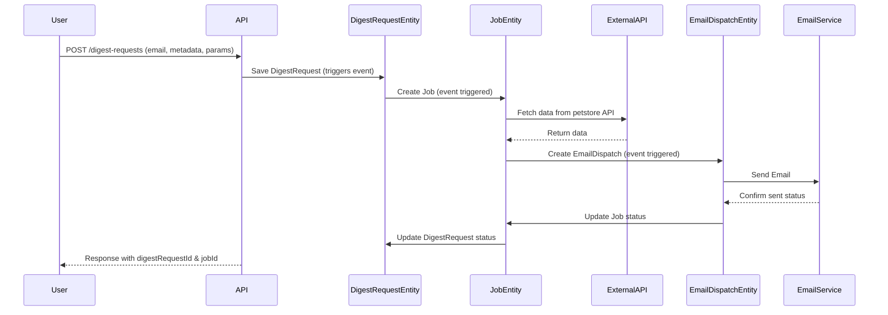

# Functional Requirements for Digest Request Processing (Event-Driven Architecture)

## 1. Business Entities

| Entity Type            | Description                                                  |
|-----------------------|--------------------------------------------------------------|
| **Job** (Orchestration) | Represents a digest processing job triggered by event receipt. Contains status, timestamps, and references to related entities. |
| **DigestRequest** (Business) | Captures incoming digest request details: user email, metadata, and parameters for data retrieval. |
| **EmailDispatch** (Orchestration) | Tracks email sending details, status, and results for each dispatched digest. |

## 2. API Endpoints

### POST Endpoints

- `/digest-requests`  
  *Purpose:* Create or update a DigestRequest entity, triggering the digest processing job.  
  *Request:*  
  ```json
  {
    "email": "user@example.com",
    "metadata": { "key1": "value1", "key2": "value2" },
    "parameters": { "endpoint": "/pet/findByStatus", "query": { "status": "available" } }
  }
  ```  
  *Response:*  
  ```json
  {
    "digestRequestId": "12345",
    "jobId": "67890",
    "status": "CREATED"
  }
  ```

### GET Endpoints

- `/digest-requests/{id}`  
  *Purpose:* Retrieve digest request details and status.  
  *Response:*  
  ```json
  {
    "digestRequestId": "12345",
    "email": "user@example.com",
    "status": "COMPLETED",
    "createdAt": "2024-06-01T12:00:00Z",
    "metadata": { "key1": "value1" }
  }
  ```

- `/email-dispatches/{id}`  
  *Purpose:* Get email dispatch status and delivery details.  
  *Response:*  
  ```json
  {
    "emailDispatchId": "abcde",
    "digestRequestId": "12345",
    "status": "SENT",
    "sentAt": "2024-06-01T12:05:00Z"
  }
  ```

## 3. Event Processing Workflows

- **On `DigestRequest` creation/update:**  
  - Trigger creation of a `Job` entity to orchestrate the processing.  
  - Job state set to `PENDING`.

- **On `Job` creation:**  
  - Process fetch of external API data based on parameters in `DigestRequest`.  
  - Compile data into digest format.  
  - Create `EmailDispatch` entity with status `PENDING`.

- **On `EmailDispatch` creation:**  
  - Send email to the specified address.  
  - Update `EmailDispatch` status to `SENT` or `FAILED`.  
  - Update corresponding `Job` and `DigestRequest` statuses accordingly.

## 4. Request/Response Formats

- Use JSON for all API request and response bodies as shown above.  
- Status fields use simple enums like `CREATED`, `PENDING`, `COMPLETED`, `SENT`, `FAILED`.

---

## Mermaid Diagram: User-App Interaction & Event Processing Flow


```mermaid
sequenceDiagram
    participant User
    participant API
    participant DigestRequestEntity
    participant JobEntity
    participant ExternalAPI
    participant EmailDispatchEntity
    participant EmailService

    User->>API: POST /digest-requests (email, metadata, params)
    API->>DigestRequestEntity: Save DigestRequest (triggers event)
    DigestRequestEntity->>JobEntity: Create Job (event triggered)
    JobEntity->>ExternalAPI: Fetch data from petstore API
    ExternalAPI-->>JobEntity: Return data
    JobEntity->>EmailDispatchEntity: Create EmailDispatch (event triggered)
    EmailDispatchEntity->>EmailService: Send Email
    EmailService-->>EmailDispatchEntity: Confirm sent status
    EmailDispatchEntity->>JobEntity: Update Job status
    JobEntity->>DigestRequestEntity: Update DigestRequest status
    API-->>User: Response with digestRequestId & jobId
```