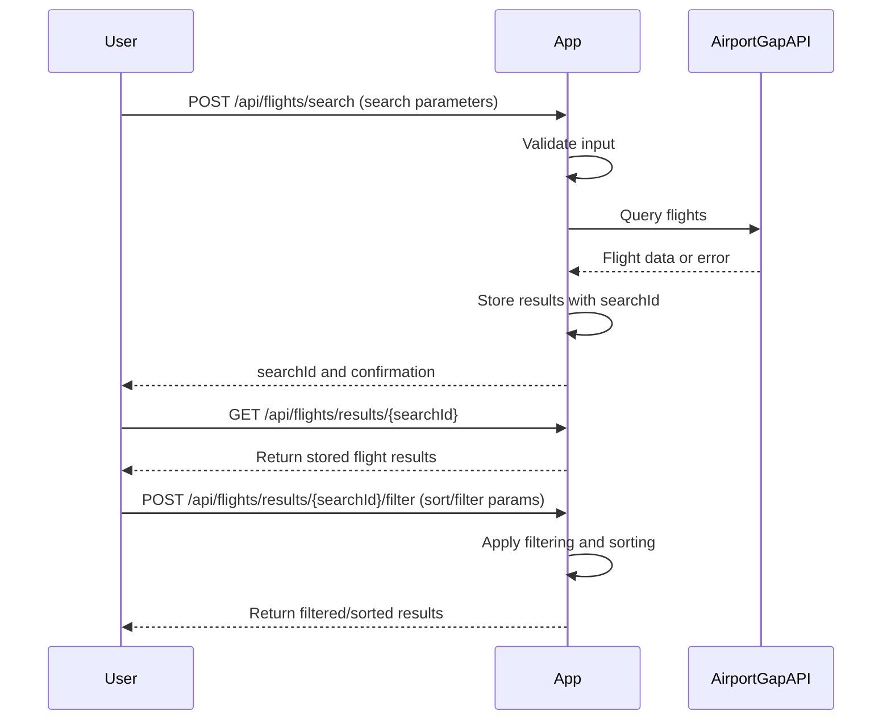

# Flight Search Application - Functional Requirements

## API Endpoints

### 1. POST /api/flights/search
- **Purpose:** Accept user inputs for flight search, invoke Airport Gap API, process and store search results.
- **Request Body (JSON):  
```json
{
  "departureAirport": "string",        // IATA code, e.g., "JFK"
  "arrivalAirport": "string",          // IATA code, e.g., "LAX"
  "departureDate": "YYYY-MM-DD",       // Travel date
  "returnDate": "YYYY-MM-DD|null",     // Optional for round-trip; null if one-way
  "passengers": integer                 // Number of passengers
}
```
- **Response Body (JSON):  
```json
{
  "searchId": "string",                 // Unique identifier for this search
  "resultsCount": integer,
  "message": "string"                   // Success or error message
}
```
- **Business Logic:**  
  - Validate input data (airport codes, date formats, passenger count).  
  - Query Airport Gap API for available flights.  
  - Store results internally linked to `searchId`.  
  - Handle errors such as no flights found or external API failure.

---

### 2. GET /api/flights/results/{searchId}
- **Purpose:** Retrieve stored flight search results by `searchId`.
- **Response Body (JSON):  
```json
{
  "searchId": "string",
  "flights": [
    {
      "flightNumber": "string",
      "airline": "string",
      "departureAirport": "string",
      "arrivalAirport": "string",
      "departureTime": "ISO8601 datetime",
      "arrivalTime": "ISO8601 datetime",
      "price": "decimal"
    }
  ]
}
```
- **Business Logic:**  
  - Return cached search results without querying external API.  
  - Support optional query parameters for sorting and filtering, e.g., `?sort=price_asc&filterAirline=Delta`.

---

### 3. POST /api/flights/results/{searchId}/filter
- **Purpose:** Apply filtering and sorting to stored search results.
- **Request Body (JSON):  
```json
{
  "sortBy": "string",                 // e.g., "price_asc", "departureTime_desc"
  "filters": {                       // Optional filter criteria
    "airlines": ["string"],          // List of airlines to include
    "priceRange": {                  // Price range filter
      "min": "decimal",
      "max": "decimal"
    },
    "departureTimeRange": {          // Time range filter
      "start": "ISO8601 datetime",
      "end": "ISO8601 datetime"
    }
  }
}
```
- **Response Body:** Same as GET /api/flights/results/{searchId}, but filtered and sorted.

---

## User-App Interaction Sequence Diagram


```mermaid
sequenceDiagram
    participant User
    participant App
    participant AirportGapAPI

    User->>App: POST /api/flights/search (search parameters)
    App->>App: Validate input
    App->>AirportGapAPI: Query flights
    AirportGapAPI-->>App: Flight data or error
    App->>App: Store results with searchId
    App-->>User: searchId and confirmation

    User->>App: GET /api/flights/results/{searchId}
    App-->>User: Return stored flight results

    User->>App: POST /api/flights/results/{searchId}/filter (sort/filter params)
    App->>App: Apply filtering and sorting
    App-->>User: Return filtered/sorted results
```
