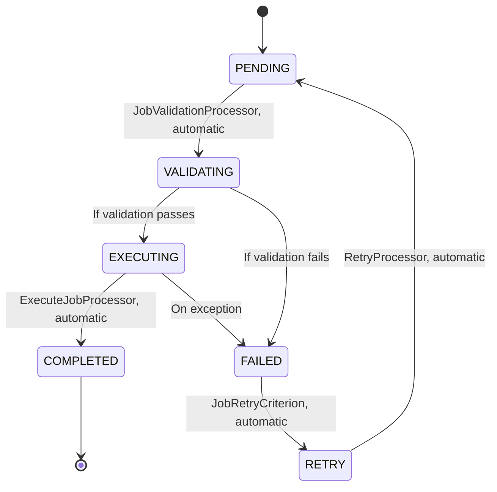
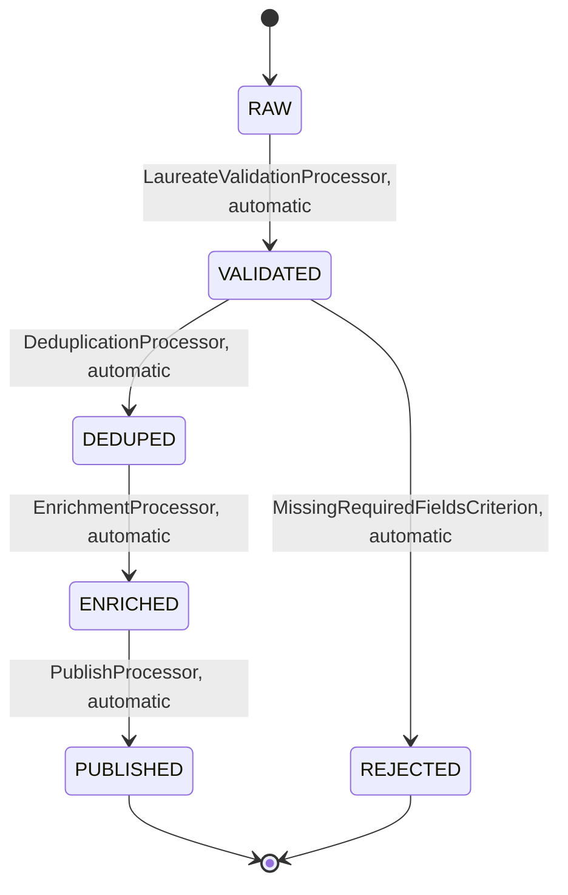
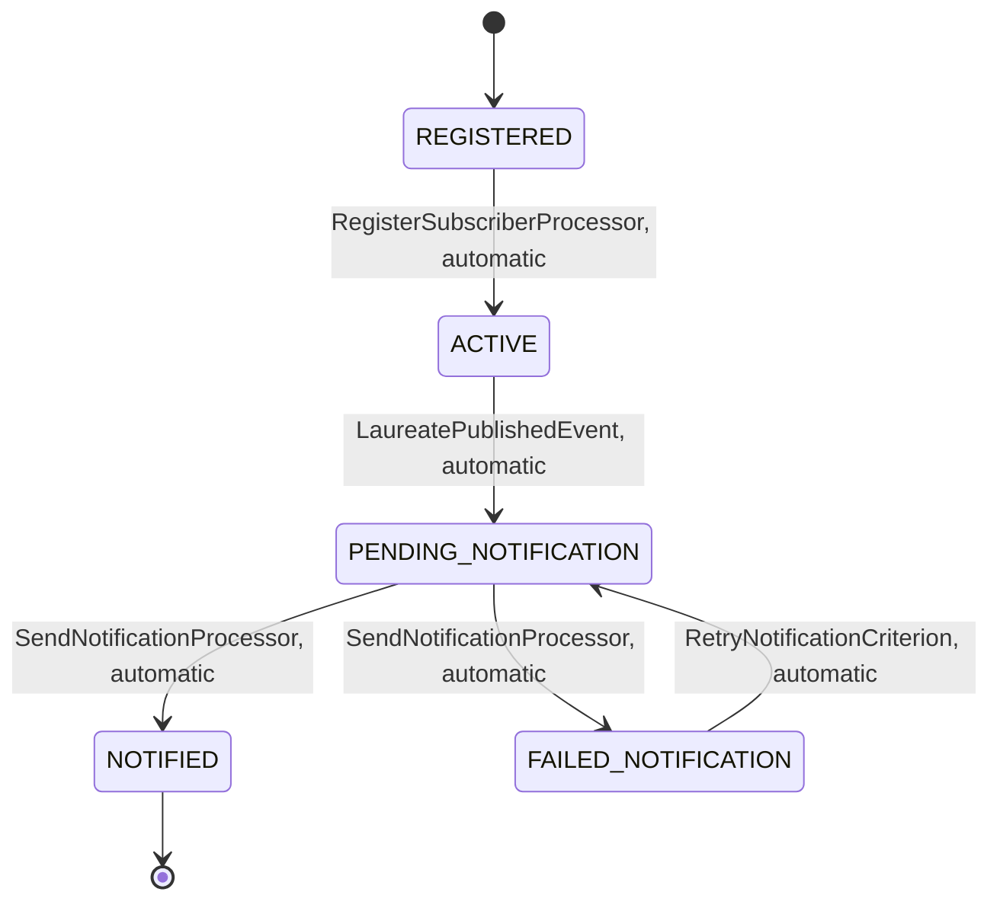

### 1. Entity Definitions
```
Job:
- type: String (job type e.g. INGEST, TRANSFORM, NOTIFY)
- status: String (PENDING RUNNING FAILED COMPLETED)
- createdAt: String (ISO8601 timestamp)
- startedAt: String (ISO8601 timestamp)
- completedAt: String (ISO8601 timestamp)
- attemptCount: Integer (retry attempts)
- payload: Object (input data pointer or inline payload)
- resultRef: String (optional pointer to produced dataset or entity collection)

Laureate:
- id: String (domain id from source or generated)
- sourceRecordId: String (original source identifier)
- fullName: String (person name)
- birthDate: String (ISO date or partial)
- diedDate: String
- birthCity: String
- birthCountry: String
- category: String (prize category)
- year: String (prize year)
- motivation: String
- status: String (RAW VALIDATED ENRICHED PUBLISHED REJECTED)
- createdAt: String (ISO8601)

Subscriber:
- id: String (business id)
- name: String
- contact: Object (email/webhook/sms identifier)
- subscribedCategories: Array of String
- subscribedYearRange: Object (from,to) optional
- active: Boolean
- createdAt: String (ISO8601)
```

### 2. Entity workflows

Job workflow:
1. Initial State: PENDING when Job POSTed (persistence triggers Cyoda process)
2. Validation: automatic JobValidationProcessor checks parameters
3. Execution: automatic processors run per job.type (Ingest, Transform, Notify)
4. Postprocessing: set COMPLETED or FAILED
5. Retry/Escalate: automatic requeue if retry criterion met; manual escalate to ADMIN if max attempts exhausted


```mermaid
stateDiagram-v2
    [*] --> PENDING
    PENDING --> VALIDATING : JobValidationProcessor, automatic
    VALIDATING --> EXECUTING : If validation passes
    VALIDATING --> FAILED : If validation fails
    EXECUTING --> COMPLETED : ExecuteJobProcessor, automatic
    EXECUTING --> FAILED : On exception
    FAILED --> RETRY : JobRetryCriterion, automatic
    RETRY --> PENDING : RetryProcessor, automatic
    COMPLETED --> [*]
```

Job processors and criteria:
- Processors: JobValidationProcessor, IngestProcessor, TransformProcessor, NotifyProcessor, RetryProcessor
- Criteria: JobValidationCriterion, JobRetryCriterion

Laureate workflow:
1. Initial State: RAW when produced by INGEST job (persisted -> Cyoda starts Laureate workflow)
2. Validation: LaureateValidationProcessor verifies required fields
3. Deduplication/Normalization: DeduplicationProcessor removes duplicates and normalizes category/year
4. Enrichment: EnrichmentProcessor adds missing location or canonical category
5. Publication: PublishProcessor marks as PUBLISHED and indexes/records for notifications
6. Rejection: If invalid after attempts, move to REJECTED (manual review possible)


```mermaid
stateDiagram-v2
    [*] --> RAW
    RAW --> VALIDATED : LaureateValidationProcessor, automatic
    VALIDATED --> DEDUPED : DeduplicationProcessor, automatic
    DEDUPED --> ENRICHED : EnrichmentProcessor, automatic
    ENRICHED --> PUBLISHED : PublishProcessor, automatic
    VALIDATED --> REJECTED : MissingRequiredFieldsCriterion, automatic
    PUBLISHED --> [*]
    REJECTED --> [*]
```

Laureate processors and criteria:
- Processors: LaureateValidationProcessor, DeduplicationProcessor, EnrichmentProcessor, PublishProcessor
- Criteria: MissingRequiredFieldsCriterion, IsDuplicateCriterion

Subscriber workflow:
1. Initial State: REGISTERED when POSTed
2. Activation: RegisterSubscriberProcessor sets active=true if verification passes
3. Ready: ACTIVE subscribers evaluate incoming PUBLISHED laureates
4. Pending Notification: EvaluateInterestProcessor creates notification tasks when matches found
5. Notification: SendNotificationProcessor dispatches notifications; FAILED_NOTIFICATION can retry


```mermaid
stateDiagram-v2
    [*] --> REGISTERED
    REGISTERED --> ACTIVE : RegisterSubscriberProcessor, automatic
    ACTIVE --> PENDING_NOTIFICATION : LaureatePublishedEvent, automatic
    PENDING_NOTIFICATION --> NOTIFIED : SendNotificationProcessor, automatic
    PENDING_NOTIFICATION --> FAILED_NOTIFICATION : SendNotificationProcessor, automatic
    FAILED_NOTIFICATION --> PENDING_NOTIFICATION : RetryNotificationCriterion, automatic
    NOTIFIED --> [*]
```

Subscriber processors and criteria:
- Processors: RegisterSubscriberProcessor, EvaluateInterestProcessor, SendNotificationProcessor, RetryNotificationProcessor
- Criteria: SubscriberActiveCriterion, HasMatchesCriterion

### 3. Pseudo code for processor classes

LaureateValidationProcessor
```java
class LaureateValidationProcessor {
  void process(Laureate l) {
    if (l.getFullName() == null || l.getCategory() == null) {
      l.setStatus("REJECTED");
      persist(l);
      return;
    }
    l.setStatus("VALIDATED");
    persist(l);
  }
}
```

DeduplicationProcessor
```java
class DeduplicationProcessor {
  void process(Laureate l) {
    boolean duplicate = lookupBySourceId(l.getSourceRecordId()) || lookupByNameYear(l.getFullName(), l.getYear());
    if (duplicate) {
      markDuplicate(l);
      // either drop or merge depending on rule
      persist(l);
      return;
    }
    l.setStatus("DEDUPED");
    persist(l);
  }
}
```

EnrichmentProcessor
```java
class EnrichmentProcessor {
  void process(Laureate l) {
    if (l.getBirthCountry() == null) {
      String country = inferCountryFromCity(l.getBirthCity());
      if (country != null) l.setBirthCountry(country);
    }
    normalizeCategory(l);
    l.setStatus("ENRICHED");
    persist(l);
  }
}
```

IngestProcessor (job level)
```java
class IngestProcessor {
  void process(Job j) {
    List<Laureate> rows = fetchFromExternalSource(j.payload);
    for (Laureate r : rows) persist(r); // persistence triggers Laureate workflow in Cyoda
    createJob("TRANSFORM", rowsReference);
  }
}
```

NotifyProcessor (job level)
```java
class NotifyProcessor {
  void process(Job j) {
    List<Laureate> laureates = j.payload;
    for (Subscriber s : activeSubscribers()) {
      List<Laureate> matches = filterBySubscriberPreferences(laureates, s);
      if (!matches.isEmpty()) sendNotification(s, matches);
    }
  }
}
```

### 4. API Endpoints Design Rules

Notes:
- Each POST persists an entity -> Cyoda will trigger the entity workflow (event-driven).
- POST responses must return only technicalId (datastore-generated id).
- GET endpoints only for retrieving results. GET by technicalId present for entities created via POST.

Endpoints:

1) Create Job (orchestration)
POST /jobs
Request:
```json
{
  "type": "INGEST",
  "payload": {
    "apiUrl": "https://.../dataset=...",
    "rows": 50
  }
}
```
Response:
```json
{
  "technicalId": "job-123e4567"
}
```

GET /jobs/{technicalId}
Response:
```json
{
  "technicalId": "job-123e4567",
  "type": "INGEST",
  "status": "RUNNING",
  "createdAt": "2025-08-26T12:00:00Z",
  "startedAt": "2025-08-26T12:00:05Z",
  "completedAt": null,
  "attemptCount": 1,
  "payload": { }
}
```

2) Register Subscriber
POST /subscribers
Request:
```json
{
  "id": "sub-42",
  "name": "Alice",
  "contact": { "email": "alice@example.com" },
  "subscribedCategories": ["physics", "chemistry"],
  "active": true
}
```
Response:
```json
{
  "technicalId": "sub-9f8a7b"
}
```

GET /subscribers/{technicalId}
Response:
```json
{
  "technicalId": "sub-9f8a7b",
  "id": "sub-42",
  "name": "Alice",
  "contact": { "email": "alice@example.com" },
  "subscribedCategories": ["physics","chemistry"],
  "active": true,
  "createdAt": "2025-08-26T11:00:00Z"
}
```

3) Retrieve Laureate (read-only; created by INGEST)
GET /laureates/{technicalId}
Response:
```json
{
  "technicalId": "la-0001",
  "id": "rec-abc123",
  "fullName": "Marie Curie",
  "category": "chemistry",
  "year": "1911",
  "status": "PUBLISHED",
  "birthCountry": "Poland",
  "motivation": "in recognition of..."
}
```

Operational rules summary:
- Creating a Job via POST triggers Cyoda to start the Job workflow automatically.
- Persisting Laureate records (by INGEST job) triggers Laureate workflows automatically.
- Subscriber creation via POST triggers Subscriber registration workflow.
- Retry and failure policies are expressed as JobRetryCriterion and RetryProcessor; administrative/manual transitions (e.g., move REJECTED -> VALIDATED after human review) are supported as manual transitions.

If you want, I can now:
- Map these entities/workflows directly into a Cyoda project specification (entities, processors, criteria names) ready for import, or
- Reduce/increase number of processors & criteria per workflow to better match your operational constraints.