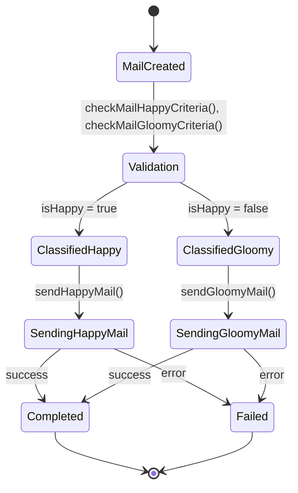
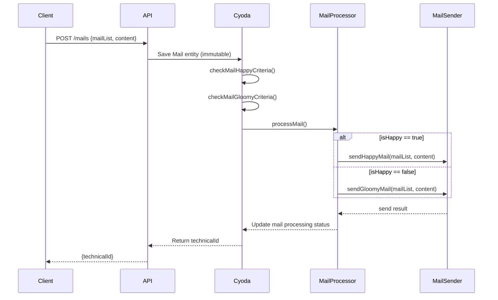
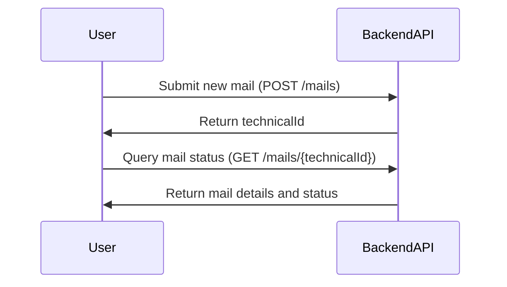

### 1. Entity Definitions

```
Mail:
- isHappy: Boolean (Indicates if the mail is happy (true) or gloomy (false))
- mailList: List<String> (List of recipient email addresses)
- content: String (The actual mail content that will be analyzed and sent)
```

### 2. Process Method Flows

```
processMail() Flow:
1. Initial State: Mail entity created with isHappy unset or preset, mailList and content provided
2. Validation: Run checkMailHappyCriteria() and checkMailGloomyCriteria() to determine if mail is happy or gloomy by analyzing `content`
3. Classification: Set `isHappy` field based on criteria results
4. Processing:
   - If isHappy == true, trigger sendHappyMail processor to send happy mail to all in mailList
   - If isHappy == false, trigger sendGloomyMail processor to send gloomy mail to all in mailList
5. Completion: Mark mail processing as completed (logical state internally or via event)
```

### 3. API Endpoints Design

- **POST /mails**  
  - Description: Create a new Mail entity (adds immutable mail event)  
  - Request JSON:
    ```json
    {
      "mailList": ["email1@example.com", "email2@example.com"],
      "content": "Mail content text here"
    }
    ```
  - Response:
    ```json
    {
      "technicalId": "generated-mail-id"
    }
    ```

- **GET /mails/{technicalId}**  
  - Description: Retrieve stored Mail entity details and status by technicalId  
  - Response JSON:
    ```json
    {
      "technicalId": "generated-mail-id",
      "isHappy": true,
      "mailList": ["email1@example.com", "email2@example.com"],
      "content": "Mail content text here",
      "status": "COMPLETED"  // or PENDING, FAILED
    }
    ```

### 4. Event Processing Workflows

- When a Mail entity is created via POST /mails:
  - Cyoda triggers `checkMailHappyCriteria()` and `checkMailGloomyCriteria()` validations if explicitly called or embedded in `processMail()`
  - Based on criteria results, `isHappy` is set
  - `processMail()` orchestrates calling either `sendHappyMail()` or `sendGloomyMail()` processors accordingly
  - The selected processor sends the mail to all recipients in `mailList`
  - Processing outcome (success/failure) is recorded internally and reflected in mail status

---

### Mermaid Diagrams

#### 1. Mail Entity Lifecycle State Diagram


```mermaid
stateDiagram-v2
    [*] --> MailCreated
    MailCreated --> Validation : checkMailHappyCriteria(), checkMailGloomyCriteria()
    Validation --> ClassifiedHappy : isHappy = true
    Validation --> ClassifiedGloomy : isHappy = false
    ClassifiedHappy --> SendingHappyMail : sendHappyMail()
    ClassifiedGloomy --> SendingGloomyMail : sendGloomyMail()
    SendingHappyMail --> Completed : success
    SendingHappyMail --> Failed : error
    SendingGloomyMail --> Completed : success
    SendingGloomyMail --> Failed : error
    Completed --> [*]
    Failed --> [*]
```

#### 2. Event-driven Processing Chain for Mail


```mermaid
sequenceDiagram
    participant Client
    participant API
    participant Cyoda
    participant MailProcessor
    participant MailSender

    Client->>API: POST /mails {mailList, content}
    API->>Cyoda: Save Mail entity (immutable)
    Cyoda->>Cyoda: checkMailHappyCriteria()
    Cyoda->>Cyoda: checkMailGloomyCriteria()
    Cyoda->>MailProcessor: processMail()
    alt isHappy == true
        MailProcessor->>MailSender: sendHappyMail(mailList, content)
    else isHappy == false
        MailProcessor->>MailSender: sendGloomyMail(mailList, content)
    end
    MailSender-->>MailProcessor: send result
    MailProcessor-->>Cyoda: Update mail processing status
    Cyoda-->>API: Return technicalId
    API-->>Client: {technicalId}
```

#### 3. User Interaction Sequence Flow


```mermaid
sequenceDiagram
    participant User
    participant BackendAPI

    User->>BackendAPI: Submit new mail (POST /mails)
    BackendAPI->>User: Return technicalId
    User->>BackendAPI: Query mail status (GET /mails/{technicalId})
    BackendAPI->>User: Return mail details and status
```

---

Please let me know if you would like to expand on any part or add further details!