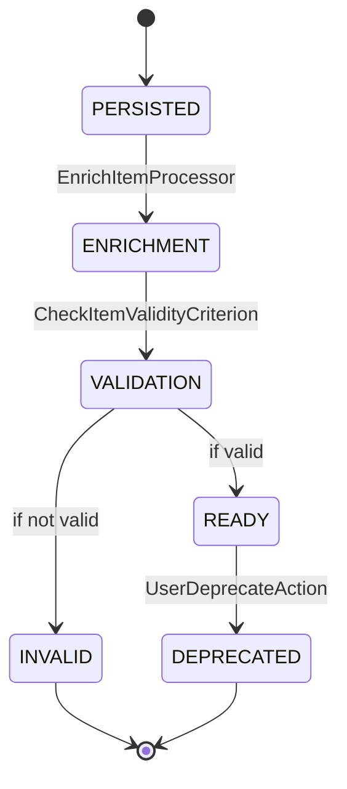
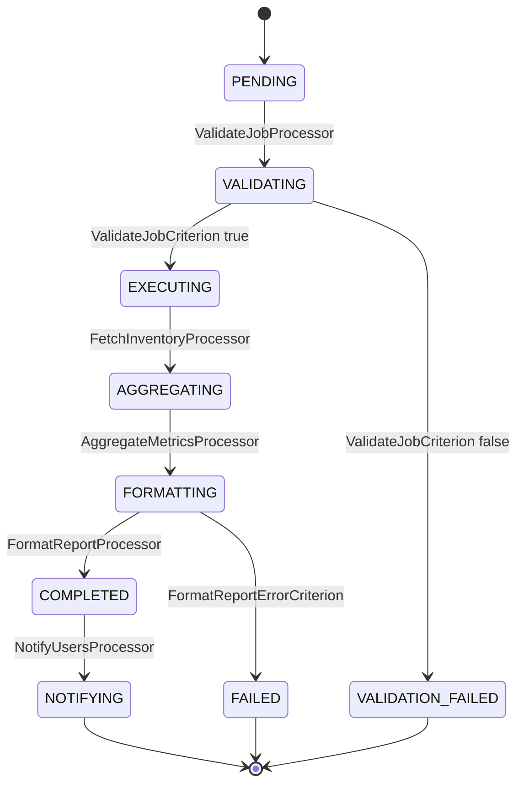
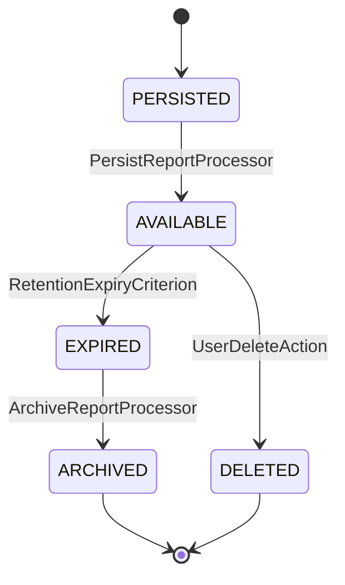
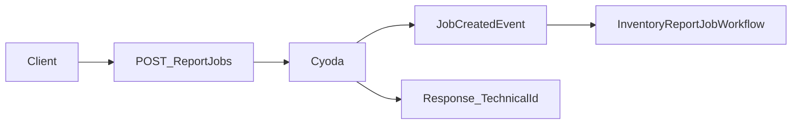

### 1. Entity Definitions
```
InventoryItem:
- sku: String (unique product code from upstream API)
- name: String (product display name)
- category: String (categorization for grouping)
- quantity: Integer (available units)
- unitPrice: Decimal (price per unit, may be null)
- location: String (warehouse/location)
- lastUpdated: DateTime (timestamp from source)
- sourceId: String (origin identifier from SwaggerHub API)

InventoryReportJob:
- jobName: String (user-friendly name)
- requestedBy: String (user id or system)
- metricsRequested: Array(String) (e.g., totalCount, avgPrice, totalValue)
- filters: Object (category, location, minDate/maxDate, supplier)
- groupBy: Array(String) (category, location)
- presentationType: String (table, chart)
- schedule: Object (optional; cron or interval description)
- createdAt: DateTime
- status: String (PENDING/IN_PROGRESS/COMPLETED/FAILED)

InventoryReport:
- reportName: String
- jobRef: String (reference to originating InventoryReportJob id)
- generatedAt: DateTime
- status: String (SUCCESS/FAILED/EMPTY)
- metricsSummary: Object (key metric name -> value)
- groupedSummaries: Array(Object) (group key -> metrics)
- presentationPayload: Object (table rows and/or chart series)
- errorMessage: String (if any)
- retentionUntil: DateTime (optional)
```

### 2. Entity workflows

InventoryItem workflow:
1. Initial State: Item persisted (event created when Cyoda saves InventoryItem).
2. Enrichment: Automatic - enrich missing price/location if external hints available.
3. Validation: Automatic - mark item invalid if key fields missing.
4. Ready: Automatic - item available for report calculations.
5. Deprecated: Manual - user marks item obsolete (archival).


```mermaid
stateDiagram-v2
    [*] --> PERSISTED
    PERSISTED --> ENRICHMENT : EnrichItemProcessor
    ENRICHMENT --> VALIDATION : CheckItemValidityCriterion
    VALIDATION --> READY : if valid
    VALIDATION --> INVALID : if not valid
    READY --> DEPRECATED : UserDeprecateAction
    INVALID --> [*]
    DEPRECATED --> [*]
```

Processors and criteria (InventoryItem)
- Processors: EnrichItemProcessor, NormalizeFieldsProcessor, IndexItemProcessor
- Criteria: CheckItemValidityCriterion, PricePresentCriterion

InventoryReportJob workflow:
1. Initial State: Job created with PENDING status (POST creates job -> event).
2. Validation: Automatic - validate requested metrics and filters.
3. Execution: Automatic - fetch relevant InventoryItems and compute metrics.
4. Formatting: Automatic - format metrics into presentationPayload.
5. Completion: Automatic - status COMPLETED or FAILED; InventoryReport persisted.
6. Notification/Archive: Manual or scheduled - notify users or archive reports.


```mermaid
stateDiagram-v2
    [*] --> PENDING
    PENDING --> VALIDATING : ValidateJobProcessor
    VALIDATING --> VALIDATION_FAILED : ValidateJobCriterion false
    VALIDATING --> EXECUTING : ValidateJobCriterion true
    EXECUTING --> AGGREGATING : FetchInventoryProcessor
    AGGREGATING --> FORMATTING : AggregateMetricsProcessor
    FORMATTING --> COMPLETED : FormatReportProcessor
    FORMATTING --> FAILED : FormatReportErrorCriterion
    COMPLETED --> NOTIFYING : NotifyUsersProcessor
    NOTIFYING --> [*]
    FAILED --> [*]
    VALIDATION_FAILED --> [*]
```

Processors and criteria (InventoryReportJob)
- Processors: ValidateJobProcessor, FetchInventoryProcessor, AggregateMetricsProcessor, FormatReportProcessor, NotifyUsersProcessor
- Criteria: ValidateJobCriterion, DataSufficientCriterion, FormatReportErrorCriterion

InventoryReport workflow:
1. Initial State: Report persisted with status SUCCESS/FAILED/EMPTY.
2. Available: Manual/Automatic - report ready for view/download.
3. Retention: Automatic - mark expired when retentionUntil passes.
4. Archived/Deleted: Manual - user triggers archive or delete.


```mermaid
stateDiagram-v2
    [*] --> PERSISTED
    PERSISTED --> AVAILABLE : PersistReportProcessor
    AVAILABLE --> EXPIRED : RetentionExpiryCriterion
    EXPIRED --> ARCHIVED : ArchiveReportProcessor
    ARCHIVED --> [*]
    AVAILABLE --> DELETED : UserDeleteAction
    DELETED --> [*]
```

Processors and criteria (InventoryReport)
- Processors: PersistReportProcessor, GeneratePresentationProcessor, ArchiveReportProcessor
- Criteria: RetentionExpiryCriterion, ReportCompleteCriterion

### 3. Pseudo code for processor classes (concise)

ValidateJobProcessor
```
class ValidateJobProcessor {
  process(job) {
    if missing(job.metricsRequested) or invalidFilters(job.filters) {
      job.status = VALIDATION_FAILED
      emit InventoryReportJobUpdated(job)
      return
    }
    job.status = IN_PROGRESS
    emit StartExecutionEvent(job)
  }
}
```

FetchInventoryProcessor
```
class FetchInventoryProcessor {
  process(job) {
    items = callSourceSearch(job.filters) // Cyoda will trigger fetch from configured source
    if items.empty then emit NoDataEvent(job)
    emit ItemsFetchedEvent(job, items)
  }
}
```

AggregateMetricsProcessor
```
class AggregateMetricsProcessor {
  process(job, items) {
    metrics = computeRequestedMetrics(job.metricsRequested, items)
    grouped = groupBy(items, job.groupBy)
    emit MetricsAggregatedEvent(job, metrics, grouped)
  }
}
```

FormatReportProcessor
```
class FormatReportProcessor {
  process(job, metrics, grouped) {
    payload = buildPresentation(metrics, grouped, job.presentationType)
    report = InventoryReport{ jobRef: job.id, generatedAt: now(), status: SUCCESS, ... }
    persist(report)
    emit ReportPersistedEvent(report)
  }
}
```

NotifyUsersProcessor
```
class NotifyUsersProcessor {
  process(report) {
    if job.requestedBy then queueNotification(report, job.requestedBy)
  }
}
```

Criteria examples (pseudo)
- ValidateJobCriterion: returns true if required fields present and metrics supported.
- DataSufficientCriterion: returns false if zero items or all prices null when price-based metrics requested.
- RetentionExpiryCriterion: returns true if now > report.retentionUntil

### 4. API Endpoints Design Rules

Rules applied
- POST endpoints for orchestration entities only (InventoryReportJob). POST returns only technicalId.
- GET by technicalId for orchestration entity and for reports (to retrieve results).
- No POST for InventoryItem or InventoryReport (these are created by workflows/processors).
- GET all optional; provide GET /reports/{technicalId} and GET /report-jobs/{technicalId}.

Endpoints and JSON structures

POST /report-jobs
- Request JSON:
{
  "jobName":"Monthly Inventory Summary",
  "requestedBy":"user123",
  "metricsRequested":["totalCount","avgPrice","totalValue"],
  "filters":{"category":"Electronics","minDate":"2025-01-01"},
  "groupBy":["category"],
  "presentationType":"table",
  "schedule":null
}
- Response JSON (only):
{ "technicalId":"<opaque-id>" }

GET /report-jobs/{technicalId}
- Response JSON:
{
  "technicalId":"<opaque-id>",
  "jobName":"Monthly Inventory Summary",
  "status":"COMPLETED",
  "createdAt":"2025-08-19T12:00:00Z",
  "reportRef":"<report-technical-id>"
}

GET /reports/{technicalId}
- Response JSON:
{
  "technicalId":"<opaque-id>",
  "reportName":"Monthly Inventory Summary",
  "generatedAt":"2025-08-19T12:05:00Z",
  "status":"SUCCESS",
  "metricsSummary":{ "totalCount":1000, "avgPrice":12.5, "totalValue":12500 },
  "presentationPayload":{ "table":[ /* rows */ ], "charts":[ /* series */ ] }
}

Mermaid visualization of request/response (POST flow)

```mermaid
flowchart LR
    Client --> POST_ReportJobs
    POST_ReportJobs --> Cyoda
    Cyoda --> JobCreatedEvent
    JobCreatedEvent --> InventoryReportJobWorkflow
    Cyoda --> Response_TechnicalId
```

Mermaid visualization of retrieving report

```mermaid
flowchart LR
    Client --> GET_ReportByJobId
    GET_ReportByJobId --> Cyoda
    Cyoda --> LookupReport
    LookupReport --> Return_ReportPayload
```

Notes / business rules
- Every InventoryReportJob POST triggers Cyoda workflow automatically.
- Errors should be surfaced as InventoryReport with status FAILED and user-facing errorMessage.
- Reports with insufficient data produce InventoryReport status EMPTY and include suggestion text.
- Retention policy configurable per job; archive after retentionUntil.

If you want, I can:
- Add more detailed metric definitions (median, min/max, counts by category).
- Add optional GET by condition endpoints (e.g., find jobs by requestedBy or status).
- Expand processors with retry/backoff and partial-failure handling in workflows.