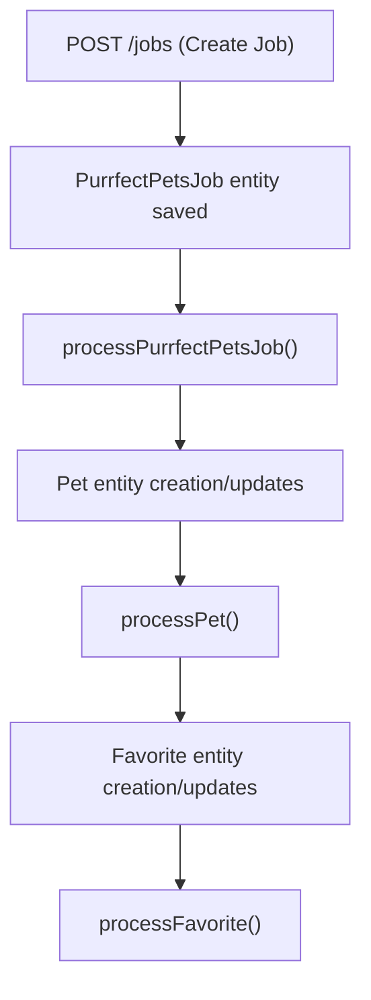
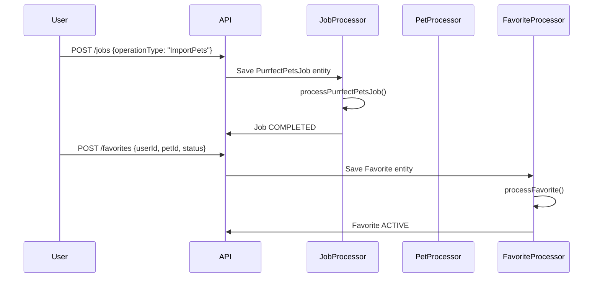

### 1. Entity Definitions

```
PurrfectPetsJob:  
- jobId: String (unique identifier for the orchestration job)  
- operationType: String (type of operation e.g., "ImportPets", "SyncFavorites")  
- payload: JSON (input data or parameters for the job)  
- status: StatusEnum (PENDING, PROCESSING, COMPLETED, FAILED)  

Pet:  
- petId: String (unique identifier from Petstore API)  
- name: String (pet name)  
- category: String (e.g., "cat", "dog")  
- status: StatusEnum (AVAILABLE, PENDING, SOLD)  

Favorite:  
- favoriteId: String (unique identifier for favorite relation)  
- userId: String (user who favorited the pet)  
- petId: String (the pet that is favorited)  
- status: StatusEnum (ACTIVE, REMOVED)  
```

---

### 2. Process Method Flows

```
processPurrfectPetsJob() Flow:  
1. Initial State: Job created with PENDING status  
2. Validation: Verify job parameters and payload correctness  
3. Execution:  
   - If operationType = "ImportPets", fetch and persist pets from Petstore API  
   - If operationType = "SyncFavorites", update Favorite entities accordingly  
4. Status Update: Mark job as COMPLETED or FAILED based on outcome  
5. Notification: Trigger any downstream events or notify users if needed  

processPet() Flow:  
1. Initial State: Pet entity saved with status (AVAILABLE, PENDING, SOLD)  
2. Validation: Confirm data integrity (e.g., valid category)  
3. Processing: Update internal indexes or caches if needed  
4. Completion: Confirm persistence and readiness for API queries  

processFavorite() Flow:  
1. Initial State: Favorite entity saved with ACTIVE or REMOVED status  
2. Validation: Ensure userId and petId exist and valid  
3. Processing: Update user’s favorite pet list or remove pet from favorites  
4. Completion: Confirm favorite status updated in system  
```

---

### 3. API Endpoints Design (JSON Examples)

**POST /jobs**  
- Create a new orchestration job (triggers `processPurrfectPetsJob()`)  
Request:  
```json
{
  "operationType": "ImportPets",
  "payload": {}
}
```
Response:  
```json
{
  "jobId": "job-123",
  "status": "PENDING"
}
```

**POST /pets**  
- Add new pet entity (triggers `processPet()`)  
Request:  
```json
{
  "petId": "pet-001",
  "name": "Whiskers",
  "category": "cat",
  "status": "AVAILABLE"
}
```
Response:  
```json
{
  "petId": "pet-001",
  "status": "AVAILABLE"
}
```

**POST /favorites**  
- Add or update favorite (triggers `processFavorite()`)  
Request:  
```json
{
  "userId": "user-123",
  "petId": "pet-001",
  "status": "ACTIVE"
}
```
Response:  
```json
{
  "favoriteId": "fav-456",
  "status": "ACTIVE"
}
```

**GET /pets/{petId}**  
- Retrieve pet details (read-only)  
Response:  
```json
{
  "petId": "pet-001",
  "name": "Whiskers",
  "category": "cat",
  "status": "AVAILABLE"
}
```

**GET /favorites?userId=user-123**  
- Retrieve user's favorite pets  
Response:  
```json
[
  {
    "favoriteId": "fav-456",
    "petId": "pet-001",
    "status": "ACTIVE"
  }
]
```

---

### 4. Mermaid Diagrams

**Entity Lifecycle State Diagram (PurrfectPetsJob)**  

```mermaid
stateDiagram-v2
    [*] --> PENDING
    PENDING --> PROCESSING : processPurrfectPetsJob()
    PROCESSING --> COMPLETED : success
    PROCESSING --> FAILED : error
    COMPLETED --> [*]
    FAILED --> [*]
```

**Event-Driven Processing Chain**  

```mermaid
flowchart TD
    POST_jobs["POST /jobs (Create Job)"]
    POST_jobs --> PurrfectPetsJobEntity["PurrfectPetsJob entity saved"]
    PurrfectPetsJobEntity --> processJob["processPurrfectPetsJob()"]
    processJob --> PetEntity["Pet entity creation/updates"]
    PetEntity --> processPet["processPet()"]
    processPet --> FavoriteEntity["Favorite entity creation/updates"]
    FavoriteEntity --> processFavorite["processFavorite()"]
```

**User Interaction Sequence Flow**  

```mermaid
sequenceDiagram
    participant User
    participant API
    participant JobProcessor
    participant PetProcessor
    participant FavoriteProcessor

    User->>API: POST /jobs {operationType: "ImportPets"}
    API->>JobProcessor: Save PurrfectPetsJob entity
    JobProcessor->>JobProcessor: processPurrfectPetsJob()
    JobProcessor->>API: Job COMPLETED
    User->>API: POST /favorites {userId, petId, status}
    API->>FavoriteProcessor: Save Favorite entity
    FavoriteProcessor->>FavoriteProcessor: processFavorite()
    FavoriteProcessor->>API: Favorite ACTIVE
```

---

If you need any further adjustments or additions, please let me know!