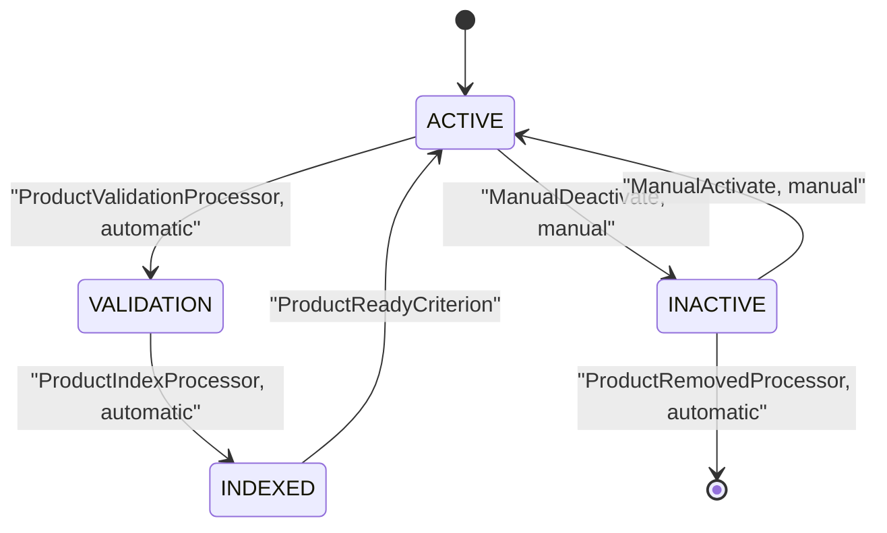
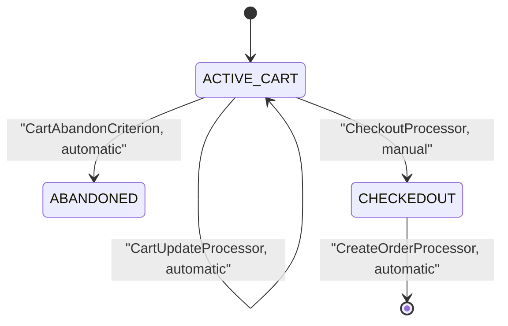
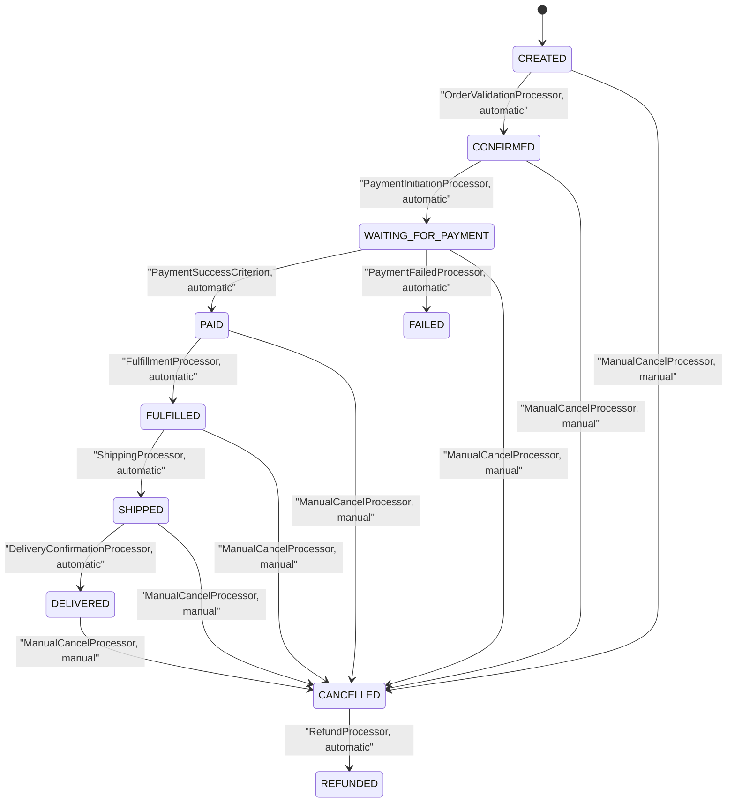
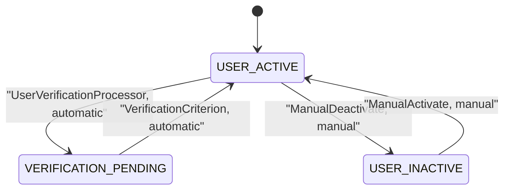
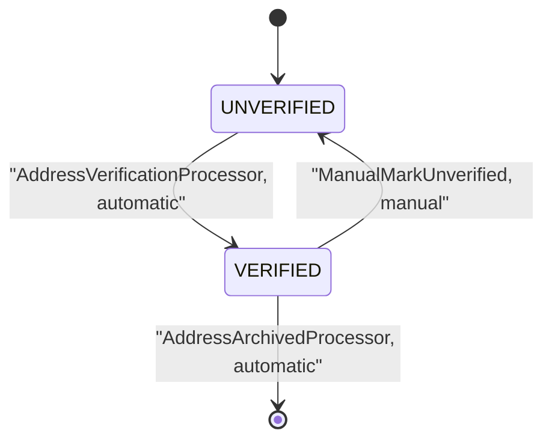

### 1. Entity Definitions

Note: You specified Product, Cart, Order, User, Address — I will use exactly these 5 entities.

```
Product:
- id: String (business id)
- name: String (display name)
- sku: String (stock keeping unit)
- price: Number (unit price)
- currency: String (currency code)
- description: String (text)
- available: Boolean (sellable flag)
- stock: Number (inventory count)

Cart:
- id: String (business id)
- userId: String|null (owner user id or null for guest)
- items: Array (items: [{productId: String, quantity: Number, priceAtAdd: Number}])
- total: Number (calculated)
- status: String (Active/Abandoned/CheckedOut)
- createdAt: String (timestamp)

Order:
- id: String (business id)
- userId: String|null
- items: Array (snapshot items [{productId, name, quantity, unitPrice}])
- total: Number
- currency: String
- shippingAddressId: String
- billingAddressId: String
- paymentStatus: String (Pending/Paid/Failed)
- status: String (Created/Confirmed/Fulfilled/Shipped/Delivered/Cancelled/Refunded)
- createdAt: String

User:
- id: String (business id)
- email: String
- name: String
- phone: String
- defaultAddressId: String|null
- status: String (Active/Inactive)

Address:
- id: String
- userId: String
- line1: String
- line2: String|null
- city: String
- postalCode: String
- country: String
- isDefault: Boolean
- verified: Boolean
- status: String (Unverified/Verified)
```

---

### 2. Entity workflows

Product workflow:
1. Initial State: Product persisted with status Active or Inactive (admin chooses)  
2. Validation: System validates price, sku, stock  
3. Indexing: Product indexed for UI/catalog  
4. Availability change: status can change manual (admin) or automatic on stock thresholds


```mermaid
stateDiagram-v2
    [*] --> ACTIVE
    ACTIVE --> VALIDATION : "ProductValidationProcessor, automatic"
    VALIDATION --> INDEXED : "ProductIndexProcessor, automatic"
    INDEXED --> ACTIVE : "ProductReadyCriterion"
    ACTIVE --> INACTIVE : "ManualDeactivate, manual"
    INACTIVE --> ACTIVE : "ManualActivate, manual"
    INACTIVE --> [*] : "ProductRemovedProcessor, automatic"
```

Processors / Criteria:
- ProductValidationProcessor (checks price >=0, sku unique)  
- ProductIndexProcessor (prepare catalog entry)  
- ProductReadyCriterion (ensures validations passed)  
- ProductRemovedProcessor (cleanup)

Cart workflow:
1. Initial State: Cart created Active  
2. Update: items added/removed (automatic recalculation of total)  
3. Abandon: system marks Abandoned after inactivity timeout (automatic)  
4. Checkout: manual transition to CheckedOut (user triggers) -> emits Order creation event


```mermaid
stateDiagram-v2
    [*] --> ACTIVE_CART
    ACTIVE_CART --> ACTIVE_CART : "CartUpdateProcessor, automatic"
    ACTIVE_CART --> ABANDONED : "CartAbandonCriterion, automatic"
    ACTIVE_CART --> CHECKEDOUT : "CheckoutProcessor, manual"
    CHECKEDOUT --> [*] : "CreateOrderProcessor, automatic"
```

Processors / Criteria:
- CartUpdateProcessor (recalculate totals)  
- CartAbandonCriterion (checks lastUpdated older than threshold)  
- CartAbandonProcessor (marks abandoned)  
- CheckoutProcessor (validate cart, user, stock)  
- CreateOrderProcessor (emit Order create event)

Order workflow:
1. Initial State: Order created (Created) when Cart -> CheckedOut triggers  
2. Confirmation: validate addresses, items snapshot (automatic)  
3. Payment: Await payment -> payment status updated to Paid or Failed  
4. Fulfillment: when Paid -> Fulfilled (warehouse), then Shipped -> Delivered  
5. Cancellation/Refunds: manual or automatic per rules


```mermaid
stateDiagram-v2
    [*] --> CREATED
    CREATED --> CONFIRMED : "OrderValidationProcessor, automatic"
    CONFIRMED --> WAITING_FOR_PAYMENT : "PaymentInitiationProcessor, automatic"
    WAITING_FOR_PAYMENT --> PAID : "PaymentSuccessCriterion, automatic"
    WAITING_FOR_PAYMENT --> FAILED : "PaymentFailedProcessor, automatic"
    PAID --> FULFILLED : "FulfillmentProcessor, automatic"
    FULFILLED --> SHIPPED : "ShippingProcessor, automatic"
    SHIPPED --> DELIVERED : "DeliveryConfirmationProcessor, automatic"
    CREATED --> CANCELLED : "ManualCancelProcessor, manual"
    CONFIRMED --> CANCELLED : "ManualCancelProcessor, manual"
    WAITING_FOR_PAYMENT --> CANCELLED : "ManualCancelProcessor, manual"
    PAID --> CANCELLED : "ManualCancelProcessor, manual"
    FULFILLED --> CANCELLED : "ManualCancelProcessor, manual"
    SHIPPED --> CANCELLED : "ManualCancelProcessor, manual"
    DELIVERED --> CANCELLED : "ManualCancelProcessor, manual"
    CANCELLED --> REFUNDED : "RefundProcessor, automatic"
```

Processors / Criteria:
- OrderValidationProcessor (address, item snapshot consistency)  
- PaymentInitiationProcessor (trigger payment request)  
- PaymentSuccessCriterion (payment gateway callback processed)  
- FulfillmentProcessor (prepare items for shipment)  
- ShippingProcessor (create shipment)  
- RefundProcessor (process refunds)

User workflow:
1. Initial State: User created Active or Inactive  
2. Verification: email/phone verification may be pending (automatic)  
3. Status changes: admin/manual deactivate


```mermaid
stateDiagram-v2
    [*] --> USER_ACTIVE
    USER_ACTIVE --> VERIFICATION_PENDING : "UserVerificationProcessor, automatic"
    VERIFICATION_PENDING --> USER_ACTIVE : "VerificationCriterion, automatic"
    USER_ACTIVE --> USER_INACTIVE : "ManualDeactivate, manual"
    USER_INACTIVE --> USER_ACTIVE : "ManualActivate, manual"
```

Processors / Criteria:
- UserVerificationProcessor (send verification email)  
- VerificationCriterion (checks verification token)  
- ManualActivate/Deactivate handlers

Address workflow:
1. Initial State: Address created Unverified  
2. Verification: system or manual verifies address -> Verified  
3. Default toggle: user can set isDefault manually


```mermaid
stateDiagram-v2
    [*] --> UNVERIFIED
    UNVERIFIED --> VERIFIED : "AddressVerificationProcessor, automatic"
    VERIFIED --> UNVERIFIED : "ManualMarkUnverified, manual"
    VERIFIED --> [*] : "AddressArchivedProcessor, automatic"
```

Processors / Criteria:
- AddressVerificationProcessor (validate format, optional external check)  
- AddressArchivedProcessor (archive unused addresses)

---

### 3. Pseudo code for processor classes (representative samples)

ProductValidationProcessor:
- if price < 0 then mark validation failed  
- if sku duplicate then mark validation failed  
- else set validation passed

CartUpdateProcessor:
- recalc total = sum(item.quantity * item.priceAtAdd)  
- persist cart.updatedAt

CreateOrderProcessor:
- build Order entity from cart snapshot  
- persist Order (this POST will return technicalId and trigger Order workflow)  
- publish event OrderCreated with order id

OrderValidationProcessor:
- ensure shipping/billing addresses exist  
- ensure totals consistent  
- set order.status = Confirmed

PaymentSuccessCriterion:
- on payment callback if status == success return true else false

Additional sample pseudo implementations:

ProductValidationProcessor pseudo:
- input: product entity  
- checks:
  - if product.price < 0 => set product.validationResult = FAILED, persist
  - if sku exists in datastore and not same product => set product.validationResult = FAILED
  - else set product.validationResult = PASSED
- emit event ProductValidated with result

ProductIndexProcessor pseudo:
- input: product entity (validated)
- build catalog document from product fields
- call indexing service / publish CatalogIndexEvent
- set product.indexed = true

CartUpdateProcessor pseudo:
- input: cart entity
- compute total = sum of items quantity * priceAtAdd
- set cart.total and cart.lastUpdatedAt
- persist cart
- if cart.total changes emit CartUpdated event

CheckoutProcessor pseudo:
- input: cart entity
- verify item availability by calling inventory service
- if any item out of stock -> return error (prevent transition)
- reserve or mark intent for stock (depending on chosen stock behavior)
- set cart.status = CheckedOut
- persist cart
- emit CartCheckedOut event

CreateOrderProcessor pseudo:
- input: cart entity with status CheckedOut
- build Order object snapshot of items, prices, addresses
- persist Order via POST /orders (returns technicalId)
- emit OrderCreated event (technicalId)

OrderValidationProcessor pseudo:
- input: order entity
- ensure shippingAddressId and billingAddressId exist in Address datastore
- ensure sum(items.unitPrice * quantity) == order.total
- if ok set order.status = Confirmed and persist
- emit OrderConfirmed event

PaymentInitiationProcessor pseudo:
- input: order (Confirmed)
- call payment gateway with amount and order id
- set order.paymentStatus = Pending
- persist and wait for callback

PaymentFailedProcessor pseudo:
- input: payment failure notification
- set order.paymentStatus = Failed
- set order.status = Failed
- persist
- emit OrderPaymentFailed event

FulfillmentProcessor pseudo:
- input: order (Paid)
- create pick/pack job for warehouse
- set order.status = Fulfilled when warehouse confirms
- persist and emit OrderFulfilled event

RefundProcessor pseudo:
- input: cancelled order requiring refund
- call payment gateway refund API
- set order.status = Refunded when refund confirmed
- persist and emit OrderRefunded event

Notes:
- Keep processors small and focused; each processor should emit events for downstream processors.

---

### 4. API Endpoints Design Rules

General rules applied:
- POST endpoints create entities and trigger Cyoda workflows (each returns only technicalId)  
- GET by technicalId available for each entity  
- No GET by condition included (not requested)  
- No other POST endpoints since workflows handle processing after persistence

Endpoints list (examples):

1) Create Product  
POST /products  
Request:
```json
{
  "id":"P-123",
  "name":"T-Shirt",
  "sku":"TS-001",
  "price":19.99,
  "currency":"USD",
  "description":"Cotton tee",
  "available":true,
  "stock":100
}
```
Response:
```json
{
  "technicalId":"tech-prod-abc123"
}
```
GET /products/{technicalId} response:
```json
{
  "technicalId":"tech-prod-abc123",
  "id":"P-123",
  "name":"T-Shirt",
  "sku":"TS-001",
  "price":19.99,
  "currency":"USD",
  "description":"Cotton tee",
  "available":true,
  "stock":100
}
```

2) Create Cart  
POST /carts  
Request:
```json
{
  "id":"C-789",
  "userId":"U-1",
  "items":[],
  "total":0
}
```
Response:
```json
{
  "technicalId":"tech-cart-xyz456"
}
```
GET /carts/{technicalId} returns cart with current state and items.

3) Create Order  
POST /orders  
Request:
```json
{
  "id":"O-555",
  "userId":"U-1",
  "items":[],
  "total":0,
  "currency":"USD",
  "shippingAddressId":"A-1",
  "billingAddressId":"A-1"
}
```
Response:
```json
{
  "technicalId":"tech-order-ord001"
}
```
GET /orders/{technicalId} returns order with status and paymentStatus.

4) Create User  
POST /users  
Request:
```json
{
  "id":"U-1",
  "email":"alice@example.com",
  "name":"Alice"
}
```
Response:
```json
{
  "technicalId":"tech-user-u1"
}
```
GET /users/{technicalId} returns user entity and status.

5) Create Address  
POST /addresses  
Request:
```json
{
  "id":"A-1",
  "userId":"U-1",
  "line1":"123 Main St",
  "city":"Exampleville",
  "postalCode":"12345",
  "country":"US",
  "isDefault":true
}
```
Response:
```json
{
  "technicalId":"tech-addr-a1"
}
```
GET /addresses/{technicalId} returns address with verified flag and status.

---

Next / Questions for you
- Confirm these exact state names match the Lovable UI expectations for each entity or provide exact names if different.  
- Guest checkout allowed (order.userId null) or must require registered user?  
- Stock behavior: reserve stock on checkout (CheckedOut) or only decrement on Order Paid?  
- Any additional processors/notifications required (email confirmations, webhooks)?  

Answer these and I will finalize the Cyoda-ready entities + workflows spec.