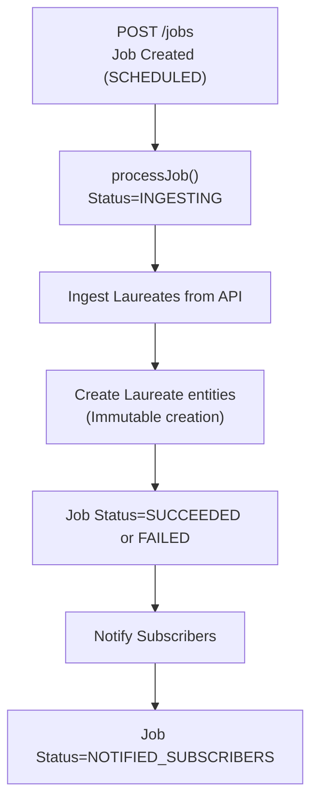

### 1. Entity Definitions

```
Job:
- jobName: String (Name or identifier of the job)
- status: String (Job status - e.g., SCHEDULED, INGESTING, SUCCEEDED, FAILED, NOTIFIED_SUBSCRIBERS)
- createdAt: DateTime (Timestamp of job creation)
- completedAt: DateTime (Timestamp of job completion or failure)
- resultDetails: String (Summary or details of job outcome)

Laureate:
- laureateId: Integer (Unique laureate identifier)
- firstname: String (Laureate's first name)
- surname: String (Laureate's surname)
- gender: String (Gender of laureate)
- born: Date (Date of birth)
- died: Date (Date of death, nullable)
- borncountry: String (Country where laureate was born)
- borncountrycode: String (Country code of birthplace)
- borncity: String (City where laureate was born)
- year: String (Year laureate received Nobel prize)
- category: String (Prize category)
- motivation: String (Reason for award)
- affiliationName: String (Affiliated institution name)
- affiliationCity: String (Affiliated institution city)
- affiliationCountry: String (Affiliated institution country)

Subscriber:
- subscriberId: String (Unique identifier for subscriber)
- contactType: String (Type of contact - e.g., email, webhook)
- contactAddress: String (Email address or webhook URL for notifications)
- active: Boolean (Indicates if subscriber is active or not)
```

---

### 2. Process Method Flows

```
processJob() Flow:
1. Initial State: Job entity created with status = SCHEDULED
2. Validation: Validate job parameters (e.g., jobName presence)
3. Processing: 
   - Change status to INGESTING
   - Call OpenDataSoft API to ingest Nobel laureates data
   - For each laureate record, create immutable Laureate entity
4. Completion:
   - If ingestion successful, update job status to SUCCEEDED
   - If ingestion fails, update job status to FAILED
5. Notification:
   - Trigger notification process to all active Subscribers
   - Update job status to NOTIFIED_SUBSCRIBERS
```

```
processLaureate() Flow:
1. Validation: Check required laureate fields (id, firstname, surname, year, category)
2. Enrichment: Normalize borncountrycode, calculate derived fields if needed (age not stored as per EDA immutability)
3. Persistence: Save laureate entity as immutable record
```

```
processSubscriber() Flow:
1. Validation: Check subscriber contact details and active status
2. Persistence: Save subscriber entity as immutable record
3. No further processing triggered by subscriber creation
```

---

### 3. API Endpoints

| Entity    | Method | Endpoint                 | Description                              | Request Body Example                 | Response Example             |
|-----------|--------|--------------------------|------------------------------------------|------------------------------------|------------------------------|
| Job       | POST   | `/jobs`                  | Create a new Job (triggers ingestion)    | `{ "jobName": "IngestNobelData" }` | `{ "technicalId": "abc123" }` |
| Job       | GET    | `/jobs/{technicalId}`    | Retrieve job by technicalId               | N/A                                | Full Job entity JSON          |
| Laureate  | GET    | `/laureates/{technicalId}`| Retrieve laureate by technicalId          | N/A                                | Full Laureate entity JSON     |
| Subscriber| POST   | `/subscribers`           | Create a new subscriber                    | `{ "contactType": "email", "contactAddress": "user@example.com", "active": true }` | `{ "technicalId": "sub456" }`|
| Subscriber| GET    | `/subscribers/{technicalId}`| Retrieve subscriber by technicalId        | N/A                                | Full Subscriber entity JSON   |

- No update or delete endpoints provided to maintain immutability.
- POST on Job triggers the entire ingestion → processing → notification workflow.
- Laureate entities are created internally during job processing; no POST endpoint exposed for Laureate.
- Subscribers can be added externally to receive notifications.

---

### 4. Request/Response Formats

**POST /jobs**

Request:
```json
{
  "jobName": "IngestNobelData"
}
```

Response:
```json
{
  "technicalId": "abc123"
}
```

---

**GET /jobs/{technicalId}**

Response:
```json
{
  "jobName": "IngestNobelData",
  "status": "NOTIFIED_SUBSCRIBERS",
  "createdAt": "2024-06-01T10:00:00Z",
  "completedAt": "2024-06-01T10:05:00Z",
  "resultDetails": "Ingested 100 laureates, notifications sent to 5 subscribers."
}
```

---

**POST /subscribers**

Request:
```json
{
  "contactType": "email",
  "contactAddress": "user@example.com",
  "active": true
}
```

Response:
```json
{
  "technicalId": "sub456"
}
```

---

**GET /subscribers/{technicalId}**

Response:
```json
{
  "subscriberId": "sub456",
  "contactType": "email",
  "contactAddress": "user@example.com",
  "active": true
}
```

---

**GET /laureates/{technicalId}**

Response:
```json
{
  "laureateId": 853,
  "firstname": "Akira",
  "surname": "Suzuki",
  "gender": "male",
  "born": "1930-09-12",
  "died": null,
  "borncountry": "Japan",
  "borncountrycode": "JP",
  "borncity": "Mukawa",
  "year": "2010",
  "category": "Chemistry",
  "motivation": "\"for palladium-catalyzed cross couplings in organic synthesis\"",
  "affiliationName": "Hokkaido University",
  "affiliationCity": "Sapporo",
  "affiliationCountry": "Japan"
}
```

---

### 5. Mermaid Diagram - Event-Driven Processing Chain


```mermaid
graph TD
  A["POST /jobs<br>Job Created (SCHEDULED)"]
  A --> B["processJob()<br>Status=INGESTING"]
  B --> C["Ingest Laureates from API"]
  C --> D["Create Laureate entities<br>(Immutable creation)"]
  D --> E["Job Status=SUCCEEDED or FAILED"]
  E --> F["Notify Subscribers"]
  F --> G["Job Status=NOTIFIED_SUBSCRIBERS"]
```