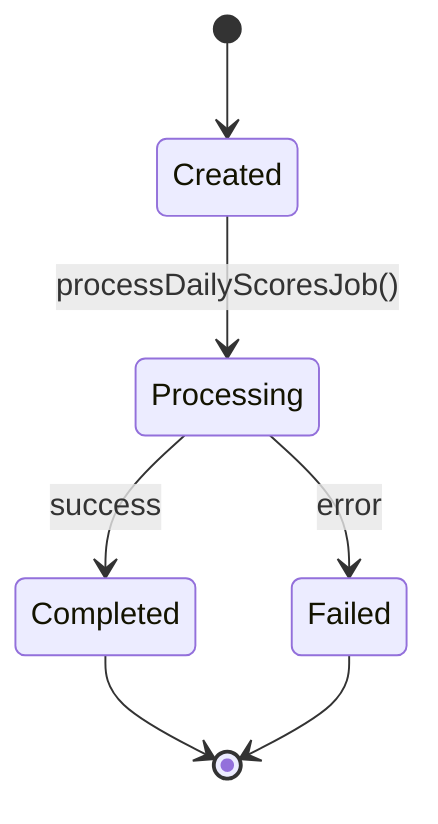

### 1. Entity Definitions

``` 
DailyScoresJob:
- date: String (The date for which NBA scores are fetched, format YYYY-MM-DD)
- status: String (Current job status: PENDING, PROCESSING, COMPLETED, FAILED)
- createdAt: String (Timestamp when the job was created)
- completedAt: String (Timestamp when the job finished processing)

Subscriber:
- email: String (Subscriber's email address)
- subscribedAt: String (Timestamp when subscription was created)

GameScore:
- date: String (Date of the NBA game, format YYYY-MM-DD)
- homeTeam: String (Name of the home team)
- awayTeam: String (Name of the away team)
- homeScore: Integer (Score of the home team)
- awayScore: Integer (Score of the away team)
- gameStatus: String (Status of the game: Scheduled, Completed, Postponed)
```

---

### 2. Process Method Flows

``` 
processDailyScoresJob() Flow:
1. Initial State: DailyScoresJob created with status = PENDING and specific date
2. Validation: Confirm the date is valid (e.g., not future date)
3. Processing:
   - Fetch NBA game scores for the job date from external API asynchronously
   - Persist all fetched GameScore entities immutably
   - Retrieve all Subscriber entities
4. Notification:
   - For each Subscriber, send an email with a summary of the day's GameScores
5. Completion:
   - Update DailyScoresJob status to COMPLETED or FAILED based on success/failure of steps
   - Record completedAt timestamp
```

``` 
processSubscriber() Flow:
1. Initial State: Subscriber entity created with email and subscribedAt timestamp
2. Validation: Check email format validity (optional, if implemented as checkSubscriberEmailFormat event)
3. Completion: No additional processing required immediately after subscription creation
```

``` 
processGameScore() Flow:
1. Initial State: GameScore entity created immutably after fetching from API
2. Validation: Optional validation of scores and gameStatus consistency
3. Completion: GameScore stored for querying; no further processing triggered automatically
```

---

### 3. API Endpoints Design

| Endpoint                     | Method | Purpose                                              | Request Body Example                               | Response Example                      |
|------------------------------|--------|------------------------------------------------------|---------------------------------------------------|-------------------------------------|
| `/jobs/daily-scores`          | POST   | Create a DailyScoresJob for a specific date (triggers data fetch and notification) | `{ "date": "2025-03-25" }`                        | `{ "technicalId": "job-123" }`      |
| `/jobs/daily-scores/{id}`     | GET    | Retrieve DailyScoresJob status and metadata          | N/A                                               | `{ "date": "2025-03-25", "status": "COMPLETED", "createdAt": "...", "completedAt": "..." }` |
| `/subscribers`                | POST   | Add a new subscriber (triggers processSubscriber)    | `{ "email": "user@example.com" }`                 | `{ "technicalId": "sub-456" }`      |
| `/subscribers/{id}`           | GET    | Retrieve subscriber information                       | N/A                                               | `{ "email": "user@example.com", "subscribedAt": "..." }` |
| `/games/{date}`               | GET    | Retrieve all GameScores for a specific date           | N/A                                               | `[ { "homeTeam": "...", "awayTeam": "...", "homeScore": 102, "awayScore": 99, "gameStatus": "Completed" }, ... ]` |

---

### 4. Request/Response Formats

**POST /jobs/daily-scores**

Request:

```json
{
  "date": "2025-03-25"
}
```

Response:

```json
{
  "technicalId": "job-123"
}
```

---

**GET /jobs/daily-scores/{id}**

Response:

```json
{
  "date": "2025-03-25",
  "status": "COMPLETED",
  "createdAt": "2025-03-25T18:00:00Z",
  "completedAt": "2025-03-25T18:10:00Z"
}
```

---

**POST /subscribers**

Request:

```json
{
  "email": "user@example.com"
}
```

Response:

```json
{
  "technicalId": "sub-456"
}
```

---

**GET /subscribers/{id}**

Response:

```json
{
  "email": "user@example.com",
  "subscribedAt": "2025-03-10T12:00:00Z"
}
```

---

**GET /games/{date}**

Response:

```json
[
  {
    "homeTeam": "Lakers",
    "awayTeam": "Warriors",
    "homeScore": 102,
    "awayScore": 99,
    "gameStatus": "Completed"
  },
  {
    "homeTeam": "Nets",
    "awayTeam": "Celtics",
    "homeScore": 110,
    "awayScore": 115,
    "gameStatus": "Completed"
  }
]
```

---

### 5. Visual Representations

#### Entity Lifecycle State Diagram for DailyScoresJob


```mermaid
stateDiagram-v2
    [*] --> Created
    Created --> Processing : processDailyScoresJob()
    Processing --> Completed : success
    Processing --> Failed : error
    Completed --> [*]
    Failed --> [*]
```

#### Event-Driven Processing Chain for DailyScoresJob

```mermaid
graph TD
    A[POST /jobs/daily-scores] --> B[Create DailyScoresJob Entity]
    B --> C[processDailyScoresJob()]
    C --> D[Fetch NBA Scores from External API]
    D --> E[Save GameScore Entities]
    E --> F[Retrieve Subscribers]
    F --> G[Send Email Notifications]
    G --> H[Update Job Status to COMPLETED or FAILED]
```

#### User Interaction Sequence Flow for Subscription and Notification

```mermaid
sequenceDiagram
    participant User
    participant API
    participant System

    User->>API: POST /subscribers {email}
    API->>System: Create Subscriber Entity (Subscriber)
    System->>System: processSubscriber()
    System-->>API: Return technicalId

    activate dailyJob
    API->>System: POST /jobs/daily-scores {date}
    System->>System: Create DailyScoresJob Entity
    System->>System: processDailyScoresJob()
    System->>ExternalAPI: Fetch NBA Scores
    ExternalAPI-->>System: Return Scores
    System->>System: Save GameScore Entities
    System->>System: Retrieve Subscribers
    System->>System: Send Emails to Subscribers
    System-->>API: Return technicalId
    deactivate dailyJob
```

---

This completes the functional requirements definition for your NBA Daily Scores Notification backend application using an Event-Driven Architecture approach on Cyoda platform.