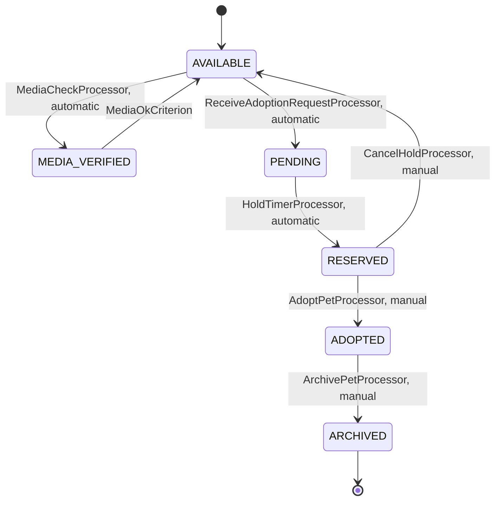
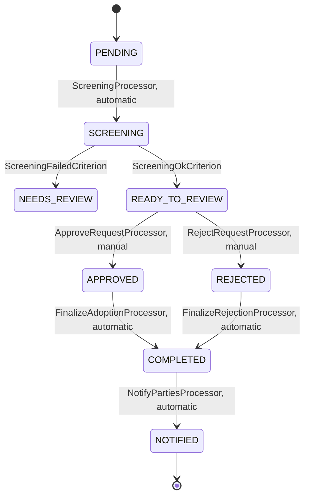
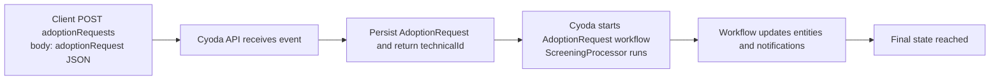

### 1. Entity Definitions
```
Pet:
- id: String (business id from Petstore or internal)
- name: String (pet name)
- species: String (dog/cat/etc)
- breed: String (breed or description)
- age: Integer (years/months)
- sex: String (M/F/unknown)
- status: String (available/pending/adopted)
- photoUrl: String (media link)
- tags: Array(String) (searchable labels)

Owner:
- id: String (business id)
- name: String (full name)
- contactEmail: String (primary contact)
- contactPhone: String (phone)
- address: String (postal address)
- role: String (customer/admin/staff)
- favorites: Array(String) (pet ids)
- adoptionHistory: Array(String) (adoptionRequest ids)

AdoptionRequest:
- id: String (business id)
- petId: String (linked Pet.id)
- ownerId: String (linked Owner.id)
- requestDate: String (ISO datetime)
- status: String (pending/approved/rejected/cancelled)
- notes: String (free text)
- processedBy: String (owner/staff id)
```

### 2. Entity workflows

Pet workflow:
1. Initial State: Pet persisted with status available or imported
2. Media Check: Verify photoUrl and tags (automatic)
3. Availability Check: If adoption request arrives set status to pending (automatic)
4. Hold/Reserve: When pending, hold for a time window (automatic)
5. Adopted: On approved AdoptionRequest mark adopted (automatic/manual)
6. Archived: If removed from Petstore or retired (manual)


```mermaid
stateDiagram-v2
    [*] --> AVAILABLE
    AVAILABLE --> MEDIA_VERIFIED : MediaCheckProcessor, automatic
    MEDIA_VERIFIED --> AVAILABLE : MediaOkCriterion
    AVAILABLE --> PENDING : ReceiveAdoptionRequestProcessor, automatic
    PENDING --> RESERVED : HoldTimerProcessor, automatic
    RESERVED --> ADOPTED : AdoptPetProcessor, manual
    RESERVED --> AVAILABLE : CancelHoldProcessor, manual
    ADOPTED --> ARCHIVED : ArchivePetProcessor, manual
    ARCHIVED --> [*]
```

Pet criteria/processors needed:
- MediaCheckProcessor (validate photoUrl/tags)
- MediaOkCriterion (checks successful media validation)
- ReceiveAdoptionRequestProcessor (locks pet)
- HoldTimerProcessor (automatic expiration)
- AdoptPetProcessor (finalize adoption)
- CancelHoldProcessor

Owner workflow:
1. Initial State: Owner created (registration) or synced
2. Verification: Contact verification (automatic/email/manual)
3. Active: Can submit requests, manage favorites
4. Suspended: If verification failed or flagged (manual)
5. Archived: account closed (manual)


```mermaid
stateDiagram-v2
    [*] --> CREATED
    CREATED --> VERIFIED : OwnerVerificationProcessor, automatic
    VERIFIED --> ACTIVE : VerificationOkCriterion
    VERIFIED --> SUSPENDED : VerificationFailedCriterion
    ACTIVE --> SUSPENDED : FlagOwnerProcessor, manual
    SUSPENDED --> ACTIVE : ReinstateOwnerProcessor, manual
    ACTIVE --> ARCHIVED : ArchiveOwnerProcessor, manual
    ARCHIVED --> [*]
```

Owner criteria/processors needed:
- OwnerVerificationProcessor (send/check verification)
- VerificationOkCriterion / VerificationFailedCriterion
- FlagOwnerProcessor / ReinstateOwnerProcessor

AdoptionRequest workflow:
1. Initial State: Request created PENDING (event triggers processing)
2. Screening: Auto-check owner verification and pet availability (automatic)
3. Review: Manual admin/staff review (manual)
4. Decision: Approve -> link owner to pet and mark pet adopted (automatic)
             Reject -> set request rejected and free pet (automatic)
5. Completion: Notify parties and archive request


```mermaid
stateDiagram-v2
    [*] --> PENDING
    PENDING --> SCREENING : ScreeningProcessor, automatic
    SCREENING --> NEEDS_REVIEW : ScreeningFailedCriterion
    SCREENING --> READY_TO_REVIEW : ScreeningOkCriterion
    READY_TO_REVIEW --> APPROVED : ApproveRequestProcessor, manual
    READY_TO_REVIEW --> REJECTED : RejectRequestProcessor, manual
    APPROVED --> COMPLETED : FinalizeAdoptionProcessor, automatic
    REJECTED --> COMPLETED : FinalizeRejectionProcessor, automatic
    COMPLETED --> NOTIFIED : NotifyPartiesProcessor, automatic
    NOTIFIED --> [*]
```

AdoptionRequest criteria/processors needed:
- ScreeningProcessor (owner verified, pet available)
- ScreeningOkCriterion / ScreeningFailedCriterion
- ApproveRequestProcessor / RejectRequestProcessor
- FinalizeAdoptionProcessor (links owner, updates pet status)
- FinalizeRejectionProcessor (releases pet)
- NotifyPartiesProcessor

### 3. Pseudo code for processor classes (concise)

Pet media check processor
```
class MediaCheckProcessor {
  process(pet) {
    if validateUrl(pet.photoUrl) and pet.tags not empty then
      pet.metadataVerified = true
      mark pet in store
    else
      schedule retry or mark for manual review
  }
}
```

Receive adoption request processor
```
class ReceiveAdoptionRequestProcessor {
  process(adoptionRequest) {
    pet = loadPet(adoptionRequest.petId)
    if pet.status == available then
      pet.status = pending
      save pet
    else
      adoptionRequest.status = rejected
      save adoptionRequest
    }
  }
}
```

Finalize adoption processor
```
class FinalizeAdoptionProcessor {
  process(adoptionRequest) {
    pet = loadPet(adoptionRequest.petId)
    owner = loadOwner(adoptionRequest.ownerId)
    pet.status = adopted
    owner.adoptionHistory.add(adoptionRequest.id)
    adoptionRequest.status = approved
    save pet, owner, adoptionRequest
  }
}
```

Screening processor
```
class ScreeningProcessor {
  process(adoptionRequest) {
    owner = loadOwner(adoptionRequest.ownerId)
    pet = loadPet(adoptionRequest.petId)
    if owner.verified and pet.status == available then
      mark adoptionRequest ready for review
    else
      mark needs review or reject
  }
}
```

### 4. API Endpoints Design Rules

General rules applied:
- Every POST that creates an entity triggers Cyoda to start the entity workflow.
- POST responses MUST return only technicalId.
- Provide GET by technicalId for all created entities.
- No GET by non-technical fields unless explicitly requested.
- GET all is optional (not included by default).

Endpoints and JSON formats (requests -> responses)

POST /pets
Request body (create pet event):
```json
{ "id":"P123","name":"Whiskers","species":"cat","breed":"tabby","age":2,"sex":"F","photoUrl":"https://...","tags":["friendly"] }
```
Response body:
```json
{ "technicalId":"tech_pet_abc123" }
```

POST /owners
Request:
```json
{ "id":"O456","name":"Alex Doe","contactEmail":"alex@example.com","contactPhone":"+1...","address":"...","role":"customer" }
```
Response:
```json
{ "technicalId":"tech_owner_def456" }
```

POST /adoptionRequests
Request:
```json
{ "id":"R789","petId":"P123","ownerId":"O456","requestDate":"2025-08-15T10:00:00Z","notes":"I love cats" }
```
Response:
```json
{ "technicalId":"tech_req_ghi789" }
```

GET by technicalId (all entities)
Request: GET /pets/{technicalId}
Response: full persisted entity JSON (Pet representation as stored)

Visualize request -> Cyoda -> response (example for AdoptionRequest) using Mermaid


```mermaid
flowchart LR
    A["Client POST adoptionRequests\nbody: adoptionRequest JSON"] --> B["Cyoda API receives event"]
    B --> C["Persist AdoptionRequest and return technicalId"]
    C --> D["Cyoda starts AdoptionRequest workflow\nScreeningProcessor runs"]
    D --> E["Workflow updates entities and notifications"]
    E --> F["Final state reached"]
```

Notes and constraints
- Max 3 entities modeled as requested. If you want additional entities (Appointments, Payments, Reviews, IngestJob) I can expand up to 10 entities.
- All transitions above map to Cyoda processors and criteria (automatic vs manual flagged). Each persisted entity triggers its workflow automatically.