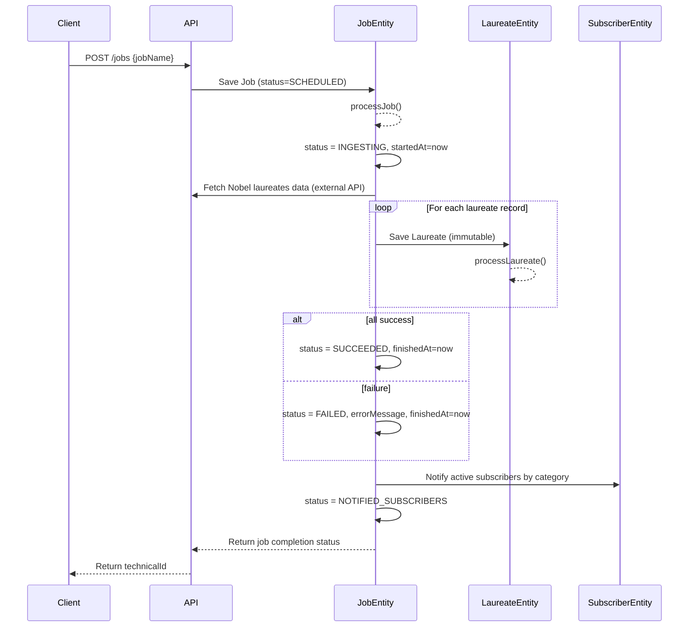
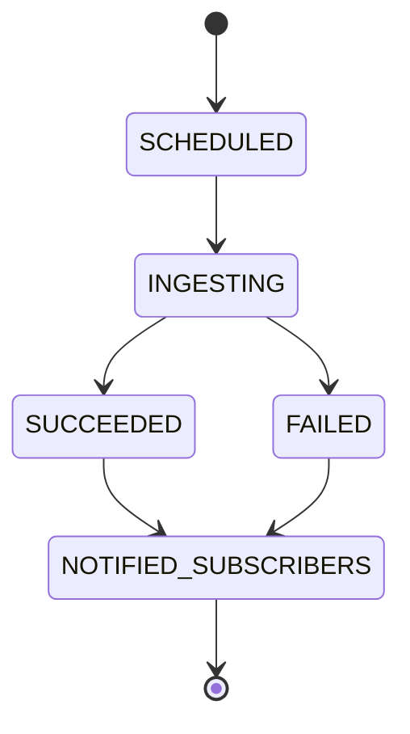

### 1. Entity Definitions

```
Job:
- jobName: String (unique descriptive name of the ingestion job)
- status: String (job lifecycle state: SCHEDULED, INGESTING, SUCCEEDED, FAILED, NOTIFIED_SUBSCRIBERS)
- createdAt: DateTime (timestamp of job creation)
- startedAt: DateTime (timestamp when ingestion started)
- finishedAt: DateTime (timestamp when ingestion finished)
- errorMessage: String (optional error details if job failed)

Laureate:
- laureateId: Long (unique identifier from the data source)
- firstname: String (first name of the laureate)
- surname: String (surname of the laureate)
- gender: String (gender of laureate)
- born: String (date of birth in ISO format)
- died: String (date of death, nullable)
- borncountry: String (country of birth)
- borncountrycode: String (ISO code of country of birth)
- borncity: String (city of birth)
- year: String (award year)
- category: String (Nobel category)
- motivation: String (award motivation text)
- affiliationName: String (institution name)
- affiliationCity: String (institution city)
- affiliationCountry: String (institution country)

Subscriber:
- contactType: String (e.g., "email" or "webhook")
- contactAddress: String (email address or webhook URL)
- subscribedCategories: String (comma-separated list of Nobel categories subscriber is interested in)
- active: Boolean (whether subscription is active)
```

---

### 2. Process Method Flows

```
processJob() Flow:
1. Initial State: Job created with status = "SCHEDULED"
2. Validation: Validate jobName uniqueness and required fields
3. Processing:
    a. Update status to "INGESTING" and set startedAt timestamp
    b. Fetch Nobel laureates data from OpenDataSoft API
    c. For each laureate record, create a new immutable Laureate entity (triggering processLaureate())
4. Completion:
    a. If all laureates ingested successfully, update Job status to "SUCCEEDED"
    b. Else update Job status to "FAILED" and populate errorMessage
    c. Set finishedAt timestamp
5. Notification:
    a. Trigger notification to all active Subscribers interested in updated categories
    b. Update status to "NOTIFIED_SUBSCRIBERS"
```

```
processLaureate() Flow:
1. Validation:
    a. Check mandatory fields (laureateId, firstname, surname, year, category)
    b. Validate date formats and country codes
2. Enrichment:
    a. Normalize fields if needed (e.g., trim strings, standardize country codes)
3. Persistence:
    a. Save laureate record immutably (no updates/deletes)
```

```
processSubscriber() Flow:
1. Validation:
    a. Verify contactType and contactAddress formats (email syntax or valid URL)
    b. Check that subscribedCategories is not empty if provided
2. Persistence:
    a. Save new subscriber entity immutably
3. No further automated processing needed on subscriber creation
```

---

### 3. API Endpoints Design

#### Job Endpoints
- **POST /jobs**  
  Request JSON:
  ```json
  {
    "jobName": "IngestNobelLaureatesJob_2024-06"
  }
  ```  
  Response JSON:
  ```json
  {
    "technicalId": "string"
  }
  ```  
  Description: Creates a Job entity with status SCHEDULED, triggers `processJob()`.

- **GET /jobs/{technicalId}**  
  Response JSON:
  ```json
  {
    "jobName": "IngestNobelLaureatesJob_2024-06",
    "status": "NOTIFIED_SUBSCRIBERS",
    "createdAt": "2024-06-01T12:00:00Z",
    "startedAt": "2024-06-01T12:05:00Z",
    "finishedAt": "2024-06-01T12:10:00Z",
    "errorMessage": null
  }
  ```

#### Laureate Endpoints
- **GET /laureates/{technicalId}**  
  Response JSON:
  ```json
  {
    "laureateId": 853,
    "firstname": "Akira",
    "surname": "Suzuki",
    "gender": "male",
    "born": "1930-09-12",
    "died": null,
    "borncountry": "Japan",
    "borncountrycode": "JP",
    "borncity": "Mukawa",
    "year": "2010",
    "category": "Chemistry",
    "motivation": "for palladium-catalyzed cross couplings in organic synthesis",
    "affiliationName": "Hokkaido University",
    "affiliationCity": "Sapporo",
    "affiliationCountry": "Japan"
  }
  ```

- **GET /laureates?category=Chemistry** (optional, if requested)  
  Returns list of laureates filtered by category.

#### Subscriber Endpoints
- **POST /subscribers**  
  Request JSON:
  ```json
  {
    "contactType": "email",
    "contactAddress": "user@example.com",
    "subscribedCategories": "Physics,Chemistry",
    "active": true
  }
  ```  
  Response JSON:
  ```json
  {
    "technicalId": "string"
  }
  ```

- **GET /subscribers/{technicalId}**  
  Response JSON:
  ```json
  {
    "contactType": "email",
    "contactAddress": "user@example.com",
    "subscribedCategories": "Physics,Chemistry",
    "active": true
  }
  ```

---

### 4. Mermaid Diagrams


```mermaid
sequenceDiagram
    participant Client
    participant API
    participant JobEntity
    participant LaureateEntity
    participant SubscriberEntity

    Client->>API: POST /jobs {jobName}
    API->>JobEntity: Save Job (status=SCHEDULED)
    JobEntity-->>JobEntity: processJob()
    JobEntity->>JobEntity: status = INGESTING, startedAt=now
    JobEntity->>API: Fetch Nobel laureates data (external API)
    loop For each laureate record
        JobEntity->>LaureateEntity: Save Laureate (immutable)
        LaureateEntity-->>LaureateEntity: processLaureate()
    end
    alt all success
        JobEntity->>JobEntity: status = SUCCEEDED, finishedAt=now
    else failure
        JobEntity->>JobEntity: status = FAILED, errorMessage, finishedAt=now
    end
    JobEntity->>SubscriberEntity: Notify active subscribers by category
    JobEntity->>JobEntity: status = NOTIFIED_SUBSCRIBERS
    JobEntity-->>API: Return job completion status
    API-->>Client: Return technicalId
```


```mermaid
stateDiagram-v2
    [*] --> SCHEDULED
    SCHEDULED --> INGESTING
    INGESTING --> SUCCEEDED
    INGESTING --> FAILED
    SUCCEEDED --> NOTIFIED_SUBSCRIBERS
    FAILED --> NOTIFIED_SUBSCRIBERS
    NOTIFIED_SUBSCRIBERS --> [*]
```

---

This document represents the finalized functional requirements for the Nobel laureates data ingestion backend application, fully aligned with the Event-Driven Architecture principles and the Cyoda platform behavior.