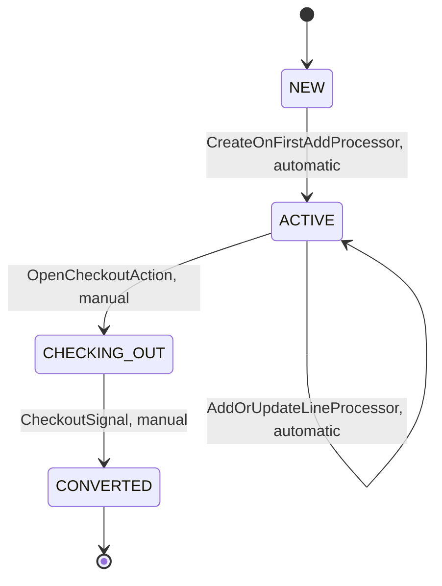
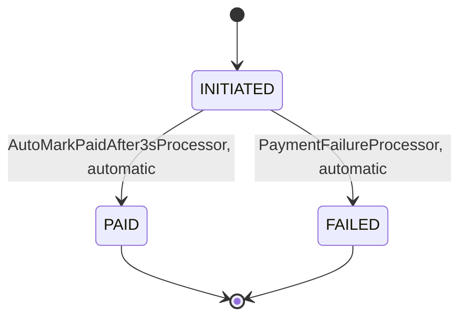
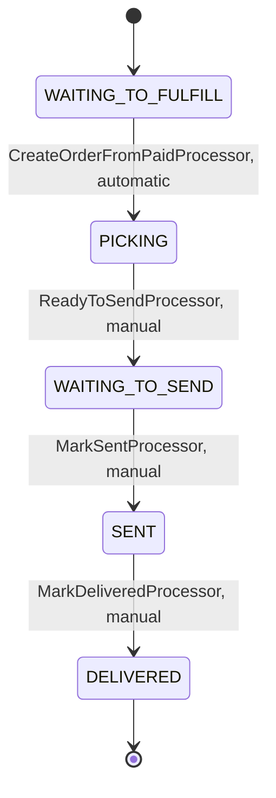

### 1. Entity Definitions
(You specified 5 entities — I will use exactly these 5.)

```
Product:
- sku: string (unique product identifier)
- name: string (display name)
- description: string (full description)
- price: number (base price)
- quantityAvailable: number (quick projection of stock)
- category: string (required category)
- warehouseId: string (optional primary node)
- attributes: object (brand/model/dimensions/weight/hazards/custom)
- localizations: object (defaultLocale, content array)
- media: array (images/docs)
- options: object (axes/constraints)
- variants: array (variantSku/optionValues/overrides)
- bundles: array (kits/bundles/components)
- inventory: object (nodes/policies/lots/reservations)
- compliance: object (docs/restrictions)
- relationships: object (suppliers/relatedProducts)
- events: array (domain events)

Cart:
- cartId: string (business cart id)
- status: string (NEW | ACTIVE | CHECKING_OUT | CONVERTED)
- lines: array (items: { sku, name, price, qty })
- totalItems: number (sum qty)
- grandTotal: number (sum price*qty)
- guestContact: object (name,email,phone,address)
- createdAt: string (ISO)
- updatedAt: string (ISO)

Payment:
- paymentId: string
- cartId: string
- amount: number
- status: string (INITIATED | PAID | FAILED | CANCELED)
- provider: string (DUMMY)
- createdAt: string (ISO)
- updatedAt: string (ISO)

Order:
- orderId: string
- orderNumber: string (short ULID)
- status: string (WAITING_TO_FULFILL | PICKING | WAITING_TO_SEND | SENT | DELIVERED)
- lines: array ({ sku, name, unitPrice, qty, lineTotal })
- totals: object ({ items, grand })
- guestContact: object (name,email?,phone?,address)
- createdAt: string (ISO)
- updatedAt: string (ISO)

Shipment:
- shipmentId: string
- orderId: string
- status: string (PICKING | WAITING_TO_SEND | SENT | DELIVERED)
- lines: array ({ sku, qtyOrdered, qtyPicked, qtyShipped })
- createdAt: string (ISO)
- updatedAt: string (ISO)
```

---

### 2. Entity workflows

Cart workflow:
1. Initial: cart persisted as NEW on first add event → CREATE_ON_FIRST_ADD processor runs (automatic).
2. ACTIVE: subsequent ADD_ITEM / DECREMENT_ITEM / REMOVE_ITEM events update lines → RecalculateTotals processor runs (automatic).
3. OPEN_CHECKOUT: UI triggers open-checkout → status set to CHECKING_OUT (manual transition via API).
4. CHECKOUT: Checkout event attaches guestContact and signals orchestration (manual via API) → status becomes CONVERTED after orchestration completes.

Mermaid state diagram

```mermaid
stateDiagram-v2
    [*] --> NEW
    NEW --> ACTIVE : CreateOnFirstAddProcessor, automatic
    ACTIVE --> ACTIVE : AddOrUpdateLineProcessor, automatic
    ACTIVE --> CHECKING_OUT : OpenCheckoutAction, manual
    CHECKING_OUT --> CONVERTED : CheckoutSignal, manual
    CONVERTED --> [*]
```

Cart processors & criteria
- Processors:
  - CreateOnFirstAddProcessor (create cart record with first line)
  - RecalculateTotalsProcessor (recompute totalItems and grandTotal after changes)
- Criteria:
  - CartHasItemsCriterion (checks lines not empty before checkout)

Payment workflow (dummy auto ~3s):
1. INITIATED: POST /ui/payment/start persists Payment with status INITIATED → CreateDummyPaymentProcessor triggers.
2. AUTO_MARK_PAID: AutoMarkPaidAfter3sProcessor (automatic) flips payment to PAID after ~3s.
3. Terminal: Payment becomes PAID or FAILED/CANCELED (manual cancel possible).

Mermaid state diagram

```mermaid
stateDiagram-v2
    [*] --> INITIATED
    INITIATED --> PAID : AutoMarkPaidAfter3sProcessor, automatic
    INITIATED --> FAILED : PaymentFailureProcessor, automatic
    PAID --> [*]
    FAILED --> [*]
```

Payment processors & criteria
- Processors:
  - CreateDummyPaymentProcessor (persist INITIATED)
  - AutoMarkPaidAfter3sProcessor (delayed transition to PAID)
- Criteria:
  - PaymentPaidCriterion (used by Order creation to check precondition)

Order lifecycle (single shipment):
1. WAITING_TO_FULFILL: created by CREATE_ORDER_FROM_PAID processor when PaymentPaidCriterion satisfied.
2. PICKING: Shipment created in PICKING state; order status derived to PICKING (automatic).
3. WAITING_TO_SEND: Shipment marked ready to send (manual or automatic ReadyToSend action).
4. SENT: Shipment marked SENT (manual action) → order advances to SENT.
5. DELIVERED: Shipment marked DELIVERED (manual or auto) → order DELIVERED.

Mermaid state diagram

```mermaid
stateDiagram-v2
    [*] --> WAITING_TO_FULFILL
    WAITING_TO_FULFILL --> PICKING : CreateOrderFromPaidProcessor, automatic
    PICKING --> WAITING_TO_SEND : ReadyToSendProcessor, manual
    WAITING_TO_SEND --> SENT : MarkSentProcessor, manual
    SENT --> DELIVERED : MarkDeliveredProcessor, manual
    DELIVERED --> [*]
```

Order processors & criteria
- Processors:
  - CreateOrderFromPaidProcessor (snapshot cart, decrement Product.quantityAvailable, persist Order, create Shipment in PICKING)
  - ReadyToSendProcessor (mark shipment ready)
  - MarkSentProcessor / MarkDeliveredProcessor (advance shipment/order)
- Criteria:
  - PaymentPaidCriterion (precondition)
  - StockAdjustmentCriterion (ensures quantityAvailable gets decremented; here used to log/verify)

Shipment (single shipment per order) — included in Order lifecycle (single shipment created automatically)
- Processors:
  - CreateShipmentInPickingProcessor (sub-step inside CreateOrderFromPaidProcessor)
  - ShipmentAdvanceProcessor (handles transitions triggered by ops)
- Criteria:
  - ShipmentCompleteCriterion (used to mark final state)

---

### 3. Pseudo code for each processor class

CreateOnFirstAddProcessor
```pseudo
class CreateOnFirstAddProcessor:
  method process(addLineEvent):
    if no cart exists for session:
      cart = new Cart(cartId=generateId(), status=ACTIVE, lines=[line])
      RecalculateTotalsProcessor.process(cart)
      EntityService.save("Cart", cart)
```

RecalculateTotalsProcessor
```pseudo
class RecalculateTotalsProcessor:
  method process(cart):
    cart.totalItems = sum(line.qty for line in cart.lines)
    cart.grandTotal = sum(line.qty * line.price for line in cart.lines)
    cart.updatedAt = now()
    EntityService.update("Cart", cart)
```

CreateDummyPaymentProcessor
```pseudo
class CreateDummyPaymentProcessor:
  method process(startPaymentRequest):
    payment = new Payment(paymentId=generateId(), cartId=request.cartId, amount=cart.grandTotal, status=INITIATED, provider="DUMMY")
    EntityService.save("Payment", payment)
    schedule AutoMarkPaidAfter3sProcessor.process(payment.paymentId) after 3 seconds
```

AutoMarkPaidAfter3sProcessor
```pseudo
class AutoMarkPaidAfter3sProcessor:
  method process(paymentId):
    payment = EntityService.get("Payment", paymentId)
    if payment.status == INITIATED:
      payment.status = PAID
      payment.updatedAt = now()
      EntityService.update("Payment", payment)
```

CreateOrderFromPaidProcessor
```pseudo
class CreateOrderFromPaidProcessor:
  method process(paymentId, cartId):
    payment = EntityService.get("Payment", paymentId)
    if payment.status != PAID: raise PreconditionFailed
    cart = EntityService.get("Cart", cartId)
    order = snapshot from cart (lines, guestContact, totals)
    order.orderId = generateId()
    order.orderNumber = generateShortULID()
    order.status = WAITING_TO_FULFILL
    EntityService.save("Order", order)
    for each line in order.lines:
      product = EntityService.findBy("Product", {"sku": line.sku})
      product.quantityAvailable = product.quantityAvailable - line.qty
      EntityService.update("Product", product)
    shipment = create Shipment(shipmentId=generateId(), orderId=order.orderId, status=PICKING, lines=...)
    EntityService.save("Shipment", shipment)
    order.status = PICKING
    EntityService.update("Order", order)
```

ReadyToSendProcessor / MarkSentProcessor / MarkDeliveredProcessor (outline)
```pseudo
class ShipmentAdvanceProcessor:
  method markReadyToSend(shipmentId):
    shipment.status = WAITING_TO_SEND
    EntityService.update("Shipment", shipment)
    updateOrderStatusFromShipment(shipment.orderId)

  method markSent(shipmentId):
    shipment.status = SENT
    EntityService.update("Shipment", shipment)
    updateOrderStatusFromShipment(shipment.orderId)

  method markDelivered(shipmentId):
    shipment.status = DELIVERED
    EntityService.update("Shipment", shipment)
    updateOrderStatusFromShipment(shipment.orderId)
```

Note: EntityService.* in pseudocode represents server-side Cyoda calls (persist/update/get).

---

### 4. API Endpoints Design Rules (POST returns only technicalId)

General rules applied:
- All POST endpoints that create/modify an entity return only { "technicalId": "..." }.
- GET endpoints return stored entity results.
- All entity-creating POSTs have corresponding GET by technicalId.

Products (UI read-only)
- GET /ui/products?search=&category=&minPrice=&maxPrice=&page=&pageSize=
Request: none

Response (list slim DTO)
```json
[
  { "sku":"SKU-001", "name":"Phone X", "description":"...", "price":499.99, "quantityAvailable":120, "category":"phones", "imageUrl":"https://..." }
]
```

- GET /ui/products/{sku}
Response (full Product document — persisted schema)
```json
{ "sku":"SKU-001", "name":"Phone X", "description":"...", "price":499.99, "quantityAvailable":120, "category":"phones", "attributes":{...}, "localizations":{...}, "media":[...], "variants":[...], "inventory":{...}, "events":[...] }
```

Cart
- POST /ui/cart
Request to create or return (first add should include first line)
```json
{ "lines":[ { "sku":"SKU-001", "qty":1, "price":499.99, "name":"Phone X" } ] }
```
Response
```json
{ "technicalId":"tx-cart-abc123" }
```

- POST /ui/cart/{technicalId}/lines
Request
```json
{ "sku":"SKU-001", "qty":1 }
```
Response
```json
{ "technicalId":"tx-cart-abc123" }
```

- PATCH /ui/cart/{technicalId}/lines
Request
```json
{ "sku":"SKU-001", "qty":2 }
```
Response
```json
{ "technicalId":"tx-cart-abc123" }
```

- POST /ui/cart/{technicalId}/open-checkout
Request: none
Response
```json
{ "technicalId":"tx-cart-abc123" }
```

- GET /ui/cart/{technicalId}
Response (cart read)
```json
{ "cartId":"C-0001", "status":"CHECKING_OUT", "lines":[{ "sku":"SKU-001","name":"Phone X","price":499.99,"qty":2 }], "totalItems":2, "grandTotal":999.98, "guestContact":null, "createdAt":"...","updatedAt":"..." }
```

Checkout (attach guest contact)
- POST /ui/checkout/{cartTechnicalId}
Request
```json
{ "guestContact": { "name":"Jane Doe", "email":"jane@example.com", "address": { "line1":"1 Road", "city":"Town", "postcode":"T1 1AA", "country":"GB" } } }
```
Response
```json
{ "technicalId":"tx-cart-abc123" }
```

Payment
- POST /ui/payment/start
Request
```json
{ "cartId":"tx-cart-abc123" }
```
Response (only technicalId for payment)
```json
{ "technicalId":"tx-payment-xyz789" }
```

- GET /ui/payment/{technicalId}
Response
```json
{ "paymentId":"P-0001", "cartId":"C-0001", "amount":999.98, "status":"PAID", "provider":"DUMMY", "createdAt":"...", "updatedAt":"..." }
```

Order
- POST /ui/order/create
Request
```json
{ "paymentId":"tx-payment-xyz789", "cartId":"tx-cart-abc123" }
```
Response
```json
{ "technicalId":"tx-order-ord456" }
```

- GET /ui/order/{technicalId}
Response
```json
{ "orderId":"O-0001", "orderNumber":"01FZ3A", "status":"PICKING", "lines":[{ "sku":"SKU-001","name":"Phone X","unitPrice":499.99,"qty":2,"lineTotal":999.98 }], "totals":{ "items":2,"grand":999.98 }, "guestContact":{...}, "createdAt":"...","updatedAt":"..." }
```

Notes:
- All POSTs that alter/persist entities trigger Cyoda workflows (the process methods / processors described above).
- Only technicalId is returned by POST to conform to the API rule.
- GET endpoints are read-only and return full stored entities (or slim DTO for product list).

---

If you want, I can:
- produce a compact mapping of processor/criterion Java class names to Cyoda workflow transitions, or
- limit processors/criteria further to exactly 1-2 each, or
- convert the pseudo code into more concrete step-by-step behavior for each Cyoda action. Which would you like next?