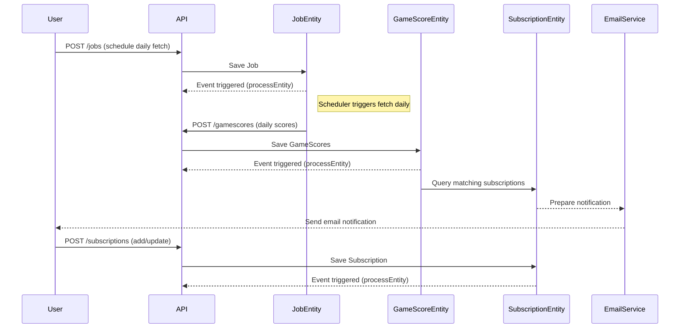

# Functional Requirements for NBA Scores Application (Event-Driven Architecture)

## 1. Business Entities to Persist (Max 3)

- **Job**  
  Represents the orchestration entity for daily score fetching and notification sending. Triggers event workflows for fetching scores and sending emails.

- **Subscription**  
  Represents user subscriptions to teams or all games. Saving/updating triggers notification preparation events.

- **GameScore**  
  Represents the stored NBA game score data. Saving/updating triggers notification dispatch events.

---

## 2. API Endpoints

### POST Endpoints (Add/Update Entities & Trigger Events)

- **POST /jobs**  
  Create or update a Job (e.g., schedule daily fetch)  
  Request:  
  ```json
  {
    "jobId": "daily-nba-fetch",
    "schedule": "0 0 19 * * *"
  }
  ```  
  Response:  
  ```json
  {
    "jobId": "daily-nba-fetch",
    "status": "scheduled"
  }
  ```

- **POST /subscriptions**  
  Add or update a Subscription  
  Request:  
  ```json
  {
    "userEmail": "user@example.com",
    "teams": ["LAL", "BOS"]
  }
  ```  
  Response:  
  ```json
  {
    "subscriptionId": "sub123",
    "status": "active"
  }
  ```

- **POST /gamescores**  
  Add or update GameScore after fetching  
  Request:  
  ```json
  {
    "gameId": "20240610-LAL-BOS",
    "date": "2024-06-10",
    "teamHome": "LAL",
    "teamAway": "BOS",
    "scoreHome": 102,
    "scoreAway": 99
  }
  ```  
  Response:  
  ```json
  {
    "gameId": "20240610-LAL-BOS",
    "status": "stored"
  }
  ```

### GET Endpoints (Retrieve Data Only)

- **GET /subscriptions/{userEmail}**  
  Retrieve user subscription details  
  Response:  
  ```json
  {
    "userEmail": "user@example.com",
    "teams": ["LAL", "BOS"]
  }
  ```

- **GET /gamescores/{date}**  
  Retrieve all game scores for a specific date  
  Response:  
  ```json
  [
    {
      "gameId": "20240610-LAL-BOS",
      "teamHome": "LAL",
      "teamAway": "BOS",
      "scoreHome": 102,
      "scoreAway": 99
    }
  ]
  ```

---

## 3. Event Processing Workflows

- **Job saved/updated →** Trigger daily scheduled task to fetch NBA scores → Save `GameScore` entities.

- **GameScore saved/updated →** Trigger event to find matching `Subscription`s → Prepare and send email notifications.

- **Subscription saved/updated →** Optionally trigger confirmation or update notification preferences.

---

## 4. Request/Response Formats

All requests and responses use JSON format with clear identifiers and status fields as shown in the endpoints above.

---

## 5. User-App Interaction Mermaid Diagram


```mermaid
sequenceDiagram
    participant User
    participant API
    participant JobEntity
    participant GameScoreEntity
    participant SubscriptionEntity
    participant EmailService

    User->>API: POST /jobs (schedule daily fetch)
    API->>JobEntity: Save Job
    JobEntity-->>API: Event triggered (processEntity)
    Note right of JobEntity: Scheduler triggers fetch daily

    JobEntity->>API: POST /gamescores (daily scores)
    API->>GameScoreEntity: Save GameScores
    GameScoreEntity-->>API: Event triggered (processEntity)
    GameScoreEntity->>SubscriptionEntity: Query matching subscriptions
    SubscriptionEntity-->>EmailService: Prepare notification
    EmailService-->>User: Send email notification

    User->>API: POST /subscriptions (add/update)
    API->>SubscriptionEntity: Save Subscription
    SubscriptionEntity-->>API: Event triggered (processEntity)
```