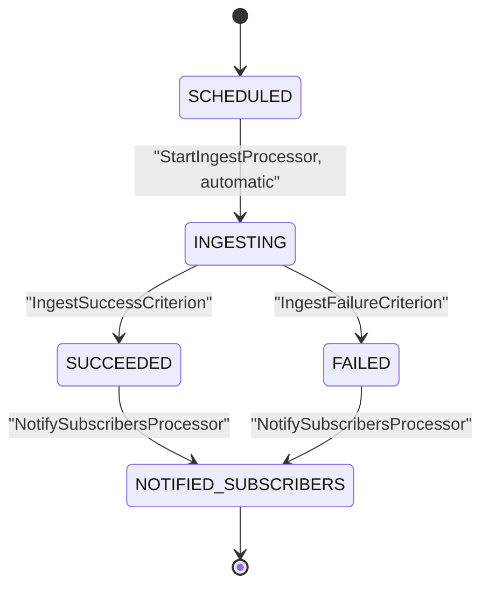
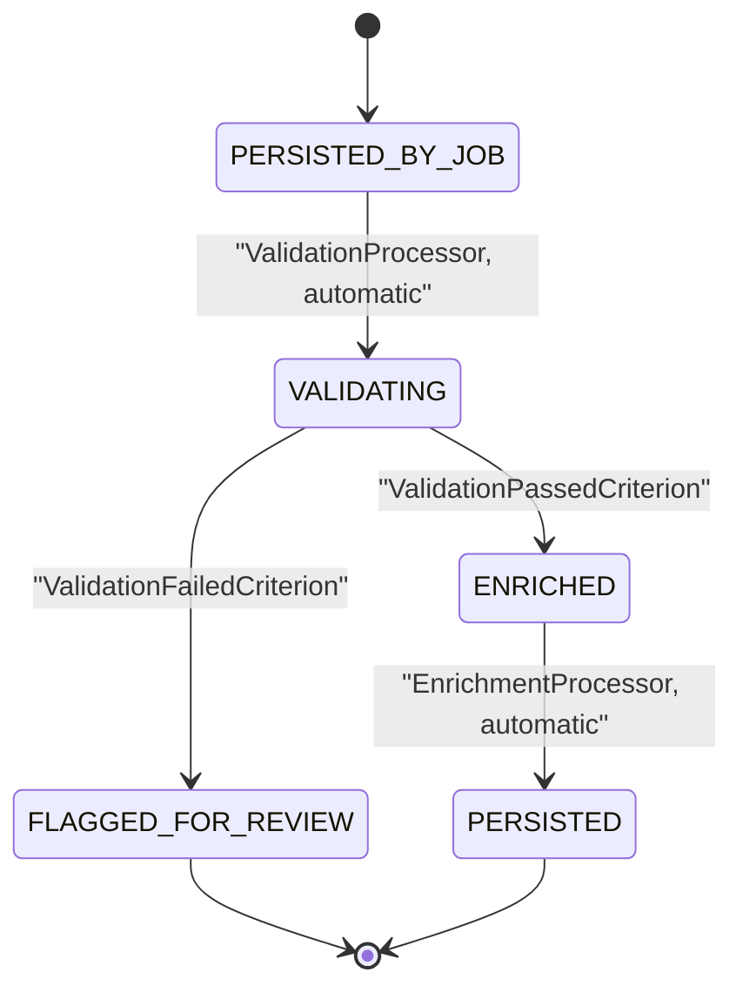
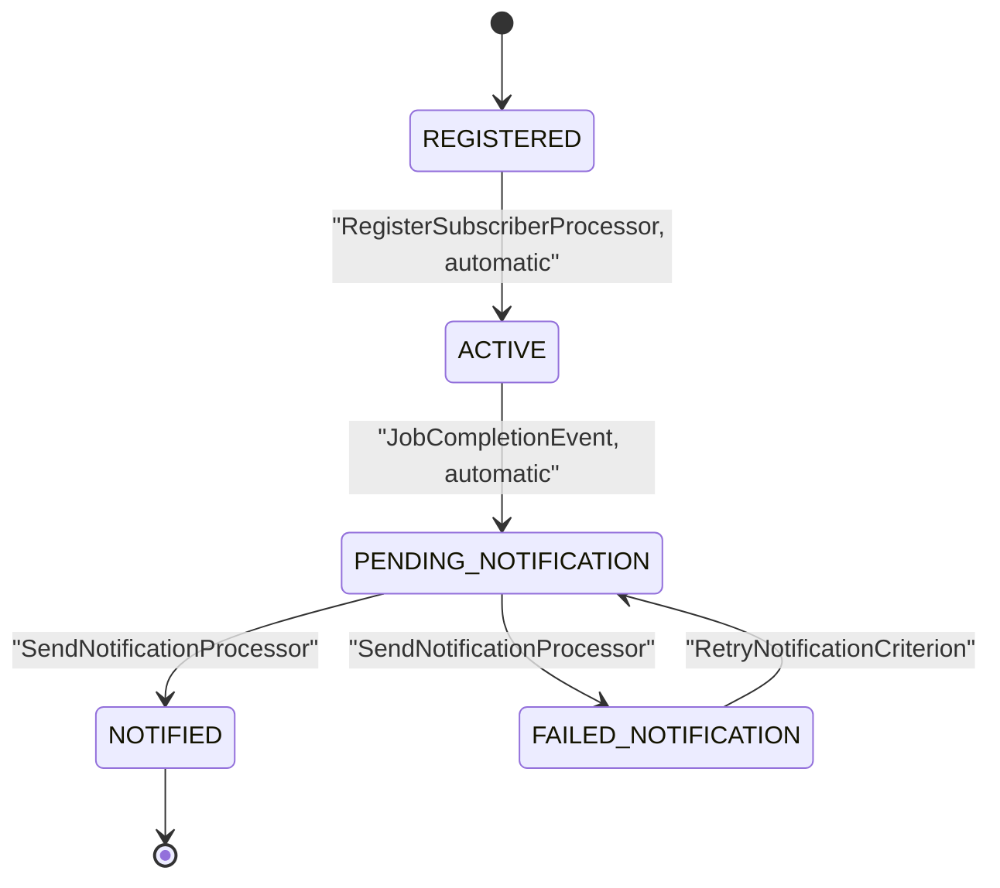

### 1. Entity Definitions
```
Job:
- jobId: String (external identifier for this ingestion job)
- scheduledAt: String (ISO datetime requested)
- startedAt: String (ISO datetime actual start)
- finishedAt: String (ISO datetime finish)
- status: String (current state label)
- sourceUrl: String (API endpoint)
- sourceSnapshot: Object (metadata: recordCount, cursor, responseHash)
- errorInfo: String (error message or null)
- summary: Object (counts: processed, new, updated, invalid)

Laureate:
- id: Integer (source record id)
- firstname: String
- surname: String
- gender: String
- born: String (date)
- died: String (date or null)
- borncountry: String
- borncountrycode: String
- borncity: String
- year: String
- category: String
- motivation: String
- affiliation_name: String
- affiliation_city: String
- affiliation_country: String
- ageAtAward: Integer (enriched)
- normalizedCountryCode: String (enriched)
- sourceJobId: String (jobId that ingested this)

Subscriber:
- subscriberId: String
- name: String
- contactType: String (email or webhook)
- contactDetails: Object (email or webhook URL)
- active: Boolean
- filters: Object (categories[], years[], borncountry[])
- deliveryMode: String (summary or per_record)
- retryPolicy: Object (maxAttempts, backoffSeconds)
```

### 2. Entity workflows

Job workflow:
1. Initial State: SCHEDULED (created via POST, event triggers process)
2. Start Ingest: move to INGESTING (automatic)
3. Ingestion result: SUCCEEDED or FAILED (automatic)
4. Processing: when SUCCEEDED run Laureate processors (automatic)
5. Notify Subscribers: NOTIFIED_SUBSCRIBERS (automatic after notifications)


```mermaid
stateDiagram-v2
    [*] --> SCHEDULED
    SCHEDULED --> INGESTING: "StartIngestProcessor, automatic"
    INGESTING --> SUCCEEDED: "IngestSuccessCriterion"
    INGESTING --> FAILED: "IngestFailureCriterion"
    SUCCEEDED --> NOTIFIED_SUBSCRIBERS: "NotifySubscribersProcessor"
    FAILED --> NOTIFIED_SUBSCRIBERS: "NotifySubscribersProcessor"
    NOTIFIED_SUBSCRIBERS --> [*]
```

Job processors & criteria:
- Processors: StartIngestProcessor, ParseSourceProcessor, CollectSummaryProcessor, NotifySubscribersProcessor
- Criteria: IngestSuccessCriterion (response OK and records parsed), IngestFailureCriterion

Laureate workflow:
1. Initial: PERSISTED_BY_JOB (created by Job process)
2. Validate: VALIDATING (automatic)
3. Enrich: ENRICHED (automatic if valid)
4. Persist: PERSISTED (upsert) or FLAGGED_FOR_REVIEW (manual for invalid)


```mermaid
stateDiagram-v2
    [*] --> PERSISTED_BY_JOB
    PERSISTED_BY_JOB --> VALIDATING: "ValidationProcessor, automatic"
    VALIDATING --> ENRICHED: "ValidationPassedCriterion"
    VALIDATING --> FLAGGED_FOR_REVIEW: "ValidationFailedCriterion"
    ENRICHED --> PERSISTED: "EnrichmentProcessor, automatic"
    FLAGGED_FOR_REVIEW --> [*]
    PERSISTED --> [*]
```

Laureate processors & criteria:
- Processors: ValidationProcessor, EnrichmentProcessor, UpsertProcessor
- Criteria: ValidationPassedCriterion, ValidationFailedCriterion

Subscriber workflow:
1. Initial: REGISTERED (created via POST)
2. Activate: ACTIVE (automatic)
3. Pending Notification: PENDING_NOTIFICATION (automatic on Job completion)
4. Notified or FAILED_NOTIFICATION (automatic with retry)


```mermaid
stateDiagram-v2
    [*] --> REGISTERED
    REGISTERED --> ACTIVE: "RegisterSubscriberProcessor, automatic"
    ACTIVE --> PENDING_NOTIFICATION: "JobCompletionEvent, automatic"
    PENDING_NOTIFICATION --> NOTIFIED: "SendNotificationProcessor"
    PENDING_NOTIFICATION --> FAILED_NOTIFICATION: "SendNotificationProcessor"
    FAILED_NOTIFICATION --> PENDING_NOTIFICATION: "RetryNotificationCriterion"
    NOTIFIED --> [*]
```

Subscriber processors & criteria:
- Processors: RegisterSubscriberProcessor, SendNotificationProcessor, RecordDeliveryStatusProcessor
- Criteria: RetryNotificationCriterion

### 3. Pseudo code for processor classes
```pseudo
class StartIngestProcessor:
  process(job):
    job.startedAt = now()
    response = fetch(job.sourceUrl)
    if response.status != 200:
      job.errorInfo = response.status + ' ' + response.message
      raise IngestError(response)
    job.sourceSnapshot = { recordCount: response.count, responseHash: hash(response) }
    emitRecordsToLaureateProcess(response.records)
    job.finishedAt = now()

class ValidationProcessor:
  process(laureate):
    required = [id, firstname, surname, year, category]
    for f in required:
      if laureate[f] is null:
        laureate.validationError = f + ' missing'
        setState(laureate, FLAGGED_FOR_REVIEW)
        return FAIL
    setState(laureate, ENRICHED)
    return PASS

class EnrichmentProcessor:
  process(laureate):
    if laureate.born:
      laureate.ageAtAward = int(laureate.year) - year(laureate.born)
    laureate.normalizedCountryCode = normalizeCountry(laureate.borncountrycode or laureate.borncountry)
    emit UpsertProcessor(laureate)

class SendNotificationProcessor:
  process(job, subscriber):
    payload = buildPayload(job, subscriber.deliveryMode)
    attempt = 0
    while attempt < subscriber.retryPolicy.maxAttempts:
      result = deliver(payload, subscriber.contactDetails)
      if result.success:
        recordDeliverySuccess(job, subscriber, attempt)
        return
      wait exponentialBackoff(attempt, subscriber.retryPolicy.backoffSeconds)
      attempt += 1
    recordDeliveryFailure(job, subscriber, attempt)
```

### 4. API Endpoints Design Rules

- POST endpoints: entity creation triggers events and must return only technicalId.
- GET endpoints: retrieving stored results. All POST-created entities must have GET by technicalId.
- No additional POST endpoints for business entities: business entities are created/updated by the process method.
- GET by non-technical fields provided only if explicitly requested (none requested here).

POST /jobs
- Purpose: create Job (triggers ingestion event). Returns only technicalId.
Request:
```json
{
  "jobId": "job-2025-08-01-01",
  "scheduledAt": "2025-08-01T10:00:00Z",
  "sourceUrl": "https://public.opendatasoft.com/api/explore/v2.1/catalog/datasets/nobel-prize-laureates/records"
}
```
Response 201:
```json
{
  "technicalId": "<generated-uuid>"
}
```

GET /jobs/{technicalId}
- Purpose: retrieve Job and full status/summary
Response 200:
```json
{
  "technicalId": "<generated-uuid>",
  "jobId": "job-2025-08-01-01",
  "scheduledAt": "2025-08-01T10:00:00Z",
  "startedAt": "2025-08-01T10:00:05Z",
  "finishedAt": "2025-08-01T10:00:20Z",
  "status": "NOTIFIED_SUBSCRIBERS",
  "summary": { "processed": 10, "new": 2, "updated": 0, "invalid": 1 },
  "errorInfo": null
}
```

POST /subscribers
- Purpose: register subscriber (triggers subscriber workflow). Returns only technicalId.
Request:
```json
{
  "name": "Nobel Alerts",
  "contactType": "webhook",
  "contactDetails": { "url": "https://example.com/webhook" },
  "active": true,
  "filters": { "categories": ["Chemistry"], "years": ["2010","2011"] },
  "deliveryMode": "summary",
  "retryPolicy": { "maxAttempts": 3, "backoffSeconds": 30 }
}
```
Response 201:
```json
{
  "technicalId": "<generated-uuid>"
}
```

GET /subscribers/{technicalId}
Response 200:
```json
{
  "technicalId": "<generated-uuid>",
  "subscriberId": "sub-123",
  "name": "Nobel Alerts",
  "active": true,
  "filters": { "categories": ["Chemistry"] },
  "contactDetails": { "url": "https://example.com/webhook" }
}
```

GET /laureates/{id}
- Purpose: retrieve persisted laureate (created by Job processing)
Response 200:
```json
{
  "id": 853,
  "firstname": "Akira",
  "surname": "Suzuki",
  "year": "2010",
  "category": "Chemistry",
  "ageAtAward": 80,
  "sourceJobId": "job-2025-08-01-01"
}
```

Acceptance criteria (functional)
- Persisting Job or Subscriber triggers Cyoda workflows automatically.
- Job success = API fetched and records parsed; processing summary persisted.
- Subscribers with matching filters receive notifications; delivery attempts recorded per retryPolicy.
- Laureates failing validation are flagged for review and do not block Job notification.
- All transitions record timestamps and errorInfo for auditing.

---

Example Ready-to-Copy User Response (use to confirm or request changes)
```markdown
Thanks — I confirm the corrected mermaid diagrams and the functional requirements as provided. Please proceed with modeling the Job workflow in Cyoda first.
```

finish_discussion