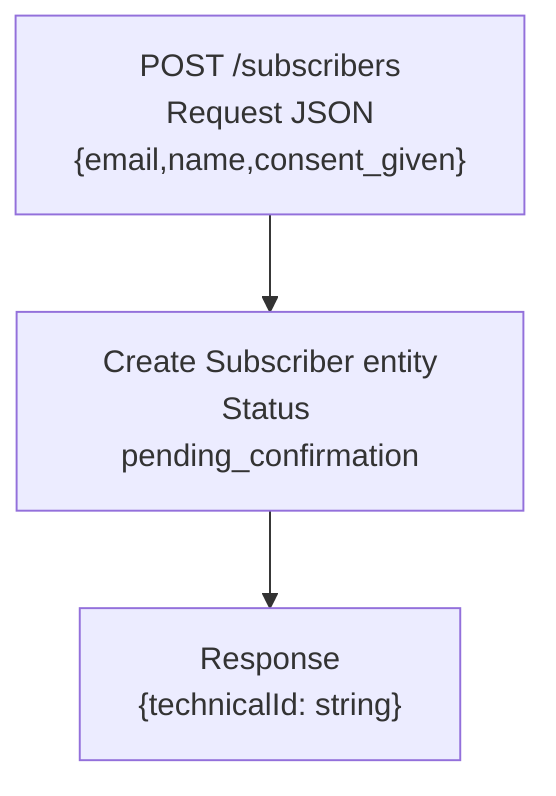
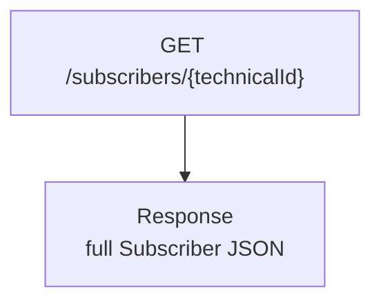
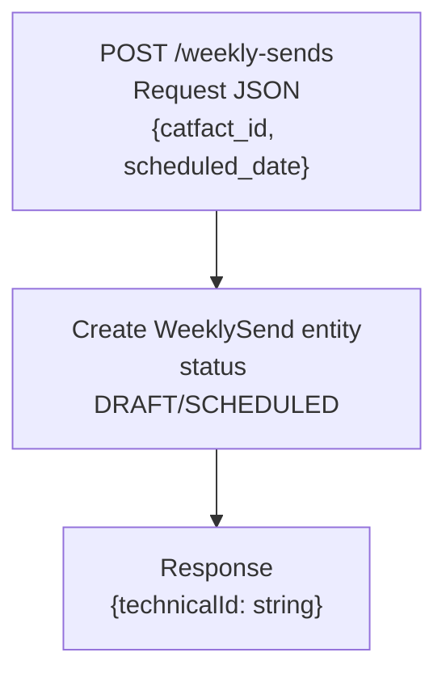
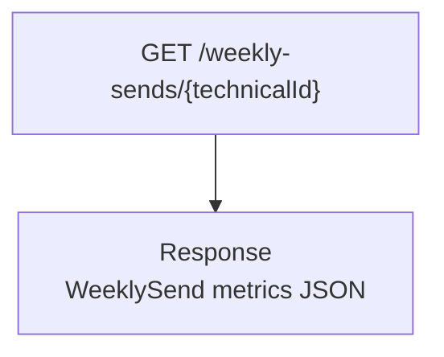
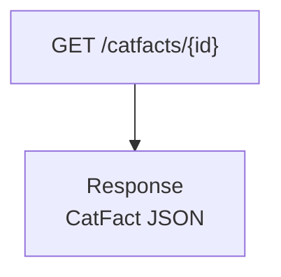

### 1. Entity Definitions
``` 
Subscriber:
- id: String (domain id for subscriber record)
- email: String (subscriber email address)
- name: String (optional display name)
- status: String (active / pending_confirmation / unsubscribed / bounced)
- subscribed_date: String (ISO timestamp)
- unsubscribed_date: String (ISO timestamp)
- consent_given: Boolean (opt-in flag)
- last_interaction_date: String (ISO timestamp)

CatFact:
- id: String (domain id for the fact)
- text: String (the cat fact content)
- source: String (source name or api endpoint)
- retrieved_date: String (ISO timestamp)
- fact_date: String (date provided by source if any)
- archived: Boolean (historical archive flag)

WeeklySend:
- id: String (domain id for this send/campaign)
- catfact_id: String (links to CatFact.id)
- scheduled_date: String (planned send date ISO)
- actual_send_date: String (when send occurred ISO)
- recipients_count: Integer
- opens_count: Integer
- clicks_count: Integer
- unsubscribes_count: Integer
- bounces_count: Integer
- status: String (draft / scheduled / sending / sent / failed)
```

### 2. Entity workflows

Subscriber workflow:
1. Initial State: Subscriber created with status = pending_confirmation (POST /subscribers event)
2. Validation: Validate email format and consent
3. Confirmation: If double opt-in chosen, send confirmation email and wait for user action (manual transition)
4. Activation: On confirmed or single opt-in, set status = active
5. Interaction Updates: When sends produce opens/clicks/unsubscribe/bounce events, update status and last_interaction_date
6. Deactivation: Manual unsubscribe or automatic bounce threshold → unsubscribed/bounced

```mermaid
stateDiagram-v2
    [*] --> "PENDING_CONFIRMATION"
    "PENDING_CONFIRMATION" --> "VALIDATED" : ValidateSubscriberCriterion / ValidateSubscriberProcessor, automatic
    "VALIDATED" --> "AWAITING_CONFIRMATION" : SendConfirmationProcessor, automatic
    "AWAITING_CONFIRMATION" --> "ACTIVE" : ConfirmationReceivedCriterion / ConfirmSubscriberProcessor, manual
    "VALIDATED" --> "ACTIVE" : SingleClickSignupProcessor, manual
    "ACTIVE" --> "UNSUBSCRIBED" : UnsubscribeProcessor, manual
    "ACTIVE" --> "BOUNCED" : BounceNoticeProcessor, automatic
    "UNSUBSCRIBED" --> [*]
    "BOUNCED" --> [*]
```

Subscriber processors & criteria:
- Criteria: ValidateSubscriberCriterion (checks email format, duplication)
- Processors:
  - ValidateSubscriberProcessor (runs basic checks)
  - SendConfirmationProcessor (enqueue confirmation email)
  - ConfirmSubscriberProcessor (mark active on user confirmation)
  - SingleClickSignupProcessor (activate without confirmation if configured)
  - UnsubscribeProcessor (handle user unsubscribe)
  - BounceNoticeProcessor (handle bounce events and escalate)

CatFact workflow:
1. Initial State: CatFact created when ingestion job runs (entity persisted by Cyoda process)
2. Quality Check: Validate text length and uniqueness vs archive
3. Archive/Ready: If passes checks, mark archived=false and READY for campaigns
4. Rejection: If duplicate or invalid, mark archived=true / rejected

```mermaid
stateDiagram-v2
    [*] --> "INGESTED"
    "INGESTED" --> "VALIDATING" : FetchQualityCriterion / FetchCatFactProcessor, automatic
    "VALIDATING" --> "REJECTED" : DuplicateCriterion / RejectCatFactProcessor, automatic
    "VALIDATING" --> "READY" : AcceptCatFactProcessor, automatic
    "READY" --> "ARCHIVED" : ArchiveOldFactsProcessor, automatic
    "REJECTED" --> [*]
    "ARCHIVED" --> [*]
```

CatFact processors & criteria:
- Criteria: FetchQualityCriterion (checks presence and length), DuplicateCriterion (checks against recent facts)
- Processors:
  - FetchCatFactProcessor (retrieves fact from API and persists)
  - AcceptCatFactProcessor (marks READY)
  - RejectCatFactProcessor (marks archived/rejected)
  - ArchiveOldFactsProcessor (periodically archive old facts)

WeeklySend workflow (orchestration entity):
1. Initial State: WeeklySend created (POST or scheduled event) in DRAFT
2. Scheduling: Move to SCHEDULED with scheduled_date set
3. Preparation: Resolve recipients (query active Subscribers) and prepare personalized payloads
4. Sending: Transition to SENDING and dispatch emails; track partial failures
5. Completion: Move to SENT if all done, or FAILED with error details
6. Reporting: Aggregate opens/clicks/unsubscribes/bounces and update metrics

```mermaid
stateDiagram-v2
    [*] --> "DRAFT"
    "DRAFT" --> "SCHEDULED" : ScheduleSendProcessor, manual
    "SCHEDULED" --> "PREPARING" : PrepareRecipientsProcessor, automatic
    "PREPARING" --> "SENDING" : StartSendProcessor, automatic
    "SENDING" --> "SENT" : SendCompleteCriterion / CompleteSendProcessor, automatic
    "SENDING" --> "FAILED" : SendFailureCriterion / FailSendProcessor, automatic
    "SENT" --> "REPORTING" : AggregateReportingProcessor, automatic
    "REPORTING" --> [*]
    "FAILED" --> [*]
```

WeeklySend processors & criteria:
- Criteria:
  - SendCompleteCriterion (no pending deliveries)
  - SendFailureCriterion (delivery error thresholds)
- Processors:
  - ScheduleSendProcessor (set scheduled_date)
  - PrepareRecipientsProcessor (query active subscribers and build recipient list)
  - StartSendProcessor (dispatch emails, mark recipients_count)
  - CompleteSendProcessor (finalize counts and set actual_send_date)
  - FailSendProcessor (capture errors and retry or mark failed)
  - AggregateReportingProcessor (aggregate opens/clicks/unsubscribes/bounces)

### 3. Pseudo code for processor classes

Note: these are functional pseudocode sketches (Cyoda process method will invoke them).

ValidateSubscriberProcessor:
```
function process(subscriber):
    if not isValidEmail(subscriber.email):
        mark subscriber.status = pending_confirmation
        emit validation_error event
    else:
        mark subscriber.status = validated
```

SendConfirmationProcessor:
```
function process(subscriber):
    create confirmation_token
    enqueue EmailEvent(recipient=subscriber.email, template=confirmation, token)
    mark subscriber.status = awaiting_confirmation
```

FetchCatFactProcessor:
```
function process(ingestionJob):
    fact = call CatFact API
    create CatFact entity with text, source, retrieved_date
    emit CatFact created event
```

PrepareRecipientsProcessor:
```
function process(weeklySend):
    subscribers = query Subscribers where status == active
    weeklySend.recipients_count = subscribers.size
    create delivery records per subscriber
```

StartSendProcessor:
```
function process(weeklySend):
    for each delivery in weeklySend.deliveries:
        enqueue EmailEvent(recipient=delivery.email, body=compose(catfact, subscriber))
    mark weeklySend.status = sending
```

AggregateReportingProcessor:
```
function process(weeklySend):
    weeklySend.opens_count = count opens linked to weeklySend.id
    weeklySend.clicks_count = count clicks linked to weeklySend.id
    weeklySend.unsubscribes_count = count unsubscribes linked to weeklySend.id
    weeklySend.bounces_count = count bounces linked to weeklySend.id
    update weeklySend.status = sent
```

Criteria pseudo examples:
- ValidateSubscriberCriterion: returns true if email format ok and not duplicated.
- DuplicateCriterion: compares new fact text hash vs recent facts.
- SendCompleteCriterion: checks all deliveries have final state delivered/failed.

### 4. API Endpoints Design Rules

Rules applied:
- POST endpoints create entities and MUST return only technicalId.
- GET by technicalId available for entities created via POST.
- GET all / GET by condition omitted unless requested.

Defined endpoints and JSON formats:

1) POST /subscribers
- Purpose: user signup (creates Subscriber entity, triggers Subscriber workflow)
- Request JSON:
{
  "email": "alice@example.com",
  "name": "Alice",
  "consent_given": true
}
- Response JSON:
{
  "technicalId": "string"
}

Mermaid visualization:

```mermaid
graph TD
    A["POST /subscribers\nRequest JSON\n{email,name,consent_given}"] --> B["Create Subscriber entity\nStatus pending_confirmation"]
    B --> C["Response\n{technicalId: string}"]
```

2) GET /subscribers/{technicalId}
- Purpose: retrieve stored subscriber record
- Response JSON:
{
  "technicalId": "string",
  "id": "string",
  "email": "alice@example.com",
  "name": "Alice",
  "status": "active",
  "subscribed_date": "2025-08-01T00:00:00Z",
  "consent_given": true,
  "last_interaction_date": "2025-08-07T12:00:00Z"
}

Mermaid visualization:

```mermaid
graph TD
    A["GET /subscribers/{technicalId}"] --> B["Response\nfull Subscriber JSON"]
```

3) POST /weekly-sends
- Purpose: create a WeeklySend orchestration (manual trigger or scheduled job creates same entity). Creates WeeklySend entity and starts its workflow (prepare -> send -> report).
- Request JSON:
{
  "catfact_id": "string",
  "scheduled_date": "2025-08-15T09:00:00Z"
}
- Response JSON:
{
  "technicalId": "string"
}

Mermaid visualization:

```mermaid
graph TD
    A["POST /weekly-sends\nRequest JSON\n{catfact_id, scheduled_date}"] --> B["Create WeeklySend entity\nstatus DRAFT/SCHEDULED"]
    B --> C["Response\n{technicalId: string}"]
```

4) GET /weekly-sends/{technicalId}
- Purpose: retrieve send status and metrics
- Response JSON:
{
  "technicalId": "string",
  "id": "string",
  "catfact_id": "string",
  "scheduled_date": "2025-08-15T09:00:00Z",
  "actual_send_date": "2025-08-15T09:05:00Z",
  "recipients_count": 1200,
  "opens_count": 300,
  "clicks_count": 45,
  "unsubscribes_count": 3,
  "bounces_count": 12,
  "status": "sent"
}

Mermaid visualization:

```mermaid
graph TD
    A["GET /weekly-sends/{technicalId}"] --> B["Response\nWeeklySend metrics JSON"]
```

5) GET /catfacts/{id}
- Purpose: read stored cat fact (no POST - facts created by ingestion workflow)
- Response JSON:
{
  "id": "string",
  "text": "Cats sleep 70% of their lives.",
  "source": "CatFactAPI",
  "retrieved_date": "2025-08-14T00:00:00Z",
  "archived": false
}

Mermaid visualization:

```mermaid
graph TD
    A["GET /catfacts/{id}"] --> B["Response\nCatFact JSON"]
```

Notes / Assumptions:
- Maximum entities used: 3 (Subscriber, CatFact, WeeklySend) per your default.
- All entity additions are events that trigger Cyoda workflows (process method).
- Confirmation flow (double opt-in) and reporting granularity assumed available; adjust processors/criteria if you prefer single opt-in or additional tracking (opens/clicks/forwards).
- If you want GET by condition (e.g., list active subscribers) or additional entities (delivery records, metrics), tell me and I will expand the model (up to 10 entities).