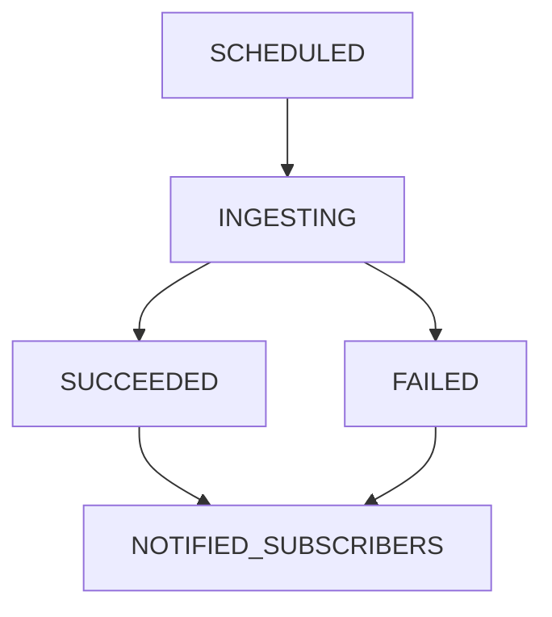

# Complete Requirement Specification

## Overview
Develop a Java-based application that ingests Nobel laureates data from the OpenDataSoft API and distributes relevant updates to subscribers. The system should model three core entities and implement a basic workflow engine for data processing and notification.

---

## Data Source

- **API Endpoint:**  
  `https://public.opendatasoft.com/api/explore/v2.1/catalog/datasets/nobel-prize-laureates/records`
  
- This endpoint returns structured JSON data representing Nobel Prize laureates.

---

## Core Components

### 1. Job Entity
- **Responsibilities:**
  - Manage the lifecycle of a data ingestion process.
  - Schedule ingestion from the API.
  - Transition through well-defined workflow states.
  - Trigger downstream processing on successful ingestion.
  - Notify all active subscribers upon job completion (success or failure).
  
- **States:**
  - `SCHEDULED` → `INGESTING` → (`SUCCEEDED` | `FAILED`) → `NOTIFIED_SUBSCRIBERS`

### 2. Laureate Entity
- **Represents:** A Nobel Prize laureate.
  
- **Example input structure (JSON):**
  ```json
  {
    "id": 853,
    "firstname": "Akira",
    "surname": "Suzuki",
    "born": "1930-09-12",
    "died": null,
    "borncountry": "Japan",
    "borncountrycode": "JP",
    "borncity": "Mukawa",
    "gender": "male",
    "year": "2010",
    "category": "Chemistry",
    "motivation": "for palladium-catalyzed cross couplings in organic synthesis",
    "name": "Hokkaido University",
    "city": "Sapporo",
    "country": "Japan"
  }
  ```
  
- **Attributes to Extract & Store:**
  - Personal Info: `id`, `firstname`, `surname`, `gender`, `born`, `died`
  - Origin Details: `borncountry`, `borncountrycode`, `borncity`
  - Award Info: `year`, `category`, `motivation`
  - Affiliation: `name`, `city`, `country`
  
- **Processors:**
  - **Validation Processor:** Ensure required fields are non-null and values conform to expected formats.
  - **Enrichment Processor:** Enhance or normalize data, e.g., calculating age, standardizing country codes, etc.

### 3. Subscriber Entity
- **Responsibilities:**
  - Define recipients who are notified when new laureates are ingested.
  - Hold contact information (email, webhook, etc.).
  - Receive notifications upon job completion.
  - Do **not** participate in workflow orchestration.

---

## Workflow Summary



- Each job must strictly follow this lifecycle to ensure reliable ingestion and notification.

---

## Additional Notes

- Use **asynchronous processing** for ingestion and notification.
- Provide **error handling/logging** per state transition.
- Prefer JSON parsing libraries like **Jackson** or **Gson** for processing responses.
- Configure job scheduling using libraries like **Quartz** or **Spring Scheduler**.