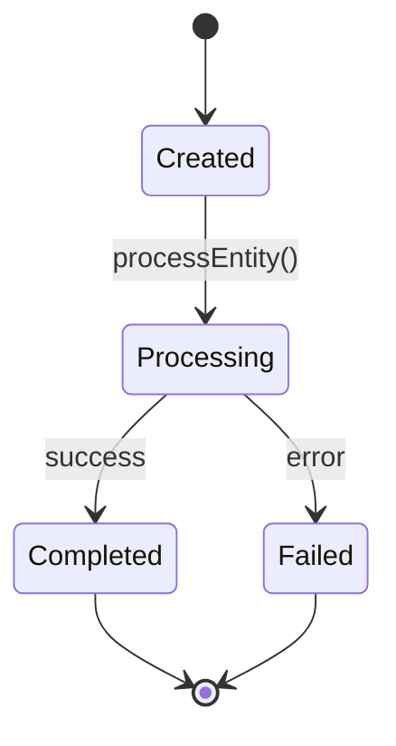
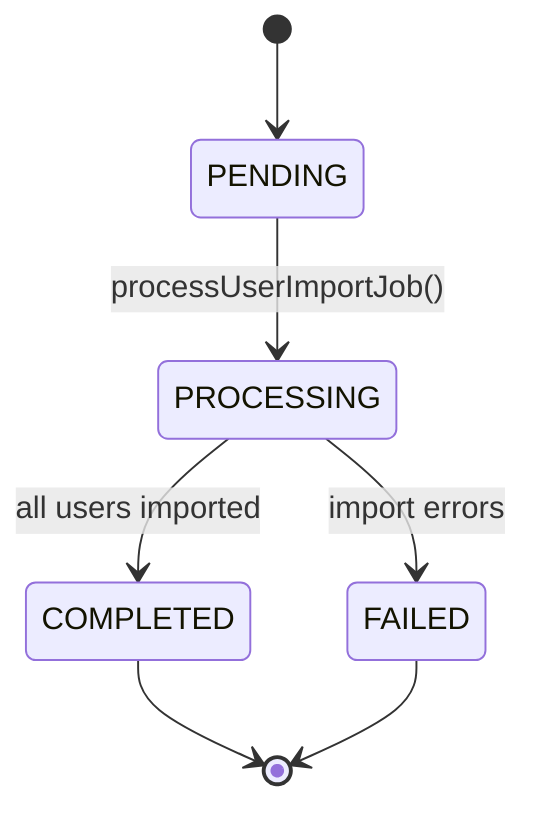

# Complete Requirements for Order Management System Based on Cyoda's Event-Driven Architecture

---

## 1. Entity Definitions

- **UserImportJob:**
  - `jobId`: String (unique identifier for the import job)
  - `importData`: String (raw user data in JSON or CSV format)
  - `status`: String (job processing status: PENDING, PROCESSING, COMPLETED, FAILED)
  - `createdAt`: DateTime (timestamp of job creation)

- **User:**
  - `userId`: String (unique identifier for user)
  - `name`: String (user's full name)
  - `email`: String (user email)
  - `role`: String (user role: Admin or Customer)
  - `createdAt`: DateTime (user creation timestamp)

- **Cart:**
  - `cartId`: String (unique identifier for the shopping cart)
  - `customerId`: String (reference to Customer userId)
  - `items`: List of CartItem (list of current products in cart)
  - `status`: String (cart status: ACTIVE, CHECKED_OUT)
  - `createdAt`: DateTime (cart creation timestamp)

- **CartItem:**
  - `productId`: String (reference to product)
  - `quantity`: Integer (number of product units added)

- **Order:**
  - `orderId`: String (unique identifier for the order)
  - `customerId`: String (reference to Customer userId)
  - `items`: List of OrderItem (products and quantities purchased)
  - `status`: String (order status: PENDING, COMPLETED, FAILED)
  - `createdAt`: DateTime (order creation timestamp)

- **OrderItem:**
  - `productId`: String (reference to product)
  - `quantity`: Integer (number of product units ordered)
  - `price`: Decimal (price per unit at order time)

---

## 2. Process Method Flows

- **processUserImportJob() Flow:**
  1. Initial State: UserImportJob created with PENDING status
  2. Validation: Validate `importData` format and required fields
  3. Processing: Parse `importData` and create immutable User entities with roles
  4. Completion: Update UserImportJob status to COMPLETED or FAILED
  5. Notification: (Optional) Notify Admin of import results

- **processCart() Flow:**
  1. Triggered on Cart creation or update (add/remove items)
  2. Validation: Check product availability for CartItems
  3. Processing: Update Cart entity with new items or changes (mutable updates allowed)
  4. Completion: Save updated Cart with status ACTIVE

- **processOrder() Flow:**
  1. Triggered on Order entity creation (checkout)
  2. Validation: Embedded `checkOrderStockAvailability` within `processOrder` to ensure stock sufficiency
  3. Processing:
     - Deduct product stock based on OrderItems
     - Update Cart status to CHECKED_OUT
     - Update Order status to COMPLETED on success, FAILED on error
  4. Completion: Persist Order and related stock adjustments
  5. Notification: (Optional) Notify Customer or Admin of order outcome

---

## 3. API Endpoints

| Method | Endpoint                               | Description                          | Request Body                                                    | Response                        |
|--------|--------------------------------------|------------------------------------|----------------------------------------------------------------|---------------------------------|
| POST   | /api/admin/users/import               | Create UserImportJob to import users | `{ "importData": "string" }`                                    | `{ "technicalId": "jobId" }`    |
| GET    | /api/admin/users/import/{jobId}      | Get UserImportJob status by jobId   | -                                                              | Full UserImportJob entity data  |
| GET    | /api/users/{userId}                   | Get User by userId                  | -                                                              | Full User entity data           |
| POST   | /api/customers/{customerId}/cart      | Create or update Cart for customer | `{ "items": [ { "productId": "string", "quantity": int } ] }` | `{ "technicalId": "cartId" }`   |
| GET    | /api/customers/{customerId}/cart      | Retrieve current Cart for customer | -                                                              | Full Cart entity data           |
| POST   | /api/customers/{customerId}/orders    | Create Order (checkout)             | `{ "cartId": "string" }`                                        | `{ "technicalId": "orderId" }`  |
| GET    | /api/customers/{customerId}/orders/{orderId} | Get Order by orderId           | -                                                              | Full Order entity data          |

---

## 4. Request/Response JSON Examples

- **User Import Job Request:**

```json
{
  "importData": "[{\"name\":\"Alice\", \"email\":\"alice@example.com\", \"role\":\"Admin\"}, {\"name\":\"Bob\", \"email\":\"bob@example.com\", \"role\":\"Customer\"}]"
}
```

- **Cart Add/Update Request:**

```json
{
  "items": [
    { "productId": "prod-123", "quantity": 2 },
    { "productId": "prod-456", "quantity": 1 }
  ]
}
```

- **Order Checkout Request:**

```json
{
  "cartId": "cart-789"
}
```

---

## 5. Mermaid Diagrams

- **Entity Lifecycle State Diagram**


```mermaid
stateDiagram-v2
    [*] --> Created
    Created --> Processing : processEntity()
    Processing --> Completed : success
    Processing --> Failed : error
    Completed --> [*]
    Failed --> [*]
```

- **UserImportJob Lifecycle**


```mermaid
stateDiagram-v2
    [*] --> PENDING
    PENDING --> PROCESSING : processUserImportJob()
    PROCESSING --> COMPLETED : all users imported
    PROCESSING --> FAILED : import errors
    COMPLETED --> [*]
    FAILED --> [*]
```

- **Cart and Order Event Flow**

```mermaid
sequenceDiagram
    Customer->>API: POST /cart (add/update items)
    API->>CartEntity: save Cart (mutable update)
    CartEntity->>processCart(): trigger processing
    processCart()->>ProductStockService: validate stock
    processCart-->>API: return CartId

    Customer->>API: POST /orders (checkout)
    API->>OrderEntity: create Order entity (immutable)
    OrderEntity->>processOrder(): trigger order processing
    processOrder->>StockService: checkOrderStockAvailability
    StockService-->>processOrder: validation result
    processOrder->>StockService: deduct stock
    processOrder->>CartEntity: update Cart status CHECKED_OUT
    processOrder-->>API: return OrderId
```

---

This specification fully captures the required entities, workflows, API design, example payloads, and architectural state/event diagrams for your order management system based on Cyoda’s Event-Driven Architecture principles.