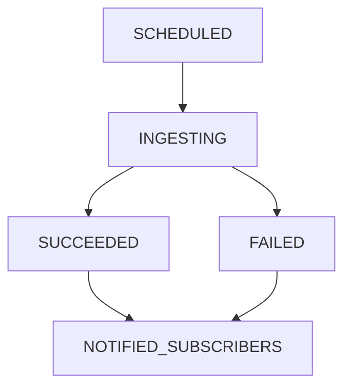

# Java-based Application for Nobel Laureates Data Ingestion Using OpenDataSoft API

## Overview
Develop a Java-based application that ingests Nobel laureates data from the OpenDataSoft API. The application should include three core entities — **Job**, **Laureate**, and **Subscriber** — each with specific responsibilities and workflow states.

---

## Core Entities and Responsibilities

### 1. Job Entity
- **Purpose:** Manages the data ingestion lifecycle.
- **Workflow States:**
  - SCHEDULED
  - INGESTING
  - SUCCEEDED or FAILED
  - NOTIFIED_SUBSCRIBERS
- **Responsibilities:**
  - Schedule ingestion from the OpenDataSoft API.
  - Transition through the defined workflow states.
  - Trigger downstream processing upon successful ingestion.
  - Notify all active subscribers upon job completion (success or failure).

### 2. Laureate Entity
- **Purpose:** Represents Nobel Prize laureates.
- **Example Input Structure:**
  ```json
  {
    "id": 853,
    "firstname": "Akira",
    "surname": "Suzuki",
    "born": "1930-09-12",
    "died": null,
    "borncountry": "Japan",
    "borncountrycode": "JP",
    "borncity": "Mukawa",
    "gender": "male",
    "year": "2010",
    "category": "Chemistry",
    "motivation": "\"for palladium-catalyzed cross couplings in organic synthesis\"",
    "name": "Hokkaido University",
    "city": "Sapporo",
    "country": "Japan"
  }
  ```
- **Attributes to Extract & Store:**
  - Personal Info: `id`, `firstname`, `surname`, `gender`, `born`, `died`
  - Origin Details: `borncountry`, `borncountrycode`, `borncity`
  - Award Info: `year`, `category`, `motivation`
  - Affiliation: `name`, `city`, `country`
- **Processors:**
  - Validation Processor: Ensure required fields are non-null and values conform to expected formats.
  - Enrichment Processor: Enhance or normalize data (e.g., calculating age, standardizing country codes).

### 3. Subscriber Entity
- **Purpose:** Defines recipients who are notified when new laureates are ingested.
- **Responsibilities:**
  - Hold contact information (email, webhook, etc.).
  - Receive notifications upon job completion.
  - Do **not** participate in workflow orchestration.

---

## Workflow Summary


```mermaid
graph TD
    A[SCHEDULED] --> B[INGESTING]
    B --> C1[SUCCEEDED]
    B --> C2[FAILED]
    C1 --> D[NOTIFIED_SUBSCRIBERS]
    C2 --> D
```

- Each job must strictly follow this lifecycle to ensure reliable ingestion and notification.

---

## Technical Requirements

- Use **asynchronous processing** for ingestion and notification.
- Implement **error handling and logging** for all state transitions.
- Use JSON parsing libraries such as **Jackson** or **Gson** to process API responses.
- Configure job scheduling using **Quartz** or **Spring Scheduler**.

---

## Data Source

- OpenDataSoft API Endpoint:
  ```
  https://public.opendatasoft.com/api/explore/v2.1/catalog/datasets/nobel-prize-laureates/records
  ```
- This endpoint returns structured JSON data representing Nobel Prize laureates.

---

# Summary

- Java-based application using OpenDataSoft API for Nobel laureates data ingestion.
- Three core entities: Job (lifecycle management), Laureate (data representation), Subscriber (notification recipients).
- Strict workflow states with asynchronous processing and error handling.
- Use Jackson/Gson for JSON parsing.
- Use Quartz or Spring Scheduler for job scheduling.