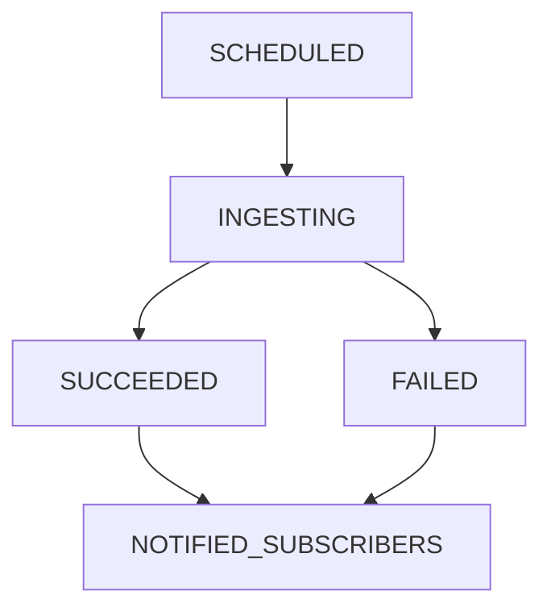

```markdown
# Java Application Specification: Nobel Laureates Data Ingestion and Notification

## Overview
Develop a **Java-based application** that ingests Nobel laureates data from the **OpenDataSoft API** and distributes relevant updates to subscribers. The system must model three core entities—**Job**, **Laureate**, and **Subscriber**—and implement a **workflow engine** to manage data processing and notification.

---

## Data Source

- **API Endpoint:**

  ```
  https://public.opendatasoft.com/api/explore/v2.1/catalog/datasets/nobel-prize-laureates/records
  ```

- This endpoint returns structured JSON data representing Nobel Prize laureates.

---

## Core Components

### 1. Job Entity

**Purpose:** Manages the lifecycle of a data ingestion process.

**Workflow States:**

```
SCHEDULED → INGESTING → (SUCCEEDED | FAILED) → NOTIFIED_SUBSCRIBERS
```

**Responsibilities:**

- Schedule ingestion from the OpenDataSoft API.
- Transition through the defined workflow states.
- Trigger downstream data processing upon successful ingestion.
- Notify all active subscribers upon job completion, whether success or failure.

**Implementation Notes:**

- Use asynchronous processing for ingestion and notification.
- Provide error handling and logging on each state transition.
- Use scheduling libraries such as **Quartz** or **Spring Scheduler** to manage job execution.

---

### 2. Laureate Entity

**Purpose:** Represents a Nobel Prize laureate.

**Sample JSON Input Structure:**

```json
{
  "id": 853,
  "firstname": "Akira",
  "surname": "Suzuki",
  "born": "1930-09-12",
  "died": null,
  "borncountry": "Japan",
  "borncountrycode": "JP",
  "borncity": "Mukawa",
  "gender": "male",
  "year": "2010",
  "category": "Chemistry",
  "motivation": "\"for palladium-catalyzed cross couplings in organic synthesis\"",
  "name": "Hokkaido University",
  "city": "Sapporo",
  "country": "Japan"
}
```

**Attributes to Extract and Store:**

- **Personal Info:** `id`, `firstname`, `surname`, `gender`, `born`, `died`
- **Origin Details:** `borncountry`, `borncountrycode`, `borncity`
- **Award Info:** `year`, `category`, `motivation`
- **Affiliation:** `name`, `city`, `country`

**Processors:**

- **Validation Processor:** Ensure all required fields are non-null and values conform to expected formats (e.g., date format, gender enumeration).
- **Enrichment Processor:** Enhance/normalize data, such as:
  - Calculating current age or age at death.
  - Standardizing country codes.
  - Normalizing names or categories.

**Implementation Notes:**

- Use JSON parsing libraries such as **Jackson** or **Gson** for response processing.
- Validate and enrich data after retrieval but before persistence or downstream processing.

---

### 3. Subscriber Entity

**Purpose:** Defines recipients who receive notifications when new laureates are ingested.

**Responsibilities:**

- Hold contact information (e.g., email address, webhook URL).
- Receive notifications upon job completion (success or failure).
- Subscribers do **not** participate in workflow orchestration.

**Implementation Notes:**

- Support multiple notification channels (email, webhook).
- Send notifications asynchronously after ingestion job completion.

---

## Workflow Summary

The ingestion job follows a strict lifecycle to ensure reliable processing:


```mermaid
graph TD
    A[SCHEDULED] --> B[INGESTING]
    B --> C1[SUCCEEDED]
    B --> C2[FAILED]
    C1 --> D[NOTIFIED_SUBSCRIBERS]
    C2 --> D
```

- **SCHEDULED:** Job is created and waiting to start.
- **INGESTING:** Data is being fetched and processed.
- **SUCCEEDED / FAILED:** Outcome of ingestion.
- **NOTIFIED_SUBSCRIBERS:** Subscribers are notified of the outcome.

---

## Additional Requirements and Recommendations

- Use **asynchronous processing** patterns for ingestion and notification to improve scalability and responsiveness.
- Implement **error handling and detailed logging** for all state transitions and processing steps.
- Prefer **Spring Boot 21** for the Java ecosystem for rapid development and integration with scheduling and messaging components.
- Use **Quartz** or **Spring Scheduler** for job scheduling.
- Use **Jackson** or **Gson** for JSON parsing and data binding.
- Maintain clear separation of concerns:
  - Workflow engine handles job states and transitions.
  - Laureate entity focuses on data validation and enrichment.
  - Subscriber entity manages notifications only.
- Design the system with **event-driven architecture** principles and support for future extensibility.
- Persist entities in a suitable datastore (e.g., relational database) for job tracking, laureate data, and subscriber management.

---

This specification ensures all business logic and technical details are preserved for robust, maintainable ingestion and notification of Nobel laureates data.
```