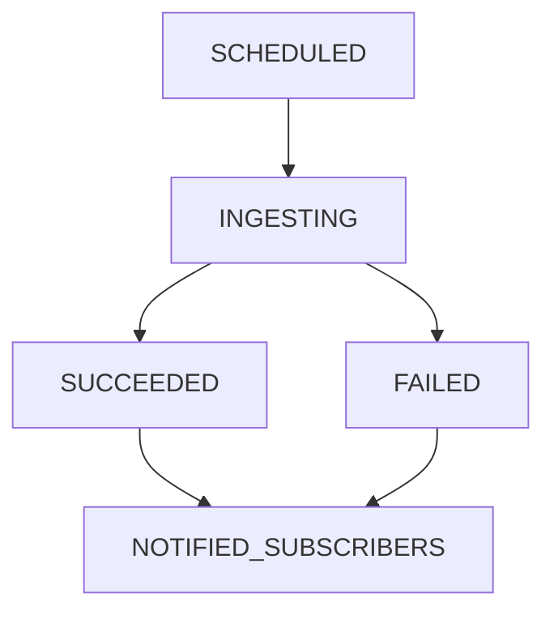

```markdown
# Java Application Specification: Nobel Laureates Data Ingestion and Notification System

## Overview
Develop a **Java-based application** that ingests Nobel laureates data from the OpenDataSoft API and distributes relevant updates to subscribers. The system should model three core entities (`Job`, `Laureate`, `Subscriber`) and implement a basic workflow engine for data processing and notification.

---

## Data Source

- **API Endpoint:**

  ```
  https://public.opendatasoft.com/api/explore/v2.1/catalog/datasets/nobel-prize-laureates/records
  ```

- This endpoint returns structured JSON data representing Nobel Prize laureates.

---

## Core Components and Entities

### 1. Job Entity

- **Responsibility:** Manage the lifecycle of a data ingestion process.

- **Workflow States:**

  ```
  SCHEDULED → INGESTING → (SUCCEEDED | FAILED) → NOTIFIED_SUBSCRIBERS
  ```

- **Responsibilities:**

  - Schedule ingestion from the OpenDataSoft API.
  - Transition through the defined workflow states following the lifecycle strictly.
  - Trigger downstream processing on successful ingestion.
  - Notify all active subscribers upon job completion (success or failure).

- **Technical Details:**

  - Use asynchronous processing for ingestion and notification.
  - Use a job scheduling library such as **Quartz** or **Spring Scheduler**.
  - Implement error handling and logging on every state transition.

---

### 2. Laureate Entity

- **Represents:** A Nobel Prize laureate with detailed attributes extracted from API data.

- **Example Input JSON Structure:**

  ```json
  {
    "id": 853,
    "firstname": "Akira",
    "surname": "Suzuki",
    "born": "1930-09-12",
    "died": null,
    "borncountry": "Japan",
    "borncountrycode": "JP",
    "borncity": "Mukawa",
    "gender": "male",
    "year": "2010",
    "category": "Chemistry",
    "motivation": "\"for palladium-catalyzed cross couplings in organic synthesis\"",
    "name": "Hokkaido University",
    "city": "Sapporo",
    "country": "Japan"
  }
  ```

- **Attributes to Extract and Store:**

  - **Personal Info:** `id`, `firstname`, `surname`, `gender`, `born`, `died`
  - **Origin Details:** `borncountry`, `borncountrycode`, `borncity`
  - **Award Info:** `year`, `category`, `motivation`
  - **Affiliation:** `name`, `city`, `country`

- **Processors:**

  - **Validation Processor:** Ensure required fields are non-null and conform to expected formats (e.g., date format, gender values).
  - **Enrichment Processor:** 
    - Enhance or normalize data, e.g.:
      - Calculate age at award or current age if applicable.
      - Standardize country codes.
      - Normalize text fields for consistency.

- **Technical Details:**

  - Use JSON parsing libraries such as **Jackson** or **Gson** for processing API responses.
  - Model this entity as a domain object with validation and enrichment logic encapsulated.

---

### 3. Subscriber Entity

- **Defines:** Recipients who receive notifications when new laureates are ingested.

- **Responsibilities:**

  - Hold contact information, e.g., email addresses, webhook URLs.
  - Receive notifications upon job completion (success or failure).
  - **Do not participate in workflow orchestration.**

- **Technical Details:**

  - Support multiple notification channels (email, webhook).
  - Notifications should be sent asynchronously.
  - Implement retry logic and error handling for notification failures.

---

## Workflow Summary


```mermaid
graph TD
    A[SCHEDULED] --> B[INGESTING]
    B --> C1[SUCCEEDED]
    B --> C2[FAILED]
    C1 --> D[NOTIFIED_SUBSCRIBERS]
    C2 --> D
```

- **Description:** Each `Job` must strictly follow this lifecycle to ensure reliable ingestion and notification.

---

## Additional Technical Notes

- **Asynchronous Processing:** Use asynchronous mechanisms (e.g., Spring’s `@Async`, messaging queues) for ingestion and notification to improve scalability and responsiveness.
- **Error Handling and Logging:** 
  - Log state transitions and errors with sufficient detail for troubleshooting.
  - Ensure failed jobs transition to `FAILED` state appropriately.
- **Scheduling:** Use Quartz Scheduler or Spring Scheduler for triggering ingestion jobs at configurable intervals or on-demand.
- **JSON Parsing:** Use Jackson or Gson libraries to parse and map JSON data from the API into Java objects.
- **Testing:** Implement unit and integration tests covering:
  - API data ingestion and parsing.
  - Workflow state transitions.
  - Validation and enrichment processors.
  - Notification delivery.

---

## Summary

This Java application will provide:

- Reliable ingestion of Nobel laureates data from OpenDataSoft API.
- A robust workflow engine managing ingestion lifecycle and notifications.
- Domain modeling of `Job`, `Laureate`, and `Subscriber` entities.
- Data validation, enrichment, and standardized notifications to subscribers.
- Asynchronous, scheduled, and fault-tolerant processing.

---

# End of Specification
```