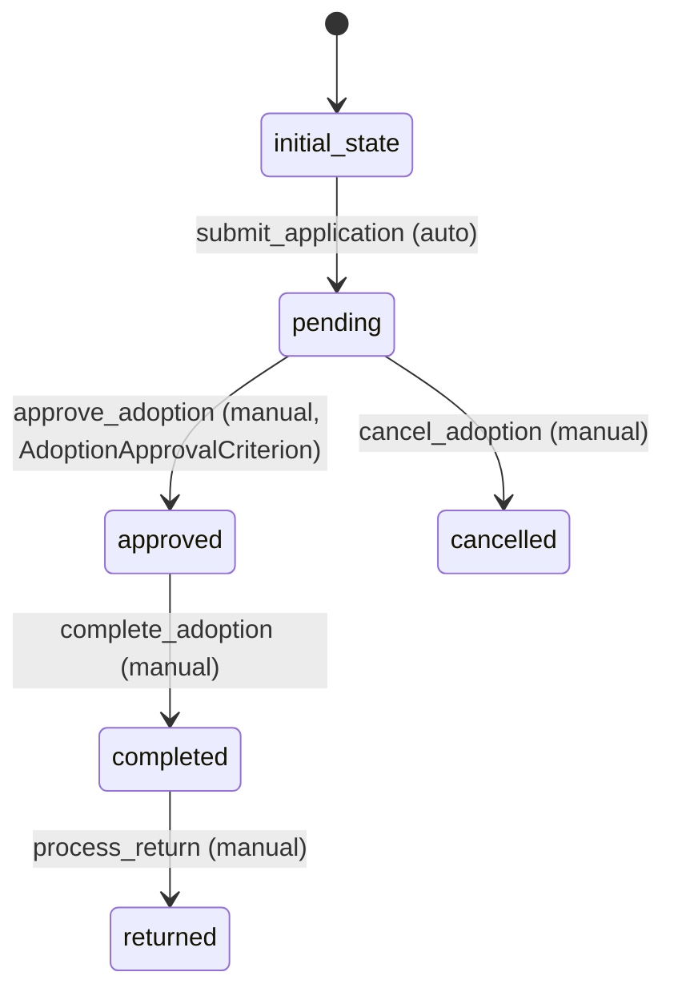

# Adoption Workflow

## States
- **initial_state**: Starting state for new adoption applications
- **pending**: Adoption application is under review
- **approved**: Adoption application has been approved
- **completed**: Adoption process is completed successfully
- **cancelled**: Adoption application was cancelled
- **returned**: Pet was returned after adoption

## Transitions

### initial_state → pending
- **Name**: submit_application
- **Manual**: false (automatic)
- **Processors**: [SubmitAdoptionProcessor]
- **Criteria**: none

### pending → approved
- **Name**: approve_adoption
- **Manual**: true
- **Processors**: [ApproveAdoptionProcessor]
- **Criteria**: [AdoptionApprovalCriterion]

### pending → cancelled
- **Name**: cancel_adoption
- **Manual**: true
- **Processors**: [CancelAdoptionProcessor]
- **Criteria**: none

### approved → completed
- **Name**: complete_adoption
- **Manual**: true
- **Processors**: [CompleteAdoptionProcessor]
- **Criteria**: none

### completed → returned
- **Name**: process_return
- **Manual**: true
- **Processors**: [ProcessReturnProcessor]
- **Criteria**: none

## Processors

### SubmitAdoptionProcessor
- **Entity**: Adoption
- **Purpose**: Initialize adoption application
- **Input**: Adoption entity with pet and owner IDs
- **Output**: Adoption application submitted
- **Pseudocode**:
```
process(adoption):
    validate pet and owner exist
    set application date
    calculate adoption fee
    log application submission
    return updated adoption
```

### ApproveAdoptionProcessor
- **Entity**: Adoption
- **Purpose**: Approve adoption application
- **Input**: Adoption entity with approval details
- **Output**: Adoption approved for completion
- **Pseudocode**:
```
process(adoption):
    verify owner eligibility
    confirm pet availability
    set approval timestamp
    notify owner of approval
    return updated adoption
```

### CancelAdoptionProcessor
- **Entity**: Adoption
- **Purpose**: Cancel adoption application
- **Input**: Adoption entity with cancellation reason
- **Output**: Adoption cancelled
- **Pseudocode**:
```
process(adoption):
    set cancellation reason and date
    notify owner of cancellation
    log cancellation activity
    return updated adoption
```

### CompleteAdoptionProcessor
- **Entity**: Adoption
- **Purpose**: Complete the adoption process
- **Input**: Adoption entity with completion details
- **Output**: Adoption completed successfully
- **Pseudocode**:
```
process(adoption):
    set adoption completion date
    process payment
    generate adoption certificate
    notify owner of completion
    return updated adoption
```

### ProcessReturnProcessor
- **Entity**: Adoption
- **Purpose**: Process pet return after adoption
- **Input**: Adoption entity with return details
- **Output**: Return processed
- **Pseudocode**:
```
process(adoption):
    set return date and reason
    process refund if applicable
    log return activity
    notify relevant parties
    return updated adoption
```

## Criteria

### AdoptionApprovalCriterion
- **Purpose**: Check if adoption can be approved
- **Pseudocode**:
```
check(adoption):
    return owner is verified AND
           pet is available AND
           adoption fee is confirmed
```

## Mermaid State Diagram


