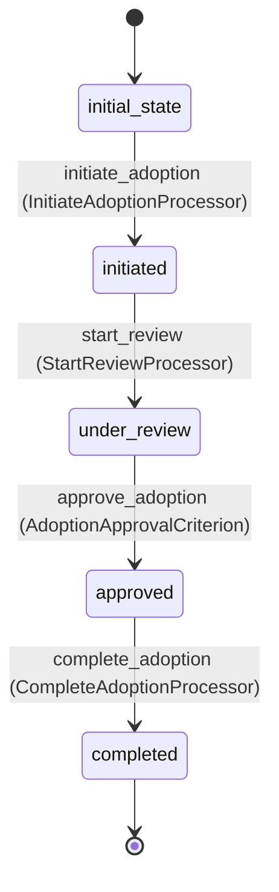

# Adoption Workflow

## States
- `initial_state`: Starting state when adoption is first created
- `initiated`: Adoption application has been submitted
- `under_review`: Application is being reviewed by staff
- `approved`: Adoption has been approved
- `completed`: Adoption process is finalized

## Transitions

### initial_state → initiated
- **Name**: `initiate_adoption`
- **Type**: Automatic
- **Processor**: `InitiateAdoptionProcessor`
- **Purpose**: Start the adoption application process

### initiated → under_review
- **Name**: `start_review`
- **Type**: Manual
- **Processor**: `StartReviewProcessor`
- **Purpose**: Begin staff review of adoption application

### under_review → approved
- **Name**: `approve_adoption`
- **Type**: Manual
- **Criterion**: `AdoptionApprovalCriterion`
- **Purpose**: Approve the adoption application

### approved → completed
- **Name**: `complete_adoption`
- **Type**: Manual
- **Processor**: `CompleteAdoptionProcessor`
- **Purpose**: Finalize the adoption process

## Processors

### InitiateAdoptionProcessor
- **Entity**: Adoption
- **Input**: New adoption application
- **Purpose**: Validate adoption application and set initial state
- **Output**: Initiated adoption
- **Pseudocode**:
```
process(adoption):
    validate adoption.petId exists
    validate adoption.ownerId exists
    set adoption.applicationDate to current timestamp
    return adoption
```

### StartReviewProcessor
- **Entity**: Adoption
- **Input**: Adoption ready for review
- **Purpose**: Begin review process and update pet status
- **Output**: Adoption under review
- **Pseudocode**:
```
process(adoption):
    find pet by adoption.petId
    transition pet to "reserved" state
    return adoption
```

### CompleteAdoptionProcessor
- **Entity**: Adoption
- **Input**: Approved adoption
- **Purpose**: Finalize adoption and update related entities
- **Output**: Completed adoption
- **Pseudocode**:
```
process(adoption):
    set adoption.completionDate to current timestamp
    find pet by adoption.petId
    transition pet to "adopted" state
    return adoption
```

## Criteria

### AdoptionApprovalCriterion
- **Purpose**: Check if adoption can be approved
- **Pseudocode**:
```
check(adoption):
    find owner by adoption.ownerId
    find pet by adoption.petId
    return owner.meta.state == "approved" AND 
           pet.meta.state == "reserved"
```

## Mermaid State Diagram


```mermaid
stateDiagram-v2
    [*] --> initial_state
    initial_state --> initiated : initiate_adoption (InitiateAdoptionProcessor)
    initiated --> under_review : start_review (StartReviewProcessor)
    under_review --> approved : approve_adoption (AdoptionApprovalCriterion)
    approved --> completed : complete_adoption (CompleteAdoptionProcessor)
    completed --> [*]
```
