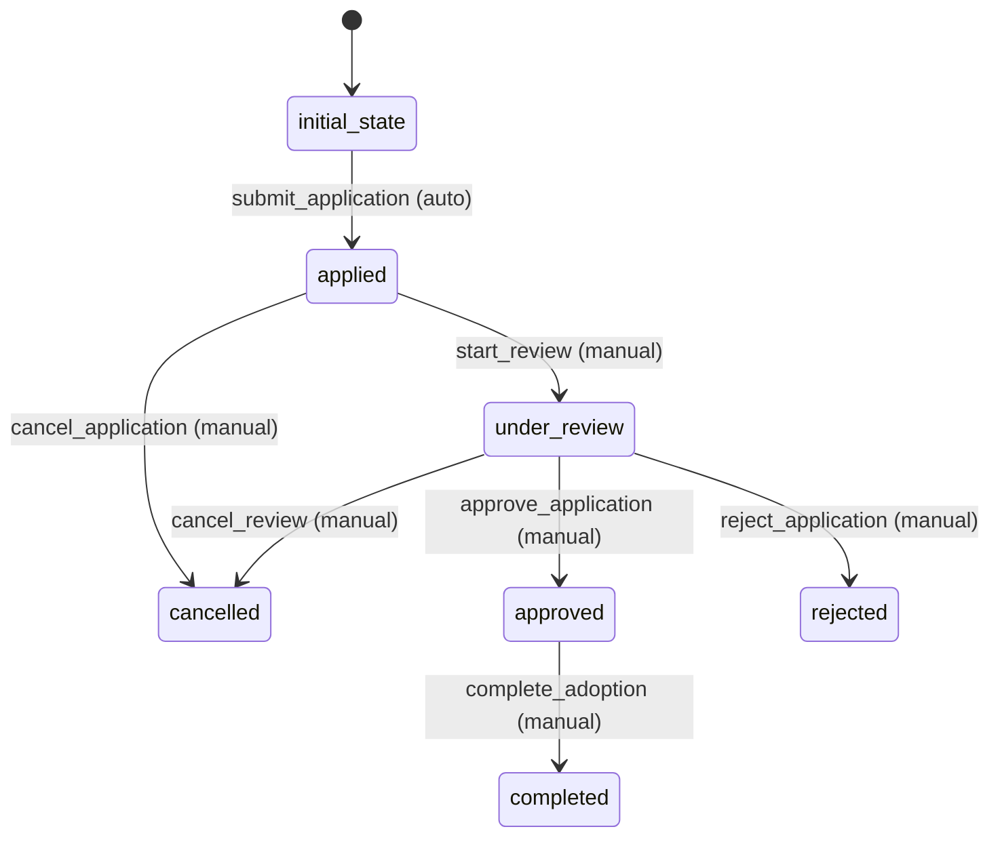

# Adoption Workflow

## States
- **initial_state**: Starting state for new adoptions
- **applied**: Adoption application submitted
- **under_review**: Application is being reviewed
- **approved**: Application approved, awaiting completion
- **completed**: Adoption successfully completed
- **rejected**: Application was rejected
- **cancelled**: Application was cancelled

## Transitions

### initial_state → applied
- **Name**: submit_application
- **Type**: Automatic
- **Processors**: AdoptionApplicationProcessor
- **Criteria**: None

### applied → under_review
- **Name**: start_review
- **Type**: Manual
- **Processors**: AdoptionReviewProcessor
- **Criteria**: None

### under_review → approved
- **Name**: approve_application
- **Type**: Manual
- **Processors**: None
- **Criteria**: AdoptionApprovalCriterion

### under_review → rejected
- **Name**: reject_application
- **Type**: Manual
- **Processors**: AdoptionRejectionProcessor
- **Criteria**: None

### approved → completed
- **Name**: complete_adoption
- **Type**: Manual
- **Processors**: AdoptionCompletionProcessor
- **Criteria**: None

### applied → cancelled
- **Name**: cancel_application
- **Type**: Manual
- **Processors**: None
- **Criteria**: None

### under_review → cancelled
- **Name**: cancel_review
- **Type**: Manual
- **Processors**: None
- **Criteria**: None

## Processors

### AdoptionApplicationProcessor
- **Entity**: Adoption
- **Purpose**: Process new adoption application
- **Input**: New adoption entity
- **Output**: Application ready for review
- **Pseudocode**:
```
process(adoption):
    validate application data
    set application date
    reserve pet (null transition)
    send confirmation to owner
    return updated adoption
```

### AdoptionReviewProcessor
- **Entity**: Adoption
- **Purpose**: Start adoption review process
- **Input**: Adoption entity
- **Output**: Adoption under review
- **Pseudocode**:
```
process(adoption):
    assign to staff reviewer
    schedule home visit if required
    perform background checks
    return updated adoption
```

### AdoptionRejectionProcessor
- **Entity**: Adoption
- **Purpose**: Handle adoption rejection
- **Input**: Adoption entity with rejection reason
- **Output**: Rejected adoption
- **Pseudocode**:
```
process(adoption):
    record rejection reason
    release pet reservation (null transition)
    send rejection notice to owner
    return updated adoption
```

### AdoptionCompletionProcessor
- **Entity**: Adoption
- **Purpose**: Complete adoption process
- **Input**: Adoption entity
- **Output**: Completed adoption
- **Pseudocode**:
```
process(adoption):
    finalize adoption paperwork
    process adoption fee payment
    complete pet adoption (null transition)
    schedule follow-up visit
    return updated adoption
```

## Criteria

### AdoptionApprovalCriterion
- **Purpose**: Check if adoption can be approved
- **Pseudocode**:
```
check(adoption):
    return adoption.homeVisitPassed == true AND 
           adoption.contractSigned == true
```

## Mermaid State Diagram


```mermaid
stateDiagram-v2
    [*] --> initial_state
    initial_state --> applied : submit_application (auto)
    applied --> under_review : start_review (manual)
    applied --> cancelled : cancel_application (manual)
    under_review --> approved : approve_application (manual)
    under_review --> rejected : reject_application (manual)
    under_review --> cancelled : cancel_review (manual)
    approved --> completed : complete_adoption (manual)
```
