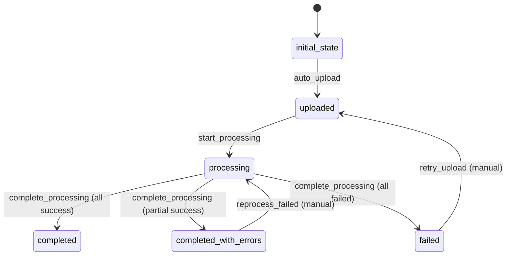

# BulkUpload Workflow Specification

## Overview
The BulkUpload workflow manages the lifecycle of bulk upload operations from file upload through processing completion.

## Workflow States

### 1. initial_state
- **Description**: Starting state for all new BulkUpload entities
- **Purpose**: Entry point for workflow processing

### 2. uploaded
- **Description**: File has been uploaded and BulkUpload entity created
- **Purpose**: File is ready for processing

### 3. processing
- **Description**: File is currently being processed
- **Purpose**: Items are being extracted and processed

### 4. completed
- **Description**: All items processed successfully
- **Purpose**: Terminal state for successful uploads

### 5. completed_with_errors
- **Description**: Processing completed but some items failed
- **Purpose**: Terminal state for partially successful uploads

### 6. failed
- **Description**: Upload processing failed completely
- **Purpose**: Terminal state for failed uploads

## State Transitions



## Transitions

### 1. auto_upload
- **From**: initial_state
- **To**: uploaded
- **Type**: Automatic
- **Manual**: false
- **Processors**: [InitializeBulkUploadProcessor]
- **Criteria**: None
- **Purpose**: Initialize bulk upload metadata

### 2. start_processing
- **From**: uploaded
- **To**: processing
- **Type**: Automatic
- **Manual**: false
- **Processors**: [StartProcessingProcessor]
- **Criteria**: [BulkUploadValidCriterion]
- **Purpose**: Begin processing uploaded file

### 3. complete_processing
- **From**: processing
- **To**: completed / completed_with_errors / failed
- **Type**: Automatic
- **Manual**: false
- **Processors**: [CompleteProcessingProcessor]
- **Criteria**: [ProcessingCompleteCriterion]
- **Purpose**: Finalize processing and determine outcome

### 4. retry_upload
- **From**: failed
- **To**: uploaded
- **Type**: Manual
- **Manual**: true
- **Processors**: [RetryUploadProcessor]
- **Criteria**: None
- **Purpose**: Retry failed upload

### 5. reprocess_failed
- **From**: completed_with_errors
- **To**: processing
- **Type**: Manual
- **Manual**: true
- **Processors**: [ReprocessFailedProcessor]
- **Criteria**: None
- **Purpose**: Reprocess failed items

## Processors

### 1. InitializeBulkUploadProcessor
- **Entity**: BulkUpload
- **Purpose**: Initialize BulkUpload with metadata
- **Input**: Basic BulkUpload data
- **Output**: BulkUpload with initialization metadata
- **Pseudocode**:
```
process(bulkUpload):
    bulkUpload.createdAt = now()
    bulkUpload.updatedAt = now()
    bulkUpload.processedItems = 0
    bulkUpload.failedItems = 0
    bulkUpload.errorMessages = []
    return bulkUpload
```

### 2. StartProcessingProcessor
- **Entity**: BulkUpload
- **Purpose**: Begin processing the uploaded file
- **Input**: BulkUpload in uploaded state
- **Output**: BulkUpload ready for processing
- **Pseudocode**:
```
process(bulkUpload):
    bulkUpload.updatedAt = now()
    // Parse file and count total items
    items = parseJsonFile(bulkUpload.fileName)
    bulkUpload.totalItems = items.size()
    
    // Process each item asynchronously
    for item in items:
        processHNItem(item, bulkUpload.uploadId)
    
    return bulkUpload
```

### 3. CompleteProcessingProcessor
- **Entity**: BulkUpload
- **Purpose**: Finalize processing and update counters
- **Input**: BulkUpload in processing state
- **Output**: BulkUpload with final status
- **Pseudocode**:
```
process(bulkUpload):
    bulkUpload.updatedAt = now()
    bulkUpload.completedAt = now()
    
    // Final counts are updated by individual item processors
    // This processor just sets completion timestamp
    return bulkUpload
```

### 4. RetryUploadProcessor
- **Entity**: BulkUpload
- **Purpose**: Reset failed upload for retry
- **Input**: Failed BulkUpload
- **Output**: BulkUpload ready for retry
- **Pseudocode**:
```
process(bulkUpload):
    bulkUpload.updatedAt = now()
    bulkUpload.processedItems = 0
    bulkUpload.failedItems = 0
    bulkUpload.errorMessages = []
    bulkUpload.completedAt = null
    return bulkUpload
```

### 5. ReprocessFailedProcessor
- **Entity**: BulkUpload
- **Purpose**: Reprocess only failed items
- **Input**: BulkUpload with errors
- **Output**: BulkUpload ready for reprocessing
- **Pseudocode**:
```
process(bulkUpload):
    bulkUpload.updatedAt = now()
    bulkUpload.completedAt = null
    
    // Reset failed counters for reprocessing
    bulkUpload.failedItems = 0
    bulkUpload.errorMessages = []
    
    return bulkUpload
```

## Criteria

### 1. BulkUploadValidCriterion
- **Purpose**: Validate bulk upload can be processed
- **Pseudocode**:
```
check(bulkUpload):
    if (bulkUpload.fileName == null || bulkUpload.fileName.isEmpty()):
        return false
    if (bulkUpload.uploadedAt == null):
        return false
    if (!fileExists(bulkUpload.fileName)):
        return false
    if (!isValidJsonFile(bulkUpload.fileName)):
        return false
    return true
```

### 2. ProcessingCompleteCriterion
- **Purpose**: Determine if processing is complete and outcome
- **Pseudocode**:
```
check(bulkUpload):
    totalProcessed = bulkUpload.processedItems + bulkUpload.failedItems
    return totalProcessed >= bulkUpload.totalItems
```

## Workflow JSON Structure
- **Name**: BulkUpload
- **Initial State**: initial_state
- **Version**: 1.0
- **Active**: true
- **States**: 6 states with defined transitions
- **Processors**: 5 processors for different lifecycle stages
- **Criteria**: 2 criteria for validation and completion checking
