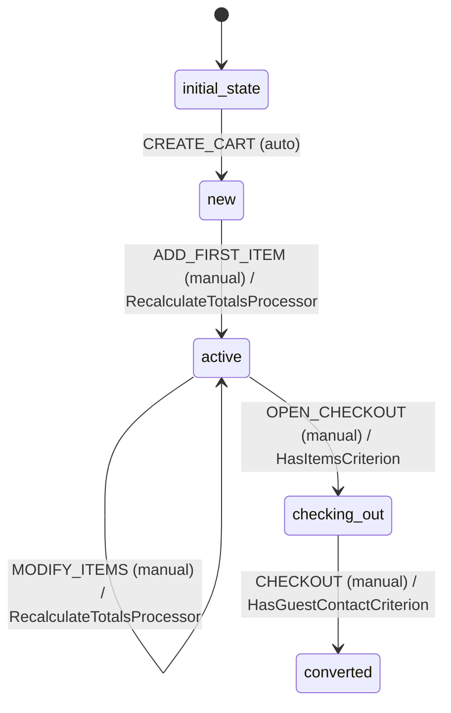

# Cart Workflow

## States
- **initial_state**: Entry point
- **new**: Cart created but empty
- **active**: Cart has items and can be modified
- **checking_out**: Cart in checkout process
- **converted**: Cart converted to order

## Transitions

### initial_state → new
- **Name**: CREATE_CART
- **Type**: Automatic
- **Processors**: None
- **Criteria**: None

### new → active
- **Name**: ADD_FIRST_ITEM
- **Type**: Manual
- **Processors**: RecalculateTotalsProcessor
- **Criteria**: None

### active → active (loop)
- **Name**: MODIFY_ITEMS
- **Type**: Manual
- **Processors**: RecalculateTotalsProcessor
- **Criteria**: None

### active → checking_out
- **Name**: OPEN_CHECKOUT
- **Type**: Manual
- **Processors**: None
- **Criteria**: HasItemsCriterion

### checking_out → converted
- **Name**: CHECKOUT
- **Type**: Manual
- **Processors**: None
- **Criteria**: HasGuestContactCriterion

## Mermaid State Diagram


## Processors

### RecalculateTotalsProcessor
- **Entity**: Cart
- **Purpose**: Recalculate cart totals when items change
- **Input**: Cart with modified lines
- **Output**: Cart with updated totals
- **Transition**: ADD_FIRST_ITEM, MODIFY_ITEMS

**Pseudocode for process() method:**
```
function process(cartWithMetadata):
    cart = cartWithMetadata.entity
    
    totalItems = 0
    grandTotal = 0
    
    for line in cart.lines:
        totalItems += line.qty
        grandTotal += line.price * line.qty
    
    cart.totalItems = totalItems
    cart.grandTotal = grandTotal
    cart.updatedAt = currentTimestamp()
    
    return cartWithMetadata
```

## Criteria

### HasItemsCriterion
- **Purpose**: Ensure cart has items before checkout

**Pseudocode for check() method:**
```
function check(cartWithMetadata):
    cart = cartWithMetadata.entity
    return cart.lines.length > 0 && cart.totalItems > 0
```

### HasGuestContactCriterion
- **Purpose**: Ensure guest contact info is provided

**Pseudocode for check() method:**
```
function check(cartWithMetadata):
    cart = cartWithMetadata.entity
    contact = cart.guestContact
    
    return contact != null && 
           contact.name != null && 
           contact.address != null &&
           contact.address.line1 != null &&
           contact.address.city != null &&
           contact.address.postcode != null &&
           contact.address.country != null
```
