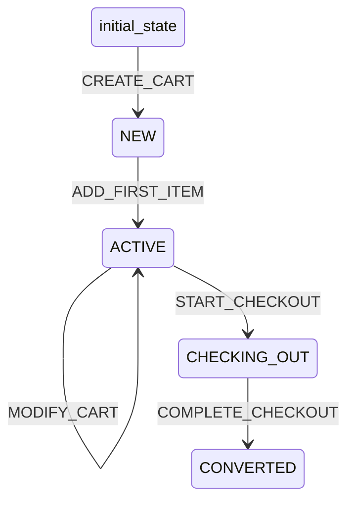

# Cart Workflow

## States
- **initial_state**: Starting state
- **NEW**: Cart created but empty
- **ACTIVE**: Cart has items and can be modified
- **CHECKING_OUT**: Cart is in checkout process
- **CONVERTED**: Cart converted to order

## Transitions



## Transition Details

### CREATE_CART (initial_state → NEW)
- **Type**: Automatic
- **Processors**: None
- **Criteria**: None

### ADD_FIRST_ITEM (NEW → ACTIVE)
- **Type**: Manual
- **Processors**: AddItemProcessor
- **Criteria**: None

### MODIFY_CART (ACTIVE → ACTIVE)
- **Type**: Manual
- **Processors**: ModifyCartProcessor
- **Criteria**: None

### START_CHECKOUT (ACTIVE → CHECKING_OUT)
- **Type**: Manual
- **Processors**: None
- **Criteria**: CartHasItemsCriterion

### COMPLETE_CHECKOUT (CHECKING_OUT → CONVERTED)
- **Type**: Manual
- **Processors**: None
- **Criteria**: None

## Processors

### AddItemProcessor
- **Entity**: Cart
- **Purpose**: Add first item to cart and recalculate totals
- **Input**: Cart with new line item
- **Output**: Updated cart with recalculated totals
- **Pseudocode**:
```
process(cart):
    add line item to cart.lines
    recalculate cart.totalItems
    recalculate cart.grandTotal
    update cart.updatedAt
    return cart
```

### ModifyCartProcessor
- **Entity**: Cart
- **Purpose**: Modify cart items and recalculate totals
- **Input**: Cart with modified line items
- **Output**: Updated cart with recalculated totals
- **Pseudocode**:
```
process(cart):
    update cart.lines (add/remove/modify items)
    recalculate cart.totalItems
    recalculate cart.grandTotal
    update cart.updatedAt
    return cart
```

## Criteria

### CartHasItemsCriterion
- **Purpose**: Verify cart has items before checkout
- **Pseudocode**:
```
check(cart):
    return cart.lines.length > 0 AND cart.totalItems > 0
```
