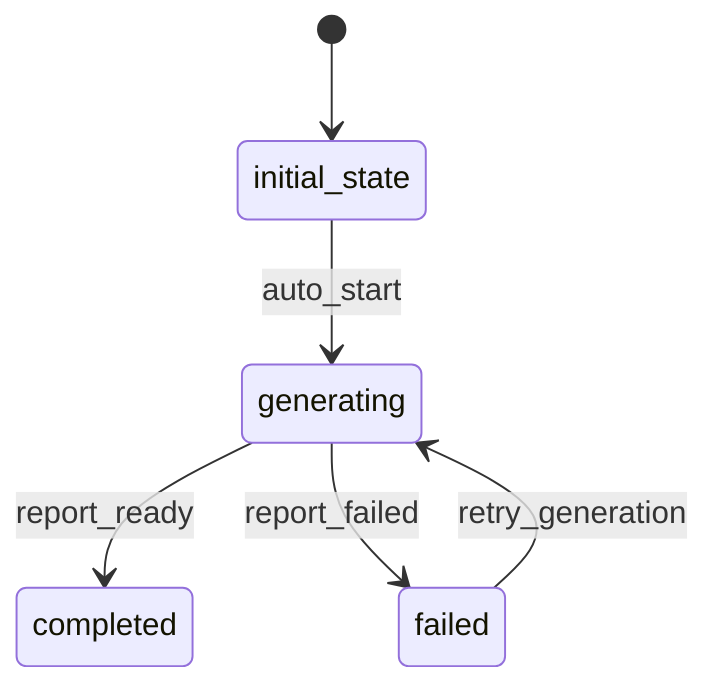

# CommentAnalysisReport Workflow

## States and Transitions



## State Definitions

- **initial_state**: Report entity created
- **generating**: Report being generated and email being sent
- **completed**: Report generated and email sent successfully
- **failed**: Report generation or email sending failed

## Transitions

### auto_start (initial_state → generating)
- **Type**: Automatic
- **Processor**: SendEmailReportProcessor
- **Purpose**: Send the analysis report via email

### report_ready (generating → completed)
- **Type**: Automatic
- **Purpose**: Mark report as successfully delivered

### report_failed (generating → failed)
- **Type**: Automatic
- **Criterion**: EmailFailedCriterion
- **Purpose**: Handle email sending failures

### retry_generation (failed → generating)
- **Type**: Manual
- **Purpose**: Retry sending the email report

## Processors

### SendEmailReportProcessor
- **Entity**: CommentAnalysisReport
- **Input**: CommentAnalysisReport with analysis data
- **Purpose**: Format and send email report
- **Output**: Report marked as sent
- **Pseudocode**:
```
subject = "Comment Analysis Report for Post " + postId
body = formatEmailBody(sentimentSummary, keyThemes, totalComments)

emailService.send(
    to: emailAddress,
    subject: subject,
    body: body
)

if email sent successfully:
    mark as completed
else:
    throw email error
```

## Criteria

### EmailFailedCriterion
- **Purpose**: Check if email sending has failed
- **Pseudocode**:
```
return entity.meta.hasError() || entity.meta.getErrorMessage() != null
```
