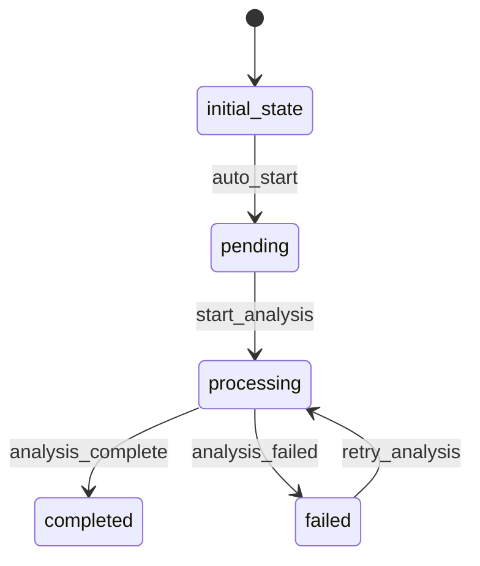

# CommentAnalysisRequest Workflow

## States and Transitions



## State Definitions

- **initial_state**: Entity created, awaiting validation
- **pending**: Request validated, ready for processing
- **processing**: Comments being fetched and analyzed
- **completed**: Analysis finished successfully
- **failed**: Analysis failed due to error

## Transitions

### auto_start (initial_state → pending)
- **Type**: Automatic
- **Processor**: ValidateRequestProcessor
- **Purpose**: Validate post ID and email address

### start_analysis (pending → processing)
- **Type**: Manual
- **Processor**: FetchCommentsProcessor
- **Purpose**: Fetch comments from JSONPlaceholder API

### analysis_complete (processing → completed)
- **Type**: Automatic
- **Processor**: GenerateReportProcessor
- **Purpose**: Create CommentAnalysisReport entity and send email

### analysis_failed (processing → failed)
- **Type**: Automatic
- **Criterion**: AnalysisFailedCriterion
- **Purpose**: Handle analysis failures

### retry_analysis (failed → processing)
- **Type**: Manual
- **Purpose**: Retry failed analysis

## Processors

### ValidateRequestProcessor
- **Entity**: CommentAnalysisRequest
- **Input**: CommentAnalysisRequest with postId and emailAddress
- **Purpose**: Validate request parameters
- **Output**: Validated request ready for processing
- **Pseudocode**:
```
if postId <= 0:
    throw validation error
if emailAddress is not valid email format:
    throw validation error
set requestedAt to current timestamp
```

### FetchCommentsProcessor
- **Entity**: CommentAnalysisRequest
- **Input**: Validated CommentAnalysisRequest
- **Purpose**: Fetch comments from JSONPlaceholder API
- **Output**: Request with fetched comments data
- **Pseudocode**:
```
url = "https://jsonplaceholder.typicode.com/comments?postId=" + postId
response = httpClient.get(url)
if response.status != 200:
    throw fetch error
comments = parse JSON response
store comments in temporary storage for analysis
```

### GenerateReportProcessor
- **Entity**: CommentAnalysisRequest
- **Input**: CommentAnalysisRequest with fetched comments
- **Purpose**: Analyze comments and create report entity
- **Output**: null transition (creates CommentAnalysisReport)
- **Pseudocode**:
```
comments = retrieve stored comments
sentimentCounts = analyzeSentiment(comments)
themes = extractThemes(comments)

report = new CommentAnalysisReport()
report.postId = this.postId
report.totalComments = comments.size()
report.sentimentSummary = sentimentCounts
report.keyThemes = themes
report.emailAddress = this.emailAddress
report.reportGeneratedAt = current timestamp

entityService.create(report)
sendEmailReport(report)
```

## Criteria

### AnalysisFailedCriterion
- **Purpose**: Check if analysis has failed
- **Pseudocode**:
```
return entity.meta.hasError() || entity.meta.getErrorMessage() != null
```
