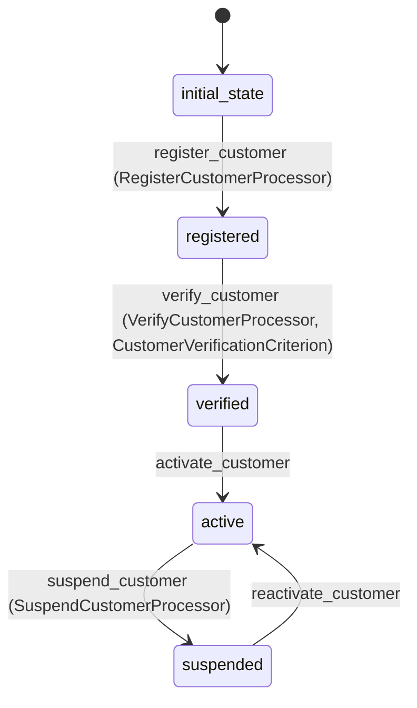

# Customer Workflow

## States
- **initial_state**: Starting state for new customers
- **registered**: Customer has registered but not verified
- **verified**: Customer identity and information verified
- **active**: Customer is active and can make purchases
- **suspended**: Customer account is temporarily suspended

## Transitions

### initial_state → registered
- **Name**: register_customer
- **Type**: Automatic
- **Processor**: RegisterCustomerProcessor
- **Purpose**: Register new customer in the system

### registered → verified
- **Name**: verify_customer
- **Type**: Manual
- **Processor**: VerifyCustomerProcessor
- **Criterion**: CustomerVerificationCriterion
- **Purpose**: Verify customer information and eligibility

### verified → active
- **Name**: activate_customer
- **Type**: Manual
- **Purpose**: Activate customer account for transactions

### active → suspended
- **Name**: suspend_customer
- **Type**: Manual
- **Processor**: SuspendCustomerProcessor
- **Purpose**: Temporarily suspend customer account

### suspended → active
- **Name**: reactivate_customer
- **Type**: Manual
- **Purpose**: Reactivate suspended customer account

## Processors

### RegisterCustomerProcessor
- **Entity**: Customer
- **Input**: New customer registration data
- **Purpose**: Initialize customer account with basic information
- **Output**: Registered customer
- **Pseudocode**:
```
process(customer):
    validate customer.isValid()
    set registration timestamp
    send welcome email
    log customer registration
    return customer
```

### VerifyCustomerProcessor
- **Entity**: Customer
- **Input**: Customer with verification documents
- **Purpose**: Verify customer identity and eligibility for pet adoption
- **Output**: Verified customer
- **Pseudocode**:
```
process(customer):
    validate identification documents
    check adoption eligibility
    set verification timestamp
    log verification completion
    return customer
```

### SuspendCustomerProcessor
- **Entity**: Customer
- **Input**: Customer with suspension reason
- **Purpose**: Suspend customer account due to policy violations
- **Output**: Suspended customer
- **Pseudocode**:
```
process(customer):
    set suspension reason
    set suspension timestamp
    notify customer of suspension
    log suspension action
    return customer
```

## Criteria

### CustomerVerificationCriterion
- **Purpose**: Check if customer meets verification requirements
- **Pseudocode**:
```
check(customer):
    return customer.email != null AND 
           customer.firstName != null AND 
           customer.lastName != null AND
           customer.address != null
```

## Mermaid State Diagram


