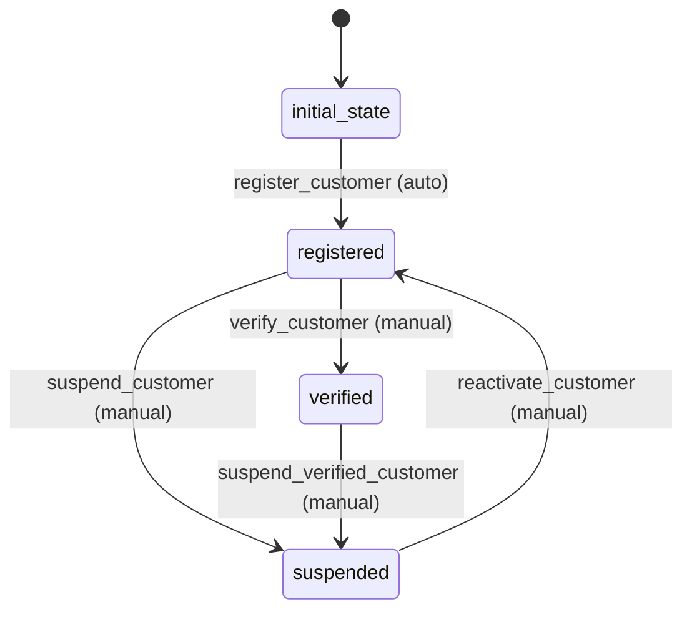

# Customer Workflow

## States
- **initial_state**: Starting state
- **registered**: Customer is registered and active
- **verified**: Customer identity has been verified
- **suspended**: Customer account is temporarily suspended

## Transitions

### initial_state → registered
- **Name**: register_customer
- **Type**: Automatic
- **Processors**: CustomerRegistrationProcessor
- **Criteria**: None

### registered → verified
- **Name**: verify_customer
- **Type**: Manual
- **Processors**: CustomerVerificationProcessor
- **Criteria**: None

### registered → suspended
- **Name**: suspend_customer
- **Type**: Manual
- **Processors**: None
- **Criteria**: None

### verified → suspended
- **Name**: suspend_verified_customer
- **Type**: Manual
- **Processors**: None
- **Criteria**: None

### suspended → registered
- **Name**: reactivate_customer
- **Type**: Manual
- **Processors**: None
- **Criteria**: None

## Mermaid State Diagram


## Processors

### CustomerRegistrationProcessor
- **Entity**: Customer
- **Purpose**: Initialize customer with default values and validate registration data
- **Input**: New customer entity
- **Output**: Validated customer entity
- **Pseudocode**:
```
process(customer):
    validate customer.isValid()
    validate email format
    set registration timestamp
    return customer
```

### CustomerVerificationProcessor
- **Entity**: Customer
- **Purpose**: Complete customer verification process
- **Input**: Customer entity with verification details
- **Output**: Updated customer entity
- **Pseudocode**:
```
process(customer):
    validate customer is in registered state
    update verification timestamp
    return customer
```
