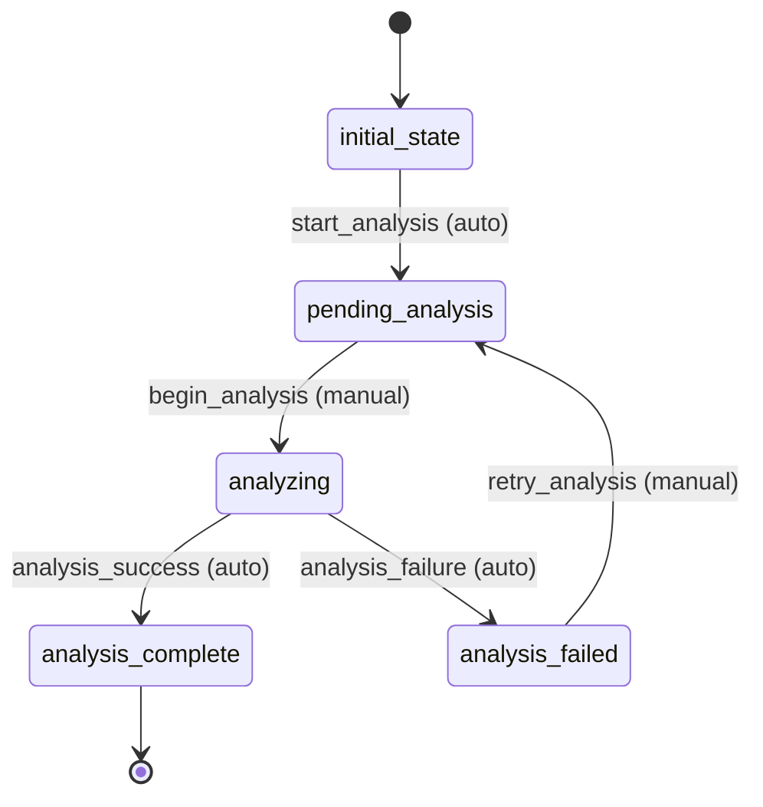

# DataAnalysis Workflow

## States and Transitions

### States
- **initial_state**: Starting state
- **pending_analysis**: Ready to analyze data
- **analyzing**: Analysis in progress
- **analysis_complete**: Analysis successfully completed
- **analysis_failed**: Analysis failed

### Transitions
1. **start_analysis**: initial_state → pending_analysis (automatic)
2. **begin_analysis**: pending_analysis → analyzing (manual)
3. **analysis_success**: analyzing → analysis_complete (automatic)
4. **analysis_failure**: analyzing → analysis_failed (automatic)
5. **retry_analysis**: analysis_failed → pending_analysis (manual)

## Mermaid State Diagram



## Processors

### AnalyzeHousingDataProcessor
- **Entity**: DataAnalysis
- **Expected Input**: DataAnalysis with dataSourceId reference
- **Purpose**: Analyze housing CSV data and generate insights
- **Expected Output**: DataAnalysis with populated reportData
- **Transition**: analysis_success

**Pseudocode for process() method:**
```
function process(dataAnalysis):
    try:
        // Get the data source
        dataSource = entityService.findBySourceId(dataAnalysis.dataSourceId)
        csvData = loadCsvFile(dataSource.fileName)
        
        // Perform pandas-style analysis
        insights = {
            totalRecords: csvData.rowCount(),
            averagePrice: csvData.column("price").mean(),
            priceRange: {
                min: csvData.column("price").min(),
                max: csvData.column("price").max()
            },
            topAreas: csvData.groupBy("area").count().top(5),
            priceByBedrooms: csvData.groupBy("bedrooms").agg("price", "mean")
        }
        
        dataAnalysis.reportData = insights
        dataAnalysis.analysisCompletedAt = currentTimestamp()
        
        // Trigger EmailNotification entity creation
        createEmailNotification(dataAnalysis.analysisId)
        
        return dataAnalysis
    catch Exception e:
        throw new ProcessingException("Analysis failed: " + e.message)
```

## Criteria

### DataAvailableCriterion
- **Name**: DataAvailableCriterion
- **Purpose**: Check if the referenced data source has completed download

**Pseudocode for check() method:**
```
function check(dataAnalysis):
    if dataAnalysis.dataSourceId == null:
        return false
    
    dataSource = entityService.findBySourceId(dataAnalysis.dataSourceId)
    return dataSource != null and 
           dataSource.meta.state == "download_complete" and
           dataSource.fileName != null
```
