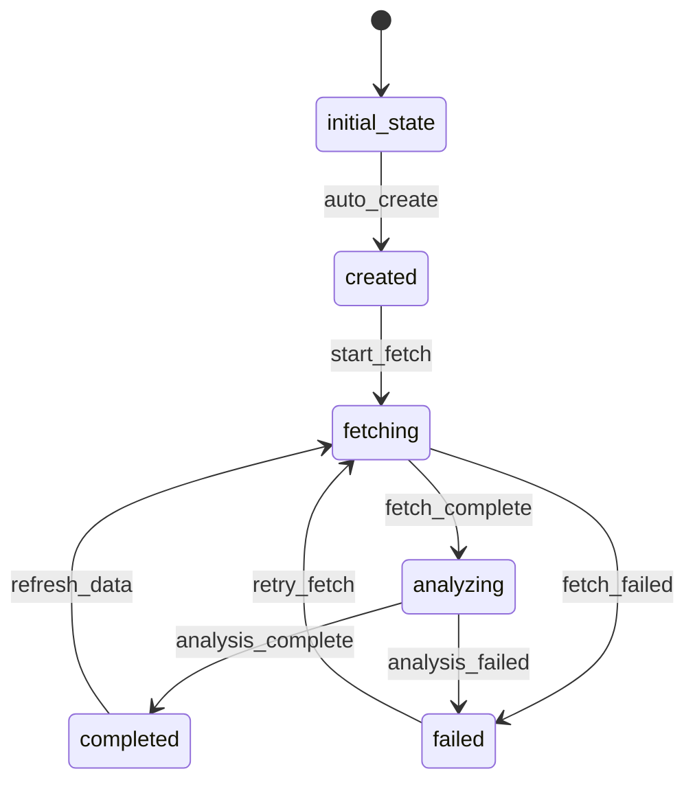

# DataSource Workflow

## States and Transitions



## Workflow States
- **initial_state**: Starting state (automatic)
- **created**: DataSource has been created and is ready for processing
- **fetching**: Currently downloading CSV data from URL
- **analyzing**: Processing and analyzing the downloaded data
- **completed**: Data has been successfully fetched and analyzed
- **failed**: An error occurred during fetch or analysis

## Transitions

### auto_create (initial_state → created)
- **Type**: Automatic
- **Processors**: None
- **Criteria**: None

### start_fetch (created → fetching)
- **Type**: Manual
- **Processors**: DataFetchProcessor
- **Criteria**: None

### fetch_complete (fetching → analyzing)
- **Type**: Automatic
- **Processors**: DataAnalysisProcessor
- **Criteria**: None

### fetch_failed (fetching → failed)
- **Type**: Automatic
- **Processors**: None
- **Criteria**: FetchFailureCriterion

### analysis_complete (analyzing → completed)
- **Type**: Automatic
- **Processors**: ReportGenerationProcessor
- **Criteria**: None

### analysis_failed (analyzing → failed)
- **Type**: Automatic
- **Processors**: None
- **Criteria**: AnalysisFailureCriterion

### retry_fetch (failed → fetching)
- **Type**: Manual
- **Processors**: DataFetchProcessor
- **Criteria**: None

### refresh_data (completed → fetching)
- **Type**: Manual
- **Processors**: DataFetchProcessor
- **Criteria**: None

## Processors

### DataFetchProcessor
- **Entity**: DataSource
- **Input**: DataSource with URL
- **Purpose**: Download CSV data from the specified URL and store metadata
- **Output**: Updated DataSource with fetch timestamp and file information
- **Pseudocode**:
```
process(dataSource):
    try:
        response = httpClient.get(dataSource.url)
        csvData = response.body
        dataSource.lastFetchTime = now()
        dataSource.fileSize = csvData.length
        dataSource.checksum = calculateChecksum(csvData)
        storeData(dataSource.dataSourceId, csvData)
        return dataSource
    catch Exception:
        throw ProcessingException("Failed to fetch data")
```

### DataAnalysisProcessor
- **Entity**: DataSource
- **Input**: DataSource with fetched data
- **Purpose**: Analyze CSV data using pandas-like operations and extract insights
- **Output**: Updated DataSource with analysis metadata
- **Pseudocode**:
```
process(dataSource):
    csvData = loadData(dataSource.dataSourceId)
    analysisResults = performAnalysis(csvData)
    dataSource.lastAnalysisTime = now()
    dataSource.recordCount = analysisResults.rowCount
    storeAnalysisResults(dataSource.dataSourceId, analysisResults)
    return dataSource
```

### ReportGenerationProcessor
- **Entity**: DataSource
- **Input**: DataSource with completed analysis
- **Purpose**: Generate a report entity based on analysis results
- **Output**: Creates new Report entity (null transition)
- **Pseudocode**:
```
process(dataSource):
    analysisResults = loadAnalysisResults(dataSource.dataSourceId)
    report = new Report()
    report.reportId = generateId()
    report.dataSourceId = dataSource.dataSourceId
    report.title = "Analysis Report for " + dataSource.name
    report.analysisResults = analysisResults
    report.generatedAt = now()
    entityService.create(report)
    return dataSource
```

## Criteria

### FetchFailureCriterion
- **Purpose**: Check if data fetch operation failed
- **Pseudocode**:
```
check(dataSource):
    return dataSource.lastFetchTime == null || hasError(dataSource.dataSourceId)
```

### AnalysisFailureCriterion
- **Purpose**: Check if data analysis operation failed
- **Pseudocode**:
```
check(dataSource):
    return dataSource.lastAnalysisTime == null || analysisHasError(dataSource.dataSourceId)
```
