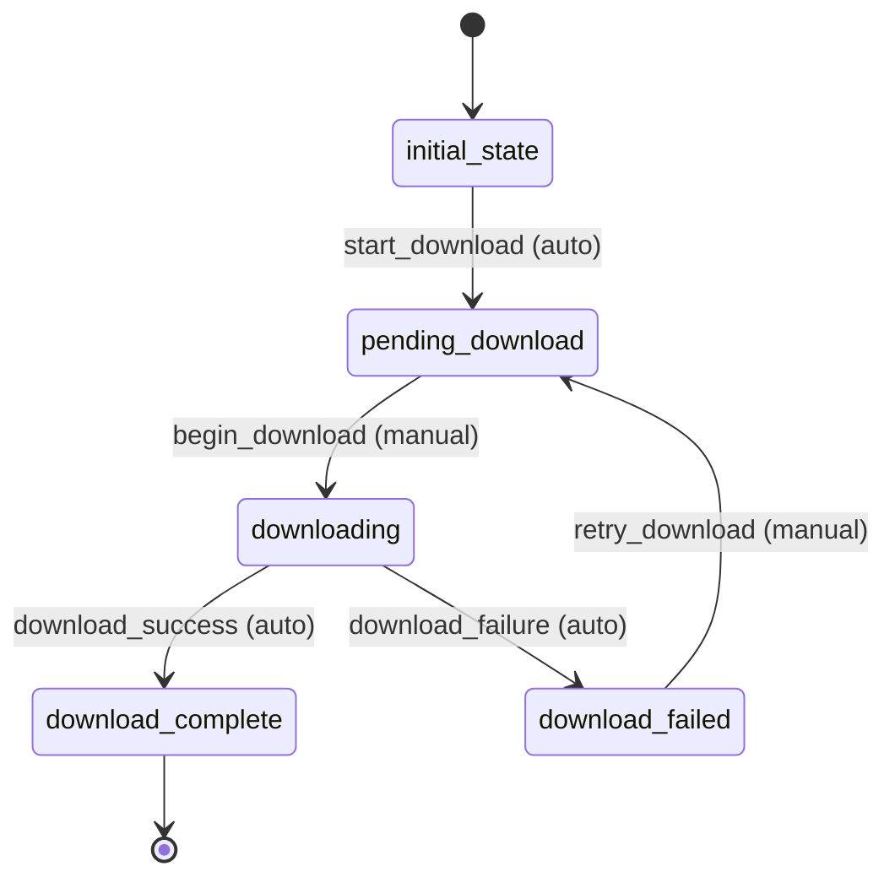

# DataSource Workflow

## States and Transitions

### States
- **initial_state**: Starting state
- **pending_download**: Ready to download data
- **downloading**: Download in progress
- **download_complete**: Data successfully downloaded
- **download_failed**: Download failed

### Transitions
1. **start_download**: initial_state → pending_download (automatic)
2. **begin_download**: pending_download → downloading (manual)
3. **download_success**: downloading → download_complete (automatic)
4. **download_failure**: downloading → download_failed (automatic)
5. **retry_download**: download_failed → pending_download (manual)

## Mermaid State Diagram


```mermaid
stateDiagram-v2
    [*] --> initial_state
    initial_state --> pending_download : start_download (auto)
    pending_download --> downloading : begin_download (manual)
    downloading --> download_complete : download_success (auto)
    downloading --> download_failed : download_failure (auto)
    download_failed --> pending_download : retry_download (manual)
    download_complete --> [*]
```

## Processors

### DownloadDataProcessor
- **Entity**: DataSource
- **Expected Input**: DataSource with url field
- **Purpose**: Download CSV data from the specified URL
- **Expected Output**: DataSource with downloaded file information
- **Transition**: download_success

**Pseudocode for process() method:**
```
function process(dataSource):
    try:
        response = httpClient.get(dataSource.url)
        if response.status == 200:
            fileName = generateFileName(dataSource.url)
            fileSize = saveFile(response.content, fileName)
            dataSource.fileName = fileName
            dataSource.fileSize = fileSize
            dataSource.downloadedAt = currentTimestamp()
            
            // Trigger DataAnalysis entity creation
            createDataAnalysis(dataSource.sourceId)
            
            return dataSource
        else:
            throw new DownloadException("HTTP " + response.status)
    catch Exception e:
        throw new ProcessingException("Download failed: " + e.message)
```

## Criteria

### ValidUrlCriterion
- **Name**: ValidUrlCriterion
- **Purpose**: Validate that the URL is accessible and returns CSV data

**Pseudocode for check() method:**
```
function check(dataSource):
    if dataSource.url == null or dataSource.url.isEmpty():
        return false
    
    try:
        response = httpClient.head(dataSource.url)
        return response.status == 200 and 
               response.contentType.contains("text/csv")
    catch Exception:
        return false
```
