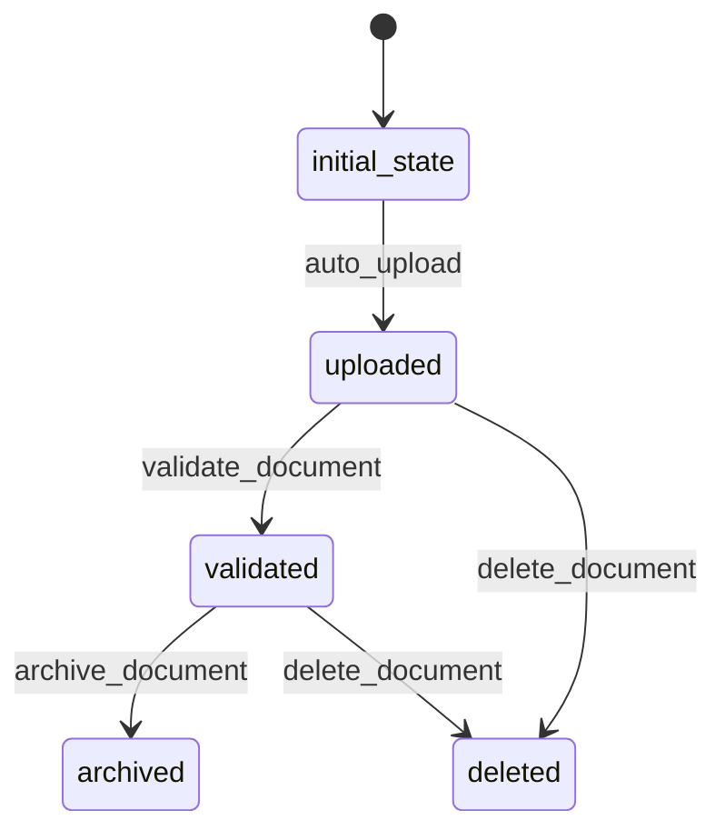

# Document Workflow

## States
- **initial_state**: System entry point
- **uploaded**: Document has been uploaded
- **validated**: Document has passed validation checks
- **archived**: Document has been archived
- **deleted**: Document has been marked for deletion

## Transitions



## Processors

### DocumentUploadProcessor
- **Entity**: Document
- **Purpose**: Process document upload and generate metadata
- **Input**: Document entity with file details
- **Output**: Document with validation and metadata
- **Pseudocode**:
```
process(document):
    set uploadDate to current timestamp
    calculate and set checksum
    validate file size limits
    set version number (increment if same fileName exists)
    validate submission exists and user has permission
    return document
```

### DocumentValidationProcessor
- **Entity**: Document
- **Purpose**: Validate document content and format
- **Input**: Document entity in uploaded state
- **Output**: Validated document
- **Pseudocode**:
```
process(document):
    scan for malware
    validate file format matches fileType
    verify checksum integrity
    create audit trail entry
    return document
```

## Criteria

### DocumentPermissionCriterion
- **Purpose**: Check if user has permission to upload document
- **Pseudocode**:
```
check(document):
    submission = get submission by submissionId
    return user is submitter OR
           user is assigned reviewer OR
           user has ADMIN role
```

### DocumentValidityCriterion
- **Purpose**: Validate document before processing
- **Pseudocode**:
```
check(document):
    return fileName is not empty AND
           fileSize > 0 AND
           fileSize <= MAX_FILE_SIZE AND
           fileType is supported format
```
