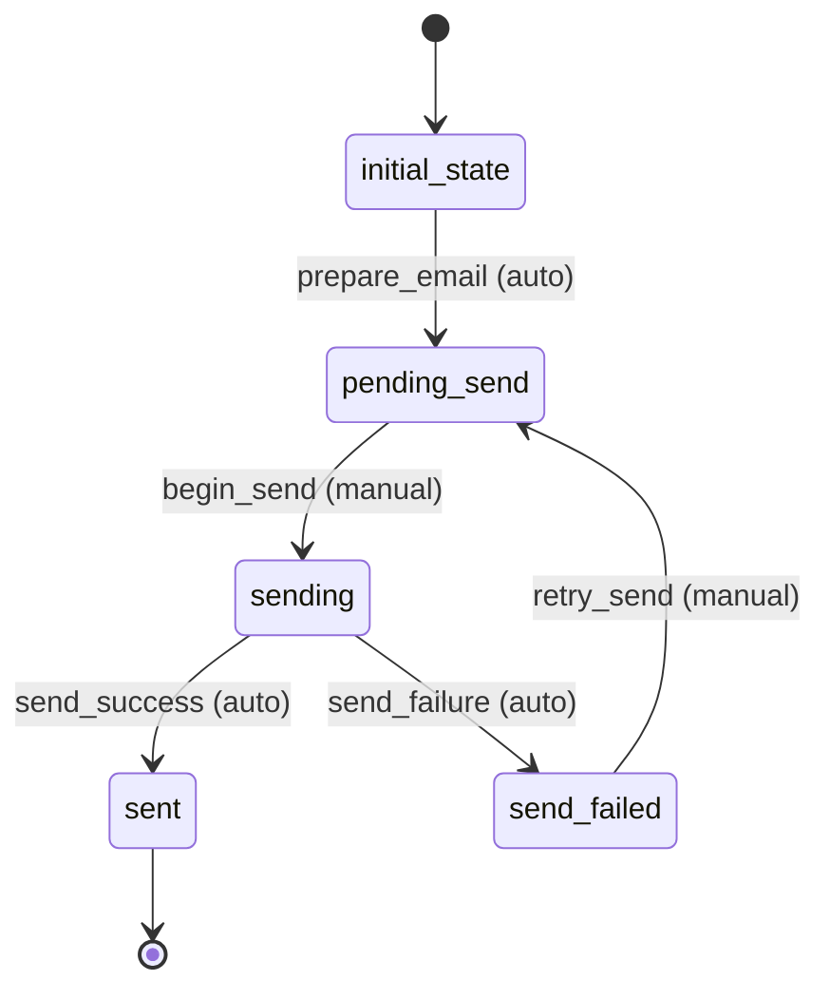

# EmailNotification Workflow

## States and Transitions

### States
- **initial_state**: Starting state
- **pending_send**: Ready to send email
- **sending**: Email sending in progress
- **sent**: Email successfully sent
- **send_failed**: Email sending failed

### Transitions
1. **prepare_email**: initial_state → pending_send (automatic)
2. **begin_send**: pending_send → sending (manual)
3. **send_success**: sending → sent (automatic)
4. **send_failure**: sending → send_failed (automatic)
5. **retry_send**: send_failed → pending_send (manual)

## Mermaid State Diagram



## Processors

### SendEmailReportProcessor
- **Entity**: EmailNotification
- **Expected Input**: EmailNotification with analysisId and subscriber emails
- **Purpose**: Send formatted email report to all subscribers
- **Expected Output**: EmailNotification with sent timestamp
- **Transition**: send_success

**Pseudocode for process() method:**
```
function process(emailNotification):
    try:
        // Get analysis data
        analysis = entityService.findByAnalysisId(emailNotification.analysisId)
        
        // Format email content
        emailBody = formatEmailReport(analysis.reportData)
        emailSubject = "London Housing Market Analysis Report - " + currentDate()
        
        // Send to all subscribers
        for email in emailNotification.subscriberEmails:
            emailService.send(email, emailSubject, emailBody)
        
        emailNotification.emailSubject = emailSubject
        emailNotification.emailBody = emailBody
        emailNotification.sentAt = currentTimestamp()
        
        return emailNotification
    catch Exception e:
        throw new ProcessingException("Email sending failed: " + e.message)
```

### FormatEmailReportProcessor
- **Entity**: EmailNotification
- **Expected Input**: EmailNotification with analysisId
- **Purpose**: Format analysis data into readable email content
- **Expected Output**: EmailNotification with formatted email content
- **Transition**: null transition (updates current entity)

**Pseudocode for process() method:**
```
function process(emailNotification):
    analysis = entityService.findByAnalysisId(emailNotification.analysisId)
    reportData = analysis.reportData
    
    emailBody = """
    London Housing Market Analysis Report
    
    Summary:
    - Total Properties Analyzed: ${reportData.totalRecords}
    - Average Price: £${reportData.averagePrice}
    - Price Range: £${reportData.priceRange.min} - £${reportData.priceRange.max}
    
    Top Areas by Property Count:
    ${formatTopAreas(reportData.topAreas)}
    
    Average Price by Bedrooms:
    ${formatPriceByBedrooms(reportData.priceByBedrooms)}
    
    Generated on: ${currentTimestamp()}
    """
    
    emailNotification.emailBody = emailBody
    return emailNotification
```

## Criteria

### AnalysisCompleteCriterion
- **Name**: AnalysisCompleteCriterion
- **Purpose**: Check if the referenced analysis has completed successfully

**Pseudocode for check() method:**
```
function check(emailNotification):
    if emailNotification.analysisId == null:
        return false
    
    analysis = entityService.findByAnalysisId(emailNotification.analysisId)
    return analysis != null and 
           analysis.meta.state == "analysis_complete" and
           analysis.reportData != null
```

### ValidEmailsCriterion
- **Name**: ValidEmailsCriterion
- **Purpose**: Validate that all subscriber emails are valid

**Pseudocode for check() method:**
```
function check(emailNotification):
    if emailNotification.subscriberEmails == null or 
       emailNotification.subscriberEmails.isEmpty():
        return false
    
    for email in emailNotification.subscriberEmails:
        if not isValidEmail(email):
            return false
    
    return true
```
