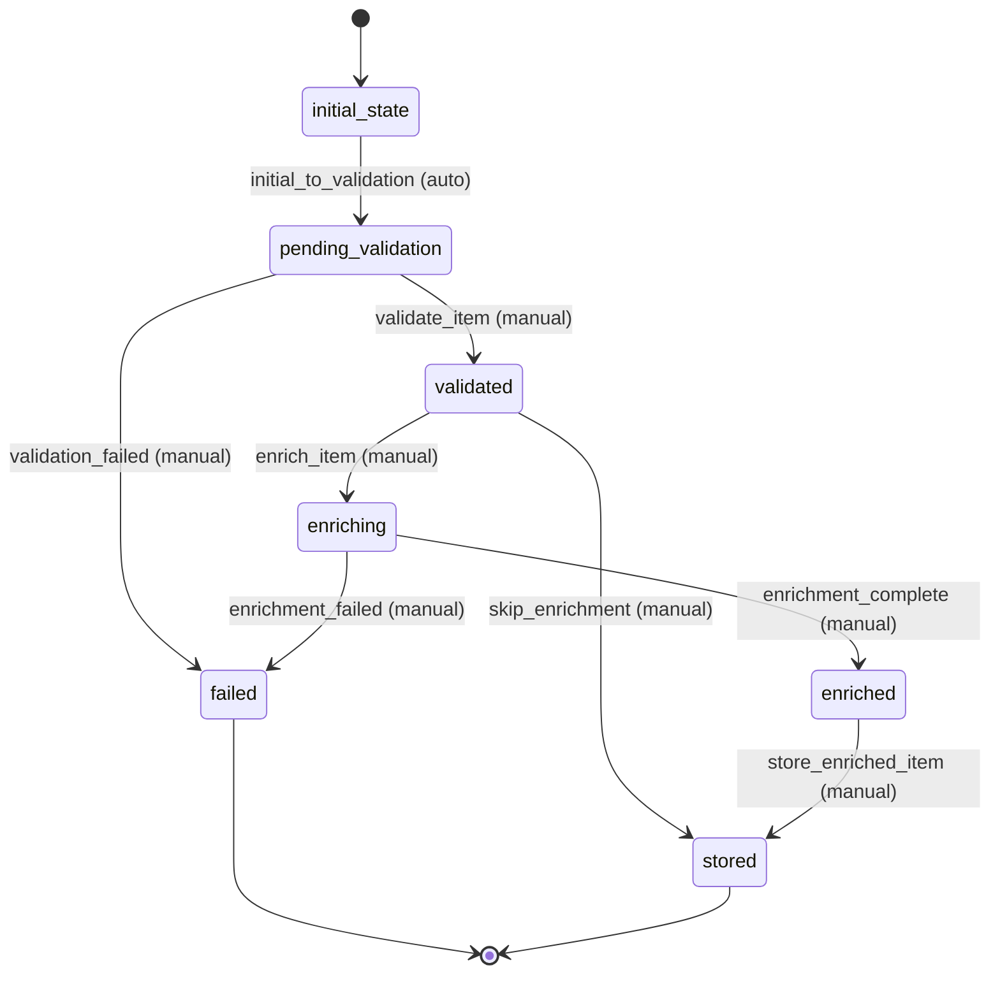

# HackerNewsItem Workflow Requirements

## Overview
The HackerNewsItem workflow manages the lifecycle of Hacker News items from initial creation through validation, enrichment, and final storage. The workflow supports multiple input sources and processing paths.

## Workflow States

### 1. initial_state
- **Description**: Entry point for all new HackerNewsItem entities
- **Purpose**: Automatic transition to begin processing
- **Duration**: Instantaneous

### 2. pending_validation
- **Description**: Item awaits validation of required fields and data integrity
- **Purpose**: Ensure item meets basic requirements before processing
- **Validation**: Check id, type, and basic field constraints

### 3. validated
- **Description**: Item has passed basic validation checks
- **Purpose**: Ready for enrichment or direct storage
- **Next Steps**: Can proceed to enrichment or completion

### 4. enriching
- **Description**: Item is being enriched with additional data from Firebase HN API
- **Purpose**: Fetch missing fields, update scores, get child comments
- **Processing**: May involve external API calls

### 5. enriched
- **Description**: Item has been successfully enriched with additional data
- **Purpose**: Ready for final storage with complete information
- **Data**: Contains full Firebase HN API data

### 6. stored
- **Description**: Item has been successfully stored in the system
- **Purpose**: Final state for successfully processed items
- **Terminal**: No further transitions

### 7. failed
- **Description**: Item processing failed due to validation or enrichment errors
- **Purpose**: Terminal state for items that cannot be processed
- **Terminal**: No further transitions

## Workflow Transitions

### 1. initial_to_validation (Automatic)
- **From**: initial_state
- **To**: pending_validation
- **Type**: Automatic (manual: false)
- **Processors**: None
- **Criteria**: None
- **Purpose**: Begin validation process immediately

### 2. validate_item (Manual)
- **From**: pending_validation
- **To**: validated
- **Type**: Manual (manual: true)
- **Processors**: ValidateHackerNewsItemProcessor
- **Criteria**: None
- **Purpose**: Validate item structure and required fields

### 3. validation_failed (Manual)
- **From**: pending_validation
- **To**: failed
- **Type**: Manual (manual: true)
- **Processors**: None
- **Criteria**: ValidationFailedCriterion
- **Purpose**: Handle validation failures

### 4. enrich_item (Manual)
- **From**: validated
- **To**: enriching
- **Type**: Manual (manual: true)
- **Processors**: EnrichHackerNewsItemProcessor
- **Criteria**: None
- **Purpose**: Fetch additional data from Firebase HN API

### 5. skip_enrichment (Manual)
- **From**: validated
- **To**: stored
- **Type**: Manual (manual: true)
- **Processors**: StoreHackerNewsItemProcessor
- **Criteria**: None
- **Purpose**: Store item without enrichment

### 6. enrichment_complete (Manual)
- **From**: enriching
- **To**: enriched
- **Type**: Manual (manual: true)
- **Processors**: None
- **Criteria**: EnrichmentCompleteCriterion
- **Purpose**: Confirm enrichment was successful

### 7. enrichment_failed (Manual)
- **From**: enriching
- **To**: failed
- **Type**: Manual (manual: true)
- **Processors**: None
- **Criteria**: EnrichmentFailedCriterion
- **Purpose**: Handle enrichment failures

### 8. store_enriched_item (Manual)
- **From**: enriched
- **To**: stored
- **Type**: Manual (manual: true)
- **Processors**: StoreHackerNewsItemProcessor
- **Criteria**: None
- **Purpose**: Store fully enriched item

## Workflow State Diagram

## Workflow Rules

### Automatic Transitions
- **initial_to_validation**: Must be automatic to begin processing immediately
- All other transitions are manual to allow for controlled processing

### Loop Transitions
- No loop transitions in this workflow
- Failed items remain in failed state
- Stored items remain in stored state

### Processor Requirements
- **ValidateHackerNewsItemProcessor**: Validates item structure and required fields
- **EnrichHackerNewsItemProcessor**: Fetches additional data from Firebase HN API
- **StoreHackerNewsItemProcessor**: Persists item to storage system

### Criteria Requirements
- **ValidationFailedCriterion**: Checks if validation failed
- **EnrichmentCompleteCriterion**: Checks if enrichment was successful
- **EnrichmentFailedCriterion**: Checks if enrichment failed

## Processing Modes
- **Validation**: Synchronous processing for quick validation
- **Enrichment**: Asynchronous processing for external API calls
- **Storage**: Synchronous processing for data persistence

## Error Handling
- Validation errors lead to failed state
- Enrichment errors lead to failed state
- Items can be stored without enrichment if needed
- Failed items require manual intervention or reprocessing
