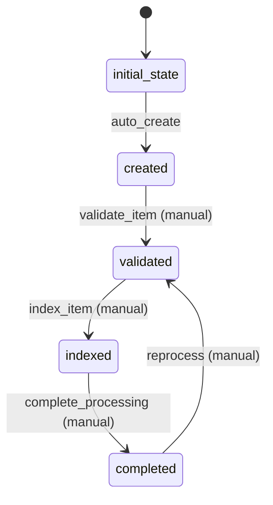

# HN Item Workflow

## Workflow States
1. **initial_state** - Entry point for new HN items
2. **created** - Item has been created and basic validation passed
3. **validated** - Item has been fully validated and enriched
4. **indexed** - Item has been indexed for search operations
5. **completed** - Item is fully processed and available

## State Transitions



## Transition Details

### auto_create (initial_state → created)
- **Type**: Automatic
- **Processors**: CreateHnItemProcessor
- **Criteria**: None
- **Purpose**: Initialize new HN item with basic validation

### validate_item (created → validated)
- **Type**: Manual
- **Processors**: ValidateHnItemProcessor
- **Criteria**: None
- **Purpose**: Validate item data and enrich with additional information

### index_item (validated → indexed)
- **Type**: Manual
- **Processors**: IndexHnItemProcessor
- **Criteria**: IsValidHnItemCriterion
- **Purpose**: Index item for search operations

### complete_processing (indexed → completed)
- **Type**: Manual
- **Processors**: None
- **Criteria**: None
- **Purpose**: Mark item as fully processed

### reprocess (completed → validated)
- **Type**: Manual (loop transition)
- **Processors**: None
- **Criteria**: None
- **Purpose**: Allow reprocessing of completed items

## Processors

### CreateHnItemProcessor
- **Entity**: HnItem
- **Input**: Raw HN item data
- **Purpose**: Create and perform basic validation of HN item
- **Output**: Created HN item entity
- **Pseudocode**:
```
process(hnItemData):
    validate required fields (id, type)
    set creation timestamp
    normalize data fields
    return processed entity
```

### ValidateHnItemProcessor
- **Entity**: HnItem
- **Input**: Created HN item
- **Purpose**: Comprehensive validation and data enrichment
- **Output**: Validated HN item entity
- **Pseudocode**:
```
process(hnItem):
    validate parent relationships
    validate poll relationships
    enrich with metadata
    update validation status
    return validated entity
```

### IndexHnItemProcessor
- **Entity**: HnItem
- **Input**: Validated HN item
- **Purpose**: Index item for search and hierarchical queries
- **Output**: Indexed HN item entity
- **Pseudocode**:
```
process(hnItem):
    create search index entries
    build hierarchical relationships
    update search metadata
    return indexed entity
```

## Criteria

### IsValidHnItemCriterion
- **Purpose**: Check if HN item is valid for indexing
- **Pseudocode**:
```
check(hnItem):
    return hnItem.id != null && 
           hnItem.type != null && 
           hnItem.isValid()
```
