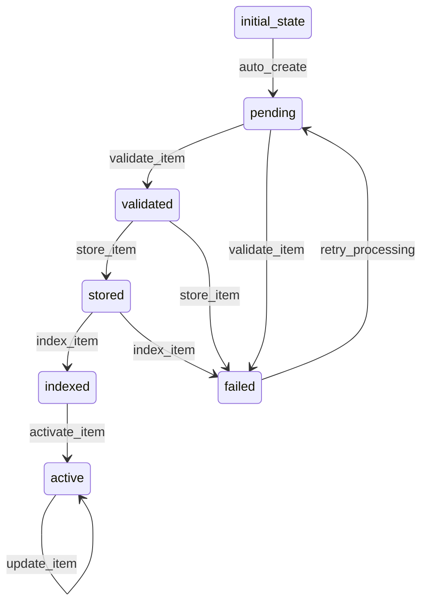

# HNItem Workflow

## States
- **initial_state**: Starting state for new items
- **pending**: Item created but not yet validated
- **validated**: Item passed validation checks
- **stored**: Item successfully stored in system
- **indexed**: Item indexed for search
- **active**: Item is active and available
- **failed**: Item processing failed

## Transitions



## Processors

### ValidateHNItemProcessor
- **Entity**: HNItem
- **Purpose**: Validates HN item structure and required fields
- **Input**: Raw HN item data
- **Output**: Validated HN item
- **Pseudocode**:
```
process(hnItem):
    if hnItem.id is null or empty:
        throw ValidationException("ID is required")
    if hnItem.type not in ["story", "comment", "job", "poll", "pollopt"]:
        throw ValidationException("Invalid item type")
    if hnItem.type == "story" and hnItem.title is null:
        throw ValidationException("Story title is required")
    return hnItem
```

### StoreHNItemProcessor
- **Entity**: HNItem
- **Purpose**: Persists HN item to storage
- **Input**: Validated HN item
- **Output**: Stored HN item with system metadata
- **Pseudocode**:
```
process(hnItem):
    existingItem = entityService.findById(hnItem.id)
    if existingItem exists:
        update existingItem with hnItem data
    else:
        create new item in storage
    return hnItem
```

### IndexHNItemProcessor
- **Entity**: HNItem
- **Purpose**: Indexes item for search functionality
- **Input**: Stored HN item
- **Output**: Indexed HN item
- **Pseudocode**:
```
process(hnItem):
    create search index entry for hnItem
    if hnItem.parent exists:
        update parent's children index
    return hnItem
```

## Criteria

### ValidItemCriterion
- **Purpose**: Checks if item data is valid
- **Pseudocode**:
```
check(hnItem):
    return hnItem.id != null and hnItem.type != null
```
