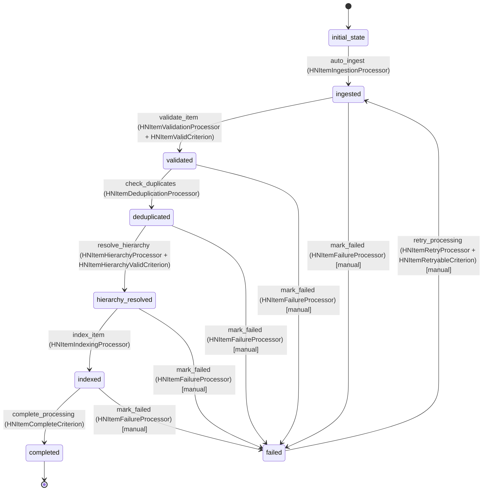

# HNItem Workflow

## Overview
The HNItem workflow manages the lifecycle of Hacker News items from ingestion through validation, processing, and final storage. It handles different ingestion sources and ensures data quality and consistency.

## Workflow States

### 1. initial_state
- **Description**: Starting state for all new HNItem entities
- **Purpose**: Entry point for workflow processing

### 2. ingested
- **Description**: Item has been received from any source (Firebase API, POST, bulk upload)
- **Purpose**: Initial validation and source tracking

### 3. validated
- **Description**: Item has passed basic validation checks
- **Purpose**: Ensure data integrity before processing

### 4. deduplicated
- **Description**: Item has been checked for duplicates and processed accordingly
- **Purpose**: Prevent duplicate items and handle updates

### 5. hierarchy_resolved
- **Description**: Parent-child relationships have been established
- **Purpose**: Build proper comment thread structure

### 6. indexed
- **Description**: Item has been indexed for search capabilities
- **Purpose**: Enable fast search and retrieval

### 7. completed
- **Description**: Item is fully processed and available
- **Purpose**: Final state for successfully processed items

### 8. failed
- **Description**: Item processing failed and requires attention
- **Purpose**: Handle processing errors and enable retry

## Workflow Transitions

### initial_state → ingested
- **Transition Name**: `auto_ingest`
- **Type**: Automatic (manual: false)
- **Processors**: [`HNItemIngestionProcessor`]
- **Criteria**: None
- **Purpose**: Automatically move new items to ingested state

### ingested → validated
- **Transition Name**: `validate_item`
- **Type**: Automatic (manual: false)
- **Processors**: [`HNItemValidationProcessor`]
- **Criteria**: [`HNItemValidCriterion`]
- **Purpose**: Validate item data and structure

### validated → deduplicated
- **Transition Name**: `check_duplicates`
- **Type**: Automatic (manual: false)
- **Processors**: [`HNItemDeduplicationProcessor`]
- **Criteria**: None
- **Purpose**: Handle duplicate detection and resolution

### deduplicated → hierarchy_resolved
- **Transition Name**: `resolve_hierarchy`
- **Type**: Automatic (manual: false)
- **Processors**: [`HNItemHierarchyProcessor`]
- **Criteria**: [`HNItemHierarchyValidCriterion`]
- **Purpose**: Establish parent-child relationships

### hierarchy_resolved → indexed
- **Transition Name**: `index_item`
- **Type**: Automatic (manual: false)
- **Processors**: [`HNItemIndexingProcessor`]
- **Criteria**: None
- **Purpose**: Add item to search index

### indexed → completed
- **Transition Name**: `complete_processing`
- **Type**: Automatic (manual: false)
- **Processors**: None
- **Criteria**: [`HNItemCompleteCriterion`]
- **Purpose**: Mark item as fully processed

### Any State → failed
- **Transition Name**: `mark_failed`
- **Type**: Manual (manual: true)
- **Processors**: [`HNItemFailureProcessor`]
- **Criteria**: None
- **Purpose**: Handle processing failures

### failed → ingested
- **Transition Name**: `retry_processing`
- **Type**: Manual (manual: true)
- **Processors**: [`HNItemRetryProcessor`]
- **Criteria**: [`HNItemRetryableCriterion`]
- **Purpose**: Retry failed items

## Processors

### HNItemIngestionProcessor
- **Purpose**: Process newly ingested HN items and set source metadata
- **Input**: Raw HNItem entity with basic data
- **Expected Output**: HNItem with sourceType, ingestedAt, and initial validation
- **Pseudocode**:
```
process(hnItem):
    set hnItem.ingestedAt = current timestamp
    if hnItem.sourceType is null:
        set hnItem.sourceType = "UNKNOWN"
    validate basic required fields (hnId, type)
    log ingestion event
    return hnItem
```

### HNItemValidationProcessor
- **Purpose**: Validate HN item data according to Firebase API schema
- **Input**: HNItem with basic data
- **Expected Output**: HNItem with validation status and cleaned data
- **Pseudocode**:
```
process(hnItem):
    validate hnId is positive integer
    validate type is in allowed values
    validate time is reasonable Unix timestamp
    clean and validate HTML in text/title fields
    validate URL format if present
    validate score is non-negative if present
    set lastUpdated = current timestamp
    return hnItem
```

### HNItemDeduplicationProcessor
- **Purpose**: Check for existing items with same hnId and handle duplicates
- **Input**: Validated HNItem
- **Expected Output**: HNItem with duplicate handling applied
- **Pseudocode**:
```
process(hnItem):
    existingItem = findByHnId(hnItem.hnId)
    if existingItem exists:
        if hnItem has newer data:
            merge updates into existingItem
            mark as updated
        else:
            mark as duplicate/skipped
    else:
        mark as new item
    return hnItem
```

### HNItemHierarchyProcessor
- **Purpose**: Establish parent-child relationships and validate hierarchy
- **Input**: Deduplicated HNItem
- **Expected Output**: HNItem with resolved hierarchy relationships
- **Pseudocode**:
```
process(hnItem):
    if hnItem.parent is not null:
        parentItem = findByHnId(hnItem.parent)
        if parentItem exists:
            add hnItem.hnId to parentItem.kids if not present
            update parentItem via entityService
        else:
            log missing parent warning
    
    if hnItem.kids is not empty:
        for each kidId in hnItem.kids:
            kidItem = findByHnId(kidId)
            if kidItem exists and kidItem.parent != hnItem.hnId:
                update kidItem.parent = hnItem.hnId
                update kidItem via entityService
    
    return hnItem
```

### HNItemIndexingProcessor
- **Purpose**: Add item to search index for fast retrieval
- **Input**: HNItem with resolved hierarchy
- **Expected Output**: HNItem indexed for search
- **Pseudocode**:
```
process(hnItem):
    create search document with:
        - full text from title and text
        - author (by field)
        - type, score, time
        - hierarchy information
    add document to search index
    log indexing completion
    return hnItem
```

### HNItemFailureProcessor
- **Purpose**: Handle processing failures and prepare for retry
- **Input**: Failed HNItem
- **Expected Output**: HNItem with failure information
- **Pseudocode**:
```
process(hnItem):
    capture failure details and stack trace
    increment retry count
    set lastFailureAt = current timestamp
    log failure event
    if retry count < max retries:
        schedule retry
    else:
        mark as permanently failed
    return hnItem
```

### HNItemRetryProcessor
- **Purpose**: Prepare failed items for retry processing
- **Input**: Failed HNItem marked for retry
- **Expected Output**: HNItem reset for reprocessing
- **Pseudocode**:
```
process(hnItem):
    reset processing flags
    clear previous error messages
    set retryAttemptAt = current timestamp
    log retry attempt
    return hnItem
```

## Criteria

### HNItemValidCriterion
- **Purpose**: Check if HN item has valid required data
- **Pseudocode**:
```
check(hnItem):
    return hnItem.hnId != null AND 
           hnItem.hnId > 0 AND
           hnItem.type != null AND
           hnItem.type in ["story", "comment", "job", "poll", "pollopt"]
```

### HNItemHierarchyValidCriterion
- **Purpose**: Check if hierarchy relationships are valid
- **Pseudocode**:
```
check(hnItem):
    if hnItem.type == "comment":
        return hnItem.parent != null
    if hnItem.type == "pollopt":
        return hnItem.poll != null
    return true  // other types don't require hierarchy
```

### HNItemCompleteCriterion
- **Purpose**: Check if item processing is complete
- **Pseudocode**:
```
check(hnItem):
    return hnItem.ingestedAt != null AND
           hnItem.lastUpdated != null AND
           (hnItem.type != "comment" OR hnItem.parent != null) AND
           (hnItem.type != "pollopt" OR hnItem.poll != null)
```

### HNItemRetryableCriterion
- **Purpose**: Check if failed item can be retried
- **Pseudocode**:
```
check(hnItem):
    maxRetries = 3
    retryWindow = 24 hours
    
    return hnItem.retryCount < maxRetries AND
           (current time - hnItem.lastFailureAt) < retryWindow AND
           hnItem.hnId != null
```

## Mermaid State Diagram


