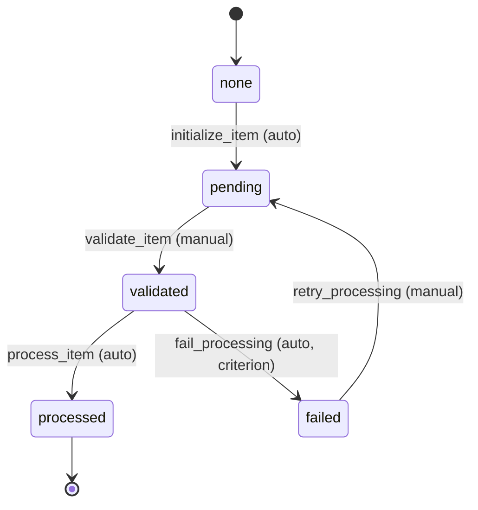

# HN Item Workflow

## Overview
Workflow for managing Hacker News items through their lifecycle from creation to processing and storage.

## States
- **none**: Initial state (automatic transition to pending)
- **pending**: Item received, awaiting validation
- **validated**: Item validated, ready for processing
- **processed**: Item processed and stored
- **failed**: Item processing failed

## Transitions

### none → pending (automatic)
- **Name**: initialize_item
- **Type**: Automatic
- **Processors**: None
- **Criteria**: None

### pending → validated (manual)
- **Name**: validate_item
- **Type**: Manual
- **Processors**: HnItemValidationProcessor
- **Criteria**: None

### validated → processed (automatic)
- **Name**: process_item
- **Type**: Automatic
- **Processors**: HnItemStorageProcessor
- **Criteria**: None

### validated → failed (automatic)
- **Name**: fail_processing
- **Type**: Automatic
- **Processors**: None
- **Criteria**: HnItemValidationCriterion

### failed → pending (manual)
- **Name**: retry_processing
- **Type**: Manual
- **Processors**: None
- **Criteria**: None

## Mermaid State Diagram

```mermaid
stateDiagram-v2
    [*] --> none
    none --> pending : initialize_item (auto)
    pending --> validated : validate_item (manual)
    validated --> processed : process_item (auto)
    validated --> failed : fail_processing (auto, criterion)
    failed --> pending : retry_processing (manual)
    processed --> [*]
```

## Processors

### HnItemValidationProcessor
- **Entity**: HnItem
- **Purpose**: Validates HN item data structure and required fields
- **Input**: Raw HN item data
- **Output**: Validated HN item
- **Pseudocode**:
```
process(entity):
    validate required fields (id, type)
    validate data types and formats
    sanitize HTML content in text fields
    set validation timestamp
    return validated entity
```

### HnItemStorageProcessor
- **Entity**: HnItem
- **Purpose**: Stores validated HN item and updates parent-child relationships
- **Input**: Validated HN item
- **Output**: Stored HN item with relationships
- **Pseudocode**:
```
process(entity):
    store item in repository
    if entity has parent:
        update parent's kids array
    if entity has kids:
        update children's parent references
    set storage timestamp
    return stored entity
```

## Criteria

### HnItemValidationCriterion
- **Purpose**: Checks if HN item validation failed
- **Pseudocode**:
```
check(entity):
    return entity.validationErrors != null && entity.validationErrors.size() > 0
```
