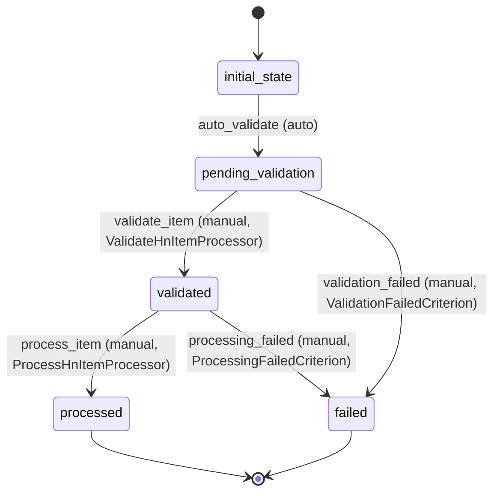

# HN Item Workflow

## Workflow Overview
The HN Item workflow manages the lifecycle of Hacker News items from creation through processing and validation. It supports multiple input sources including Firebase API pulls, single item creation, bulk uploads, and manual data entry.

## Workflow States

### 1. initial_state
- **Description**: Starting state for all new HN items
- **Purpose**: Entry point for the workflow

### 2. pending_validation
- **Description**: Item is awaiting validation of its data structure and content
- **Purpose**: Ensure data integrity before processing

### 3. validated
- **Description**: Item has passed validation and is ready for processing
- **Purpose**: Confirmed valid HN item ready for enrichment

### 4. processed
- **Description**: Item has been processed and enriched with additional data
- **Purpose**: Final state for successfully processed items

### 5. failed
- **Description**: Item failed validation or processing
- **Purpose**: Terminal state for items that cannot be processed

## Workflow Transitions

### From initial_state
1. **auto_validate** → pending_validation
   - **Type**: Automatic (manual: false)
   - **Processors**: None
   - **Criteria**: None
   - **Purpose**: Automatically move new items to validation

### From pending_validation
1. **validate_item** → validated
   - **Type**: Manual (manual: true)
   - **Processors**: ValidateHnItemProcessor
   - **Criteria**: None
   - **Purpose**: Validate HN item structure and content

2. **validation_failed** → failed
   - **Type**: Manual (manual: true)
   - **Processors**: None
   - **Criteria**: ValidationFailedCriterion
   - **Purpose**: Move invalid items to failed state

### From validated
1. **process_item** → processed
   - **Type**: Manual (manual: true)
   - **Processors**: ProcessHnItemProcessor
   - **Criteria**: None
   - **Purpose**: Process and enrich the HN item data

2. **processing_failed** → failed
   - **Type**: Manual (manual: true)
   - **Processors**: None
   - **Criteria**: ProcessingFailedCriterion
   - **Purpose**: Handle processing failures

### From processed
- **No transitions**: Terminal state

### From failed
- **No transitions**: Terminal state

## Mermaid State Diagram


```mermaid
stateDiagram-v2
    [*] --> initial_state
    initial_state --> pending_validation : auto_validate (auto)
    pending_validation --> validated : validate_item (manual, ValidateHnItemProcessor)
    pending_validation --> failed : validation_failed (manual, ValidationFailedCriterion)
    validated --> processed : process_item (manual, ProcessHnItemProcessor)
    validated --> failed : processing_failed (manual, ProcessingFailedCriterion)
    processed --> [*]
    failed --> [*]
```

## Processors

### 1. ValidateHnItemProcessor
- **Entity**: HnItem
- **Purpose**: Validate HN item data structure, required fields, and business rules
- **Expected Input**: EntityWithMetadata<HnItem> with raw HN item data
- **Expected Output**: EntityWithMetadata<HnItem> with validation status updated

**Pseudocode for process() method:**
```
function process(entityWithMetadata):
    entity = entityWithMetadata.entity()
    
    // Validate required fields
    if entity.id is null:
        throw ValidationException("HN item ID is required")
    
    if entity.type is null or not in ["job", "story", "comment", "poll", "pollopt"]:
        throw ValidationException("Invalid or missing HN item type")
    
    // Validate type-specific rules
    if entity.type == "comment" and entity.parent is null:
        throw ValidationException("Comment must have parent")
    
    if entity.type == "pollopt" and entity.poll is null:
        throw ValidationException("Poll option must reference poll")
    
    if entity.type == "poll" and (entity.parts is null or entity.parts.isEmpty()):
        throw ValidationException("Poll must have parts")
    
    // Set system timestamps
    entity.updatedAt = now()
    if entity.createdAt is null:
        entity.createdAt = now()
    
    return entityWithMetadata
```

### 2. ProcessHnItemProcessor
- **Entity**: HnItem
- **Purpose**: Process and enrich HN item data, handle parent-child relationships
- **Expected Input**: EntityWithMetadata<HnItem> with validated data
- **Expected Output**: EntityWithMetadata<HnItem> with processed and enriched data

**Pseudocode for process() method:**
```
function process(entityWithMetadata):
    entity = entityWithMetadata.entity()
    
    // Convert Unix timestamp to readable format if needed
    if entity.time is not null:
        // Keep original Unix time, add human-readable version if needed
        // This is just data enrichment, not modification
    
    // Process HTML content if present
    if entity.text is not null:
        // Validate HTML content, sanitize if needed
        // Keep original HTML structure
    
    // Handle URL validation for stories
    if entity.type == "story" and entity.url is not null:
        // Validate URL format
        if not isValidUrl(entity.url):
            log warning about invalid URL
    
    // Update processing timestamp
    entity.updatedAt = now()
    
    // Set source URL for traceability
    if entity.sourceUrl is null:
        entity.sourceUrl = "https://hacker-news.firebaseio.com/v0/item/" + entity.id + ".json"
    
    return entityWithMetadata
```

## Criteria

### 1. ValidationFailedCriterion
- **Purpose**: Check if validation has failed for an HN item
- **Type**: Pure function without side effects

**Pseudocode for check() method:**
```
function check(entityWithMetadata):
    entity = entityWithMetadata.entity()
    
    // Check if required fields are missing
    if entity.id is null:
        return true
    
    if entity.type is null or not in ["job", "story", "comment", "poll", "pollopt"]:
        return true
    
    // Check type-specific validation rules
    if entity.type == "comment" and entity.parent is null:
        return true
    
    if entity.type == "pollopt" and entity.poll is null:
        return true
    
    if entity.type == "poll" and (entity.parts is null or entity.parts.isEmpty()):
        return true
    
    return false
```

### 2. ProcessingFailedCriterion
- **Purpose**: Check if processing has failed for an HN item
- **Type**: Pure function without side effects

**Pseudocode for check() method:**
```
function check(entityWithMetadata):
    entity = entityWithMetadata.entity()
    
    // Check if processing encountered issues
    if entity.type == "story" and entity.url is not null:
        if not isValidUrl(entity.url):
            return true
    
    // Check if required processing fields are missing after processing
    if entity.updatedAt is null:
        return true
    
    return false
```

## Workflow Rules
1. All items start in `initial_state` and automatically move to `pending_validation`
2. Manual transitions are used for validation and processing to allow for external triggers
3. Failed items move to terminal `failed` state
4. Successfully processed items reach terminal `processed` state
5. Loop transitions (validation_failed, processing_failed) are marked as manual
6. The workflow supports both automated Firebase API pulls and manual item creation
